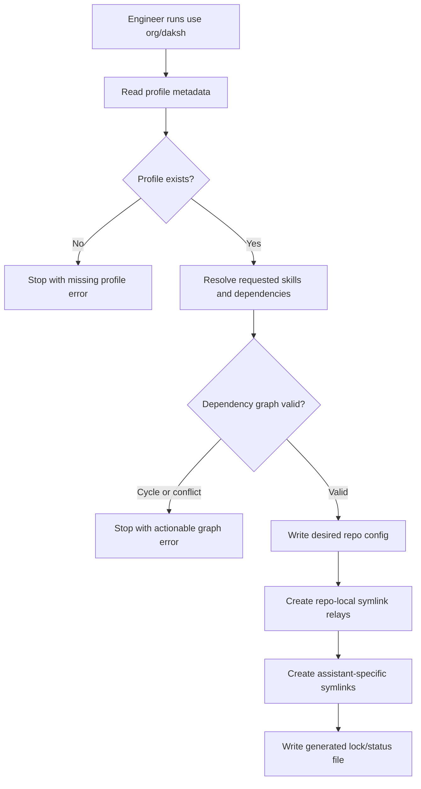
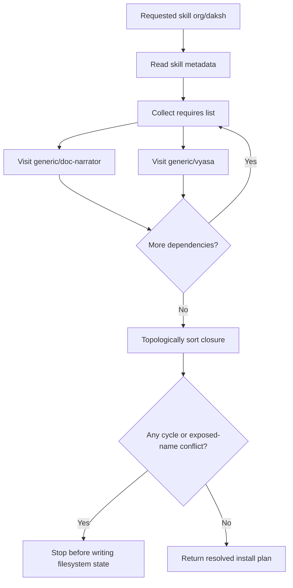
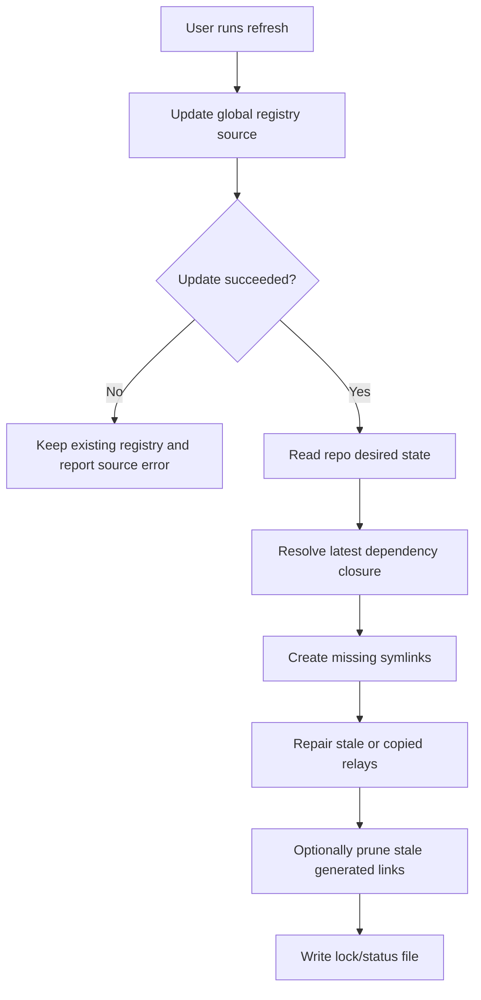
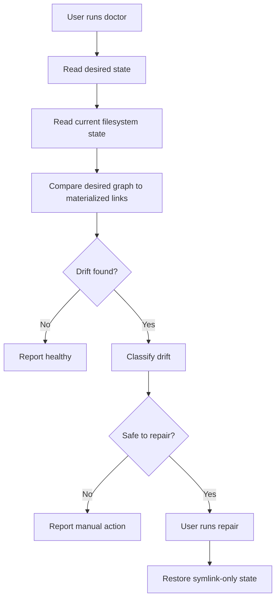
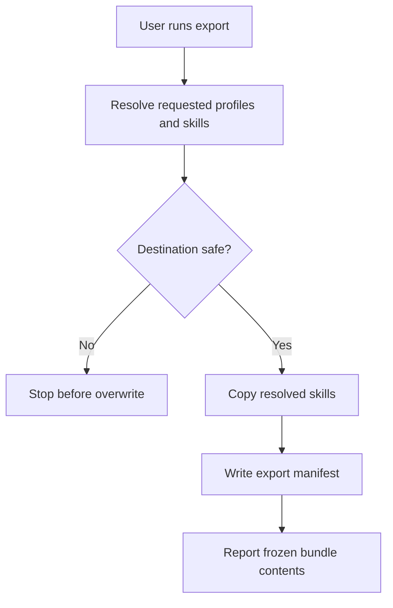
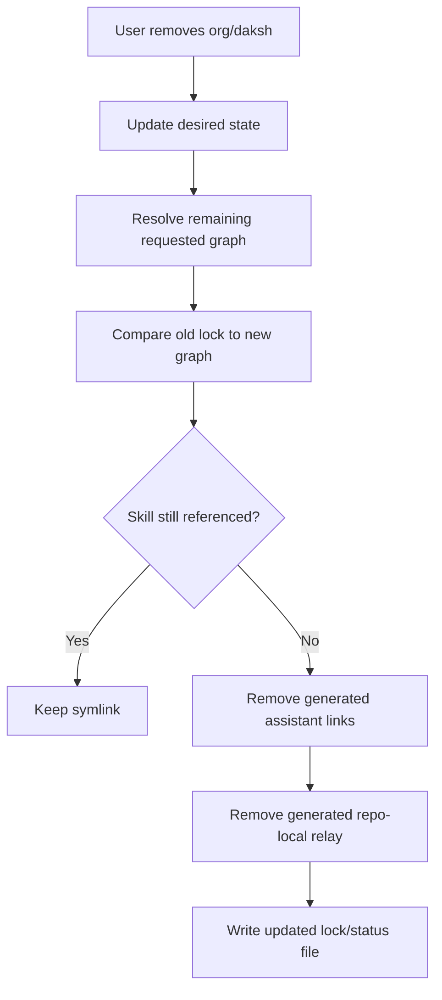
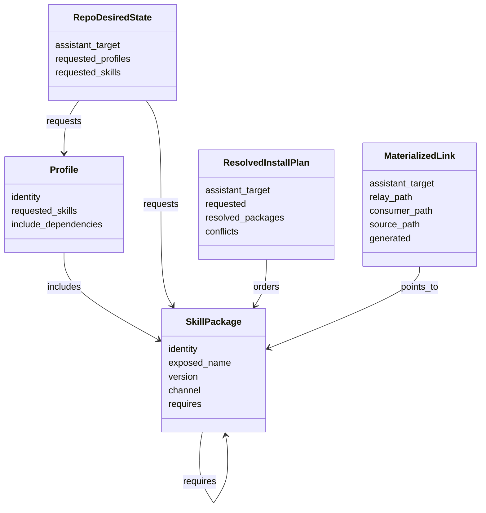

Divami Agents is becoming the distribution layer for how an organization gives AI coding assistants the right skills, keeps those skills fresh, and reduces the manual setup that kills process adoption. This business requirements document captures the product shape behind that goal: a skill package manager with dependency resolution, repo-local symlink materialization, and repair tooling. The reader should leave with a clear contract for what the tool must let engineers, team leads, and platform owners do before the technical roadmap is written. Earlier Daksh stages were intentionally skipped for this document, so the source input is the current product discussion and the existing repository behavior.

# Business Requirements for Org Skill Distribution

> [!note] Source context
> This BRD was created without `docs/vision.md`, `docs/client-context.md`, or a Daksh manifest. Those artifacts do not exist yet in this repo. The requirements below should be treated as the first durable statement of product intent and should feed a later roadmap.

## Product Boundary

The product is a command-line and terminal UI system that installs, updates, audits, and repairs AI assistant skills for an organization. It does not execute the skills themselves. It makes sure each repo and assistant has the right skill folders in the right place, using a declared organization policy instead of manual copy-paste.

| Area | In scope | Out of scope |
|---|---|---|
| Skill source management | Refreshing org-approved skill registries and channels | Building the assistant runtime that consumes skills |
| Dependency resolution | Expanding requested skills into a directed acyclic dependency closure | Runtime orchestration between skills once an assistant has loaded them |
| Repo-local install | Creating symlink-only repo-local skill entries and assistant-specific links | Manually editing generated symlink folders |
| Drift handling | Detecting and repairing copied directories, broken links, missing dependencies, and stale lock state | Preserving local modifications inside copied skill folders |
| Profiles | Letting teams request named bundles like `org/daksh` or `engineering/default` | Treating profile folders full of symlinks as canonical policy |
| Export | Explicitly producing a vendored copy for offline or client handoff | Keeping copy mode as a normal daily install path |

The boundary matters because the system must stay boring. Humans declare intent, the resolver derives the graph, and the filesystem is only the compiled output.

## Stakeholders

| Stakeholder | Need | Why this stakeholder matters |
|---|---|---|
| Engineer using Codex, Claude, Gemini, or Copilot | Run one command and get the right repo-local skills | Adoption fails if setup requires remembering paths or dependency rules |
| Team lead | Standardize process skills across project repos | A team cannot improve process if every repo has a different local setup |
| Platform owner | Publish, update, and repair org-approved skills | The organization needs one maintainable source of truth |
| Skill author | Declare dependencies and compatible channels near the skill | Dependency knowledge should live with the skill, not in someone's memory |
| Client delivery owner | Export a stable copy when a client environment cannot use symlinks | Some handoff environments need vendored files, but that should be explicit |

These stakeholders are distinct because they touch different layers of the same system. Engineers care about low-friction use. Team leads care about consistency. Platform owners care about policy and repair. Skill authors care about metadata. Client delivery owners care about exceptional packaging.

## UC-001: Adopt an Org Skill Profile in a Repo

An engineer starts in a project repo and requests a profile such as `org/daksh`. The tool records the requested profile, resolves the full dependency graph, and materializes repo-local symlinks for every required skill.

Actors: engineer, skill resolver, filesystem materializer.

Preconditions:
- The global skill registry exists under the user's home directory.
- The requested profile exists in the registry.
- The current directory is a repo or an explicit `--cwd` is provided.

Alternate flows:
- If the repo has no existing config, the tool creates one.
- If the repo already requests the profile, the command is idempotent.
- If an existing relay is a copied directory, the tool repairs it into a symlink unless the user explicitly chose export mode.

## UC-002: Resolve Skill Dependencies

A skill author declares that `org/daksh` requires `generic/doc-narrator` and `generic/vyasa`. The resolver expands the requested skill into a topologically sorted closure before install.

Actors: skill author, resolver, engineer.

Preconditions:
- Each skill has metadata with a stable package identity.
- Dependency names are namespace-aware, such as `generic/doc-narrator`.
- The resolver can inspect all active registry roots.

Alternate flows:
- If two packages expose the same assistant-facing skill name, installation stops with a conflict.
- If a dependency is missing, the tool reports the full chain that required it.
- If a dependency is already installed directly by the user, it remains installed even if the parent profile is later removed.

## UC-003: Refresh Global Sources and Sync a Repo

An engineer or platform owner refreshes the local machine after org skills changed upstream. The tool updates the global registry, then reconciles the current repo against the latest dependency graph.

Actors: engineer, platform owner, registry updater, resolver, materializer.

Preconditions:
- At least one registry source is configured.
- The user has read access to the source channel.
- The repo has desired state in `.divami-skills.toml`.

Alternate flows:
- `update` can run without a repo and only refresh global sources.
- `sync` can run without network and only reconcile the repo against the existing registry.
- A combined `refresh` command can run both for daily use.

## UC-004: Diagnose and Repair Drift

A repo may contain broken links, copied relay directories, stale assistant folders, or dependencies that changed after an update. The tool explains the mismatch and can repair safe drift automatically.

Actors: engineer, platform owner, doctor command, repair command.

Preconditions:
- The tool can read the repo config and generated lock/status file if present.
- The global registry is available locally.

Alternate flows:
- A copied directory with local edits is reported as unsafe unless policy allows deletion.
- A broken symlink is safe to replace if the source exists.
- A missing transitive dependency is safe to add.

## UC-005: Export a Vendored Skill Bundle

A client handoff or offline environment may need real files instead of symlinks. The user explicitly runs an export command that copies the resolved skill closure to a destination.

Actors: delivery owner, exporter, resolver.

Preconditions:
- The requested skills or profiles resolve successfully.
- The destination is empty or the user explicitly allows replacement.

Alternate flows:
- Export never changes the repo-local install mode.
- Exported bundles include metadata that identifies source package identities and versions.
- Export is not used by the TUI's normal install path.

## UC-006: Retire or Remove a Skill Without Breaking Shared Dependencies

A team removes `org/daksh` from a repo. The tool removes symlinks owned only by that request while keeping shared dependencies like `generic/doc-narrator` if another requested profile or direct skill still needs them.

Actors: engineer, resolver, materializer.

Preconditions:
- The repo has desired state and a generated lock/status file.
- The resolver can compute which installed entries are still referenced.

Alternate flows:
- Directly requested dependencies remain installed.
- Unowned manually created files are not removed.
- The command reports why each retained dependency stayed.

## Functional Requirements

| ID | Requirement | Trace |
|---|---|---|
| FR-001 | The system shall support namespace-aware skill identities such as `generic/doc-narrator`, while allowing assistant-facing folder names to remain flat when required by assistant loaders. | UC-001, UC-002 |
| FR-002 | The system shall read dependency metadata from each skill's own metadata, starting with a `requires` list in `SKILL.md` frontmatter. | UC-002 |
| FR-003 | The resolver shall expand requested skills and profiles into a directed acyclic dependency closure before any filesystem writes. | UC-001, UC-002 |
| FR-004 | The resolver shall detect missing dependencies, cycles, and exposed-name conflicts and stop before writing partial install state. | UC-002 |
| FR-005 | Normal repo-local installation shall be symlink-only and shall create repo-local relay entries under `<repo>/agents/<skill>`. | UC-001, UC-003 |
| FR-006 | Assistant-specific local folders such as `.agents/skills` and `.claude/skills` shall point to repo-local relay entries instead of pointing directly to global registry paths. | UC-001 |
| FR-007 | The system shall provide a daily-use command that updates global sources and syncs the current repo in one flow. | UC-003 |
| FR-008 | The system shall keep lower-level `update` and `sync` commands available because refreshing global source and reconciling repo-local state are different operations. | UC-003 |
| FR-009 | The system shall provide `doctor` diagnostics that compare desired state, resolved dependencies, lock/status data, and materialized symlinks. | UC-004 |
| FR-010 | The system shall provide `repair` behavior for safe drift, including copied relay directories, broken symlinks, and missing transitive dependencies. | UC-004 |
| FR-011 | The system shall remove copy mode from normal TUI and CLI install paths. | UC-001, UC-005 |
| FR-012 | The system shall support explicit export or vendor mode for offline/client handoff cases where symlinks are not acceptable. | UC-005 |
| FR-013 | The system shall persist requested state separately from generated resolved state. | UC-001, UC-003, UC-006 |
| FR-014 | The system shall avoid removing shared dependencies when a parent skill or profile is removed. | UC-006 |
| FR-015 | The TUI shall show whether each installed skill is healthy, missing, copied, broken, transitive, direct, or conflict-blocked. | UC-001, UC-004, UC-006 |

These requirements are intentionally centered on state reconciliation, not UI mechanics. If the graph, lock, and materialized filesystem state are correct, the CLI and TUI can stay thin. If those contracts are vague, every interface will invent its own meaning of "installed."

## Acceptance Criteria

| ID | Acceptance criterion | Covers |
|---|---|---|
| AC-001 | Given `org/daksh` requires `generic/doc-narrator` and `generic/vyasa`, when a user installs `org/daksh`, then all three repo-local relay entries are created as symlinks to their registry sources. | FR-001, FR-002, FR-003, FR-005 |
| AC-002 | Given a dependency cycle exists, when the user installs a skill in that cycle, then the command exits without creating or changing symlinks and prints the cycle path. | FR-003, FR-004 |
| AC-003 | Given two resolved skills expose the same assistant-facing folder name, when the user installs the request, then the command stops and names both conflicting package identities. | FR-001, FR-004 |
| AC-004 | Given `<repo>/agents/doc-narrator` is a copied directory and the desired mode is normal install, when `sync` or `repair` runs, then the copied relay is replaced with a symlink if no unsafe local edits are detected. | FR-005, FR-010 |
| AC-005 | Given a skill adds a new dependency upstream, when the user runs the daily refresh command, then global source is updated and the new dependency is materialized in the repo. | FR-007, FR-008 |
| AC-006 | Given the network is unavailable, when the user runs `sync`, then repo-local reconciliation still runs against the last available global registry. | FR-008 |
| AC-007 | Given a broken symlink points to a missing registry source, when `doctor` runs, then the report marks the entry broken and recommends `update` or source repair. | FR-009 |
| AC-008 | Given a user directly requested `generic/doc-narrator` and also installed `org/daksh`, when `org/daksh` is removed, then `generic/doc-narrator` remains installed. | FR-013, FR-014 |
| AC-009 | Given a client handoff requires physical files, when `export` runs, then the destination receives copied skill directories plus an export manifest, and normal repo-local symlinks are unchanged. | FR-011, FR-012 |
| AC-010 | Given the TUI is opened in a repo with drift, when the install matrix renders, then copied and broken entries are visually distinct from healthy symlinks. | FR-009, FR-015 |

## Non-Functional Requirements

| Category | Requirement |
|---|---|
| Reliability | Sync and repair must be idempotent. Running them twice should not create different filesystem state. |
| Safety | The tool must not delete non-generated directories unless the user explicitly invokes an unsafe repair mode. |
| Transparency | Every command that changes symlinks must summarize requested skills, resolved dependencies, and filesystem changes. |
| Speed | Doctor and sync should complete in under two seconds for a repo with fewer than 100 resolved skills on a normal laptop. |
| Portability | Symlink targets inside a repo should be relative where possible so moving a repo does not break assistant-local links. |
| Compatibility | The materialized assistant folders must stay compatible with flat skill loaders such as Codex's `.agents/skills`. |
| Maintainability | Dependency metadata must live with the skill so skill authors can update the graph without editing installer code. |
| Recoverability | A failed install should leave either the previous valid state or a clear repair path. Partial ambiguous state is not acceptable. |

## Data Model

The product needs four separate concepts because each one answers a different question. Package identity says what a skill is. Desired state says what the repo asked for. The resolved graph says what must be installed today. Materialized links say what currently exists on disk.

| Model | Why it exists |
|---|---|
| `SkillPackage` | Gives every skill a stable namespace-aware identity, dependency list, and assistant-facing exposed name. |
| `Profile` | Lets teams request an intent like `org/daksh` without hand-listing every transitive dependency. |
| `RepoDesiredState` | Records what humans asked for, not what the resolver happened to install today. |
| `ResolvedInstallPlan` | Captures the graph closure after dependency resolution, including conflicts before filesystem writes happen. |
| `MaterializedLink` | Lets doctor and repair compare expected symlinks against the actual filesystem. |

## Business Rules

| Rule | Rationale |
|---|---|
| BR-001: Normal install is symlink-only. | Copy mode creates drift, and drift is what kills trust in process tooling. |
| BR-002: Export is explicit and separate from install. | Some environments need copied files, but that should not pollute daily workflow semantics. |
| BR-003: Dependencies are package identities, not folder paths. | `generic/doc-narrator` can be resolved, versioned, and conflict-checked in a way raw folders cannot. |
| BR-004: Filesystem state is generated output. | Symlinks are the compiled artifact, not the source of truth. |
| BR-005: Missing or invalid dependency graphs are hard stops. | Partial installs create confusing assistant behavior that looks like a skill problem instead of an installer problem. |
| BR-006: Direct user requests outrank transitive cleanup. | Removing Daksh should not remove doc-narrator if the repo explicitly asked for doc-narrator. |

## Remaining Decisions

1. **Version constraints** - Dependencies need a version story. Options: exact versions, channel-only, or semantic ranges. This is blocked on how the global registry will publish releases.
2. **Conflict policy** - Two packages may expose the same assistant folder name. Options: hard stop always, allow aliasing, or require target-specific names. This is blocked on how flat assistant loaders behave across Codex, Claude, Gemini, and Copilot.
3. **Unsafe repair threshold** - Replacing a copied relay directory is safe only if the tool can prove it is generated or unmodified. This is blocked on whether the lock file should store content hashes.
4. **Prune behavior** - Sync can either only add/repair missing state or also remove stale generated links. This is blocked on the desired default safety posture for team repos.
5. **Registry source format** - The global registry can be a git checkout, downloaded bundle, or both. This is blocked on the release process for org skills.
6. **TUI status vocabulary** - The TUI needs a small, stable state model for direct, transitive, copied, broken, conflict, and healthy entries. This is blocked on the lock/status schema.

## Approval

Approved by:

Role:

Date:
