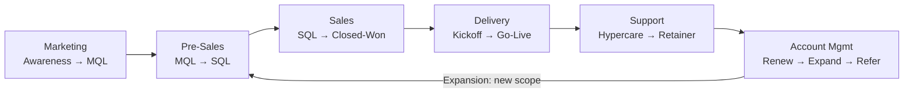

# Divami: Pipeline Overview

---

## 1. Marketing Pipeline
**Goal:** Generate awareness and inbound interest.

| Stage | Activities | Owner |
|-------|-----------|-------|
| Brand Awareness | Case studies, thought leadership, social, SEO |-|
| Demand Generation | Campaigns, webinars, paid ads, events |-|
| Lead Capture | Contact forms, demo requests, content downloads |-|
| Lead Enrichment | ICP scoring, company size, tech stack, budget signals |-|

Output → qualified MQL handed to Pre-Sales.

---

## 2. Pre-Sales Pipeline
**Goal:** Convert interest into a scoped, winnable opportunity.

| Stage | Activities | Owner |
|-------|-----------|-------|
| Lead Qualification | BANT/MEDDIC — Budget, Authority, Need, Timeline |-|
| Discovery | Requirements gathering, stakeholder mapping, pain points |-|
| Tech Feasibility | Architecture review, stack alignment, AI/ML scoping |-|
| Solution Design | High-level approach, team composition, tech choices |-|
| Effort Estimation | Story mapping, T-shirt sizing, detailed LOE |-|
| Proposal / RFP Response | SOW draft, pricing, differentiators, case studies |-|
| Presentation / Demo | PoC, prototype, live walkthrough |-|

Output → signed contract or lost deal (with reason logged).

---

## 3. Sales Pipeline
**Goal:** Close the deal.

| Stage | Activities | Owner |
|-------|-----------|-------|
| Negotiation | Pricing, payment terms, SLAs, IP ownership |-|
| Legal Review | MSA, NDA, DPA, security addendums |-|
| Contract Closure | SOW finalization, PO issuance |-|
| Handoff to Delivery | Internal kickoff, context transfer to delivery team |-|

Output → project kickoff initiated.

---

## 4. Delivery Pipeline
**Goal:** Build and ship what was sold.

### 4a. Project Initiation
- Requirements finalization, user story writing
- Architecture design, tech stack confirmation
- Team onboarding, environment setup
- Sprint 0: tooling, CI/CD, repo structure

### 4b. Development Sprints
- Sprint planning → dev → code review → QA → demo
- Frontend: design handoff (Figma), component library, responsiveness
- Backend: API design, DB schema, integrations
- AI/ML: data pipeline, model training, evaluation, integration

### 4c. QA Pipeline
- Unit, integration, E2E testing
- Performance & load testing
- Security scanning (SAST/DAST)
- UAT with client

### 4d. Release Pipeline
- Staging deploy → client sign-off → production deploy
- Release notes, migration scripts, rollback plan
- Go-live checklist

Output → delivered, accepted software.

---

## 5. Post-Delivery Support Pipeline
**Goal:** Keep the delivered product stable and evolving.

| Stage | Activities | Owner |
|-------|-----------|-------|
| Hypercare (0–4 weeks post-launch) | Dedicated team on standby, priority bug fixes |-|
| Bug Triage | Severity classification (P0–P3), SLA response |-|
| Patch Releases | Hotfixes, dependency updates |-|
| Knowledge Transfer | Runbooks, architecture docs, training sessions |-|
| Transition | Handoff to client's internal team or retainer model |-|

---

## 6. Account Management / Post-Sales Pipeline
**Goal:** Retain, expand, and deepen client relationships.

| Stage | Activities | Owner |
|-------|-----------|-------|
| Relationship Management | QBRs, health checks, exec alignment |-|
| Upsell / Cross-sell | New modules, AI additions, platform extensions |-|
| Contract Renewal | Re-scoping, rate revisions, multi-year deals |-|
| Referral Harvesting | Case study creation, testimonials, referrals |-|
| Churn Prevention | Early warning signals, satisfaction surveys (NPS/CSAT) |-|

---

## Pipeline Interconnections (Flow Summary)

---

## Divami-Specific Notes

- **Frontend-heavy projects**: Design pipeline is a sub-pipeline inside Delivery — Figma → Design QA → Dev Handoff → Implementation → Design Audit.
- **AI projects**: Add a Data Pipeline track before Dev starts — data sourcing, cleaning, labeling, baseline modeling.
- **Fixed-price vs T&M**: Estimation accuracy in Pre-Sales directly impacts delivery margin — the two pipelines are tightly coupled in risk.
- **Staff augmentation model**: Delivery pipeline compresses; Account Management pipeline becomes the primary value-add.
