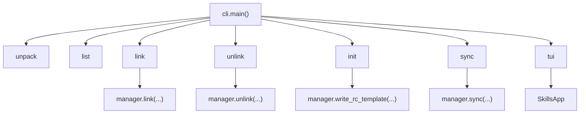

# Developer Handbook

Divami Agents is a small Python package that manages skill directories for multiple AI coding assistants. The key design choice is that the package does not invent a new runtime for skills; it only discovers skill sets, resolves assistant-specific destination folders, and materializes filesystem entries where each assistant already expects to find skills. This document explains how the project works internally so a future engineer can change it without breaking the installation model. By the end, you should understand the command surface, the registry model, the local relay behavior, and the release path from `skills/` to an installed skill directory.

## Repository Shape

The runtime path through the project is narrower than the repo tree might suggest.

| Path | Role in the system |
|---|---|
| `src/divami_skills/cli.py` | Parser and command dispatch. |
| `src/divami_skills/manager.py` | All discovery, link, unlink, and RC logic. |
| `src/divami_skills/tui.py` | Textual matrix UI over the manager layer. |
| `skills/` | Source of truth for packaged skill content. |
| `scripts/pack.py` | Builds `skills.zip` from `skills/`. |
| `pyproject.toml` | Package metadata and console scripts. |

There is also an `agents/` tree in the repo. The current runtime code does not read from it. Packaging and installation flow only through the top-level `skills/` directory and the Python package under `src/divami_skills/`.

## Core Model

The project has four important abstractions in code:

| Abstraction | Concrete type | Owned by | Why it exists |
|---|---|---|---|
| skill set | directory containing skill dirs | filesystem | Gives the CLI one named unit to discover and install. |
| registry | `dict[str, Path]` | `manager.build_registry` | Maps a skill-set name to the directory that contains its skills. |
| assistant target | `dict[str, Path]` entry | `manager.load_all_llms` | Maps a target name such as `codex-local` to the destination folder to write. |
| RC file | `.divami-skills.toml` | repo root | Declares a repo-local subset of skills to sync. |

The CLI stays thin by design. It parses arguments, resolves the working directory, builds a registry, and then hands the actual work to `manager.py`.

## Command Flow

The command surface is small and stable. `main()` in [cli.py](/Users/yeshwanth/Code/Divami/divami-agents/src/divami_skills/cli.py) dispatches seven commands.

Why these commands and nothing else:

| Command | Why it exists |
|---|---|
| `unpack` | Creates or registers the source material that all later commands need. |
| `list` | Gives a zero-side-effect view into discovery and install state. |
| `link` / `unlink` | Provide whole-skill-set install and removal without editing TOML. |
| `init` / `sync` | Support repo-owned, subset-based installs. |
| `tui` | Wraps the same manager operations in an interactive matrix. |

There is no separate command for single-skill management on the CLI because the package currently exposes that surface only through the TUI and the internal manager helpers.

## Discovery and Registry Rules

`manager.build_registry()` merges two sources:

1. Every non-hidden directory under `~/agents/skill-sets`
2. Any extra roots passed in by the caller

An extra root can be either a repo root or a `skills/` directory directly. The function first checks `root / "skills"` and falls back to `root` if that subdirectory does not exist. The registry key for an extra root is `root.name`.

This is intentionally simple. There is no manifest for skill sets, no recursive search, and no remote registry protocol. That keeps discovery predictable and cheap.

## Assistant Resolution

Assistant paths are resolved in two layers:

1. Global destinations from `load_global_llms()`
2. Repo-local destinations from `get_local_llms(base)`

`load_all_llms()` interleaves them in paired order so a UI can show `claude` next to `claude-local`, `codex` next to `codex-local`, and so on.

The local naming contract is suffix-based. `manager.is_local()` treats any target ending in `-local` as repo-local. Several later behaviors depend on that convention, so do not rename it casually.

## The Local Relay Mechanism

The most non-obvious part of the project is the relay used for repo-local installs. When linking into a repo-local assistant target such as `.agents/skills`, the manager does not point the final symlink directly at the source skill directory. It first creates a relay under `<repo>/agents/<skill-name>`, then points the consumer path at that relay.

That indirection gives all repo-local assistant folders a shared stable source inside the repo. Multiple local consumers can point at the same relay, and `_prune_local_relay()` can remove the relay only when no other local consumer still depends on it.

This is the key invariant behind local installs:

| Invariant | Why it matters |
|---|---|
| Every repo-local consumer points to a relay, not the original source | Keeps local consumer links relative and repo-contained. |
| Relay cleanup happens only after the last consumer is gone | Prevents one local uninstall from breaking another assistant. |
| Existing real directories are never overwritten by link operations | Avoids destroying user-managed content. |

## Copy Versus Symlink

The manager layer supports both modes through the `copy` boolean on `link`, `link_skill`, and the local relay installer. The CLI currently defaults to symlink mode for direct commands. The TUI starts in copy mode and lets the user toggle with `m`.

That difference is intentional in the current code, even if it surprises readers at first. The TUI is optimized for safer exploration on machines where direct symlinks may be undesirable, while the CLI favors the lighter-weight filesystem representation unless the caller uses a path that already exists.

## RC File Semantics

The RC file reader is deliberately permissive in structure and strict in skill names.

Rules:

| Rule | Effect |
|---|---|
| Missing `.divami-skills.toml` | `sync` exits with a clear error. |
| Empty RC structure | `sync` returns no work. |
| Unknown assistant table | ignored if the target name is not resolvable |
| Unknown skill name | reported in `missing_from_set` |
| Already installed skill | reported in `already_linked` |

`write_rc_template()` serializes the currently linked skills per assistant target. That means `init` is not just scaffolding. It is also a snapshot of the present install state.

## TUI Behavior

[tui.py](/Users/yeshwanth/Code/Divami/divami-agents/src/divami_skills/tui.py) is read-heavy and manager-backed. It does not duplicate discovery or link logic. Instead, it computes per-cell status and maps interactions back to `manager.link`, `manager.unlink`, `manager.link_skill`, and `manager.unlink_skill`.

Status icons encode more detail than the plain CLI:

| Status | Meaning |
|---|---|
| `full_symlink` | The selected target contains symlinks for the full set or skill. |
| `full_copy` | The selected target contains copied directories. |
| `global_symlink` | A repo-local view does not have the skill locally, but the global target does by symlink. |
| `global_copy` | Same as above, but by copy. |
| `partial` | Only some skills in a set are present. |
| `none` | Nothing is installed. |

One detail worth protecting: `_skillset_cell_status()` currently checks for `("full", "partial")` when deciding whether to remove a set, but `_skill_cell_status()` returns values such as `full_symlink` and `full_copy`. If you touch this area, verify the status vocabulary end to end rather than changing one branch in isolation.

## Packaging Boundary

Only files under `skills/` are packed into `src/divami_skills/skills.zip`. The package metadata excludes that zip from normal source editing concerns but includes it as package data for distribution.

The release story is:

1. Author or update skills in `skills/`
2. Build `skills.zip` with `scripts/pack.py`
3. Publish the Python package and GitHub release asset through the Makefile
4. Let end users fetch the latest release asset through `divami-skills unpack`

If you add new runtime content that must ship to end users, placing it only under `agents/` will not be enough. The pack script will miss it.

## Safe Extension Points

These are the lowest-risk places to add behavior:

| Extension point | Safe change |
|---|---|
| `GLOBAL_LLM_DEFAULTS` | Add a new global assistant target. |
| `LOCAL_LLM_RELPATHS` | Add a matching repo-local target. |
| `main()` parser setup | Add a new command that reuses manager behavior. |
| `manager.sync()` result model | Add richer reporting fields if the CLI and TUI both consume them consistently. |
| `tui.py` bindings and labels | Improve the interface without changing the manager contract. |

These are higher-risk changes:

| Area | Why it is fragile |
|---|---|
| suffix-based `-local` detection | Several helper functions depend on this naming rule. |
| relay creation and pruning | Easy place to create broken or dangling local installs. |
| registry key naming from `root.name` | Changing it will break saved RC files and user expectations. |
| status vocabulary in TUI | The UI flow depends on exact symbolic states. |

## Remaining Ambiguities

1. **Role of the repo's `agents/` tree** — The runtime code does not consume it, but the repository keeps parallel content there for at least some skills. The current handbook treats `skills/` as the only shipping source because that is what `scripts/pack.py` uses. If `agents/` is meant to become a runtime source later, the packaging contract should be made explicit in code rather than implied by directory convention.
