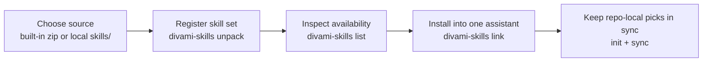

# End-User Handbook

Divami Agents is a Python CLI and terminal UI for installing, browsing, and syncing reusable AI skills into the folders that different coding assistants already watch. In this repo, a "skill set" is a directory of skill folders, and each skill folder is copied or symlinked into an assistant-specific destination such as `~/.codex/skills` or `.agents/skills` inside a repo. This handbook is for the person who wants to use the tool, not maintain it. By the end, you should know the happy path for registering a skill set, linking it into an assistant, and keeping a repo-local selection in sync.

## Who This File Is For

Use this file if your question is "what do I run next?" and you are trying to get skills into Claude, Codex, Gemini, or Copilot.

You do not need to understand the internal relay model in order to use the tool. You only need to know which skill set you want, which assistant should receive it, and whether you want a global install under your home directory or a repo-local install inside the current project.

## Before You Begin

This project ships a console script named `divami-skills`. `pyproject.toml` also exposes `divami-agents` as the same entrypoint, so either command reaches the same CLI.

You need:

| Requirement | Type | Default | Why it matters |
|---|---|---|---|
| Python | runtime | `>=3.9` | The package is built<br/>and installed as a<br/>Python CLI. |
| `pyzipper` | dependency | installed by package | Required when unpacking<br/>the encrypted built-in<br/>skill archive. |
| `textual` | dependency | installed by package | Required for the<br/>interactive `tui` command. |
| `DIVAMI_AGENTS_PASSWORD` | env var | none | Required only for<br/>downloading and extracting<br/>the built-in skills zip. |

The built-in install path for unpacked skill sets is `/Users/yeshwanth/agents/skill-sets` on this machine because the code resolves it as `~/agents/skill-sets`.

## The Fastest Working Path

Most users only need three actions: register a skill set, inspect what is available, and link it into one assistant. If you want to work from this repo directly instead of downloading the packaged release, use `unpack --skills-folder .` first.



### Step 1: Register a Skill Set

If you want the packaged Divami skills from GitHub releases:

```bash
export DIVAMI_AGENTS_PASSWORD="..."
divami-skills unpack
```

This downloads the latest `skills.zip` from `yeshwanth-divami/divami-skills-dist`, decrypts it with `DIVAMI_AGENTS_PASSWORD`, and merges its skill folders into `~/agents/skill-sets/divami-skills`.

If you want to use this repo's local `skills/` directory without downloading anything:

```bash
divami-skills unpack --skills-folder .
```

That registers the local `skills/` folder as a skill set by creating a symlink under `~/agents/skill-sets/<name>`. If you do not pass `--skillset-name`, the tool uses the parent directory name of the resolved `skills/` directory.

### Step 2: See What the Tool Knows About

Run:

```bash
divami-skills list
```

This prints a matrix of skill sets on the left and assistant targets across the top. The output is read-only. A `✓` means every skill in that set is present for that assistant, `~` means only some are present, and `·` means none are present.

If you want the tool to also scan extra skill roots outside `~/agents/skill-sets`, pass `-r` or `--roots`. Each root may be a repo root or a `skills/` directory directly.

```bash
divami-skills list -r ~/Code/other-repo -r ~/tmp/custom-skills
```

### Step 3: Install One Whole Skill Set Into One Assistant

Run:

```bash
divami-skills link <skillset> <llm>
```

Examples:

```bash
divami-skills link divami-agents codex
divami-skills link divami-agents codex-local --cwd /path/to/repo
divami-skills link yeshwanth-skills claude
```

Assistant names come from the runtime configuration. Out of the box, the code knows these global names: `claude`, `codex`, `gemini`, `copilot`. When `--cwd` is present, the tool also exposes repo-local names: `claude-local`, `codex-local`, `gemini-local`, `copilot-local`.

The local targets are:

| Local name | Writes into |
|---|---|
| `claude-local` | `.claude/skills` |
| `codex-local` | `.agents/skills` |
| `gemini-local` | `.gemini/skills` |
| `copilot-local` | `.github/skills` |

### Step 4: Remove a Whole Skill Set

Run:

```bash
divami-skills unlink <skillset> <llm>
```

This removes the installed skill entries for that set from the selected assistant target. Use the same assistant name you used with `link`.

## Repo-Local Workflow

If your team wants each repo to declare its own subset of skills, use the RC file workflow. The RC file is `.divami-skills.toml` in the repo root.

Start by generating a template:

```bash
divami-skills init --cwd /path/to/repo
```

That creates `.divami-skills.toml` with one section per assistant and one array per discovered skill set. The template is populated with whatever is already linked at generation time, so it acts as both starter config and a snapshot.

After editing the file, apply it with:

```bash
divami-skills sync --cwd /path/to/repo
```

The sync command links only the explicitly listed skills, reports which ones were newly linked, which were already present, and which names were missing from the declared skill set.

## Interactive Mode

If you prefer a keyboard-driven matrix instead of one command at a time, run:

```bash
divami-skills tui --cwd /path/to/repo
```

The TUI shows one column per assistant target and one row per skill set or individual skill. Use it when you want to expand a set, inspect status, and install or remove entries without editing the RC file by hand.

Key bindings:

| Key | Action | What it changes |
|---|---|---|
| `Enter` or `Space` | toggle | Expand a skill set<br/>or install/remove the<br/>selected cell. |
| `t` | view toggle | Switch between global<br/>assistant paths and repo-local<br/>assistant paths. |
| `m` | mode toggle | Switch install mode<br/>between copy and symlink. |
| `r` | refresh | Rebuild the matrix<br/>from disk. |
| `q` | quit | Exit the TUI. |

The symbols have meaning: `*` marks a symlink-backed install and `✝︎` marks a copied install.

## Command Reference

This section is intentionally compact. The happy path above comes first because most readers need the workflow, not the parser signature.

### `unpack`

Purpose: register a skill set source.

Arguments and flags:

| Name | Type | Default | Meaning |
|---|---|---|---|
| `--skills-folder DIR` | path | none | Use a local source<br/>instead of downloading the<br/>built-in release zip. |
| `--skillset-name NAME` | string | parent folder name | Override the registered<br/>name used under `~/agents/skill-sets`. |

### `list`

Purpose: show discovered skill sets and install status.

Arguments and flags:

| Name | Type | Default | Meaning |
|---|---|---|---|
| `--cwd DIR` | path | current directory | Sets the repo root<br/>for local assistant paths. |
| `-r, --roots PATH ...` | list of paths | none | Adds extra skill roots<br/>to discovery for this run. |

### `link` and `unlink`

Purpose: install or remove one whole skill set for one assistant target.

Arguments and flags:

| Name | Type | Default | Meaning |
|---|---|---|---|
| `skillset` | string | required | Registered skill-set name. |
| `llm` | string | required | Assistant target name such<br/>as `codex` or `codex-local`. |
| `--cwd DIR` | path | current directory | Required for meaningful<br/>`*-local` targets. |
| `-r, --roots PATH ...` | list of paths | none | Adds extra discovery roots<br/>for this run. |

### `init`

Purpose: create `.divami-skills.toml`.

Arguments and flags:

| Name | Type | Default | Meaning |
|---|---|---|---|
| `--force` | boolean | `false` | Overwrite an existing<br/>RC file. |
| `--cwd DIR` | path | current directory | Repo root where the<br/>RC file should be created. |
| `-r, --roots PATH ...` | list of paths | none | Adds extra skill roots<br/>to the generated template. |

### `sync`

Purpose: apply `.divami-skills.toml`.

Arguments and flags:

| Name | Type | Default | Meaning |
|---|---|---|---|
| `--cwd DIR` | path | current directory | Repo root that owns<br/>the RC file and local<br/>assistant paths. |
| `-r, --roots PATH ...` | list of paths | none | Adds extra skill roots<br/>during resolution. |

## If You Get Blocked

If `unpack` fails before download starts, the usual cause is a missing `DIVAMI_AGENTS_PASSWORD`. If it fails after download, the usual cause is a wrong password or a corrupt archive.

If `link` says the assistant name is unknown, re-run with `--cwd` if you intended to target a repo-local path. The `*-local` names only make sense when the tool knows which repo root you mean.

If `sync` says the RC file is missing, run `divami-skills init` first in that repo. If `sync` reports missing skills, the names in `.divami-skills.toml` do not match the folders present in the selected skill set.
