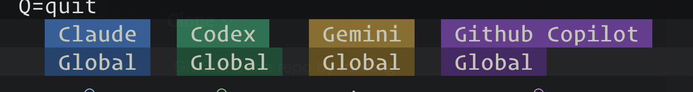
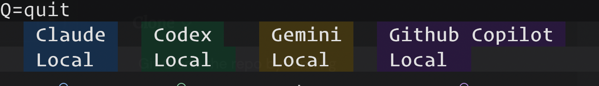

Divami Agents helps you install reusable skills into the folders your coding assistant already reads. You do not need to learn the package internals to use it; you only need a registered skill set and a target assistant such as Claude, Codex, Gemini, or Copilot. This handbook is the shortest path from clone to working TUI. By the end, you should know what to run first, what the symbols mean, and what to check when an install does not land where you expected.

# End-User Handbook

## Start Here

### Clone
Git Clone the repo by running

```bash
git clone https://github.com/yeshwanth-divami/divami-agents
```

### Setup
For a first run from this repo, use:

```bash
make setup-tui
```
That target installs `uv` if needed, installs `divami-agents` as a global tool, registers this repo's `skills/` directory through `divami-agents unpack`, and opens the Textual TUI. 

This step does not install any individual skill into Claude, Codex, Gemini, or Copilot yet. It only makes the `divami-agents` skill set discoverable by creating a registry entry under `~/agents/skillsets/`, so the TUI can show the skills as available choices.

### Install basic skills

In the TUI, toggle to global mode 



Installing in global mode creates entries in the assistant's user-level skill folder such as `~/.codex/skills` or `~/.claude/skills`. Those skills then become available in every repo for that assistant unless a repo-local install deliberately overrides the same skill name.

install `retrospect-and-update-skill` and `convo-with-me` globally for the LLMs that you use (Better to install it for all the assistants you use, so you have a consistent experience across them). These two skills are the foundation of the preferred collaboration style. 

`retrospect-and-update-skill` is how you update all the skills going forward.

As an example you were able to set up your name and other preferences that `convo-with-me` relies on to apply the working style rules in every conversation.

### Test in a new conversation
Start a new conversation and the assistant should automatically ask you to set up your name with `retrospect-and-update-skill` if you haven't already, and then apply the `convo-with-me` rules for the rest of the conversation. 

Nothing new is installed during this step. You are only verifying that the assistant can now see the globally linked skills and trigger their instructions in a fresh session. Also, because you have updated `convo-with-me` with your name, the assistant should greet you by that name in the first message on every subsequent conversation.


### Install Skills in your repo



```bash
cd /path/to/your/repo
divami-agents tui --cwd /path/to/your/repo
```

Skill-wise implication: repo-local installs write assistant-facing links under that repo, such as `.agents/skills` for Codex or `.claude/skills` for Claude. Under the hood, each local install points first to `<repo>/agents/<skill-name>`, which acts as the shared relay for any local assistant targets in the same repo.

## What The TUI Shows

Each row is either a skill set or an individual skill inside an expanded set. Each column is one assistant target in either the global view or the local view. Press `t` to switch between those views.

| Symbol | Meaning in the current view |
|---|---|
| `●` | Installed in the selected target. |
| `◎` | Visible only from the local view: installed globally, not locally. |
| `○` | Mixed state across the skills in a set. |
| `·` | Not installed in the selected target. |

## The Main Workflow

Use the arrow keys to move. Press `Enter` or `Space` on the name column to expand or collapse a skill set. Press `Enter` or `Space` on an assistant cell to install or remove that skill set or skill for that target. Press `r` to refresh the matrix and `q` to quit.

Local targets resolve under the repo given by `--cwd`, with `.agents/skills` for Codex, `.claude/skills` for Claude, `.gemini/skills` for Gemini, and `.github/skills` for Copilot. For why those folders exist and how they are resolved, see [developer.md](developer.md).

## If You Get Blocked

If the matrix is empty, the machine likely has no registered skill sets under `~/agents/skillsets/`; rerun `divami-agents unpack` from a repo that has a `skills/` directory. If local columns are missing, reopen the TUI with `--cwd /path/to/repo`. If an install does not appear where you expect, press `t` to confirm whether you are looking at the global or local view before assuming the link failed.
