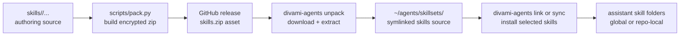

# Ops Handbook

This project is operationally simple: it is a Python package that ships a CLI, a Textual TUI, and a packaged archive of skills. There is no long-running service to deploy. The main operations work are building the encrypted skill archive, publishing a release, validating that dependencies are present, and diagnosing path or packaging failures on a workstation. This handbook covers those runtime and release procedures.

## Runtime Footprint

Divami Agents runs entirely on the local filesystem. A command reads registered skill sets, then creates or removes filesystem entries in assistant-owned skill directories.



The shipping asset is `src/divami_skills/skills.zip`. The code that consumes it lives in `src/divami_skills/cli.py`. The working source for that archive is the repo's top-level `skills/` directory.

## Environment Requirements

The following are required before first use:

| Requirement | Type | Default | Why it matters |
|---|---|---|---|
| Python | runtime | `>=3.9` | The package installs as a Python CLI. |
| `uv` | build tool | installed by `make setup-tui` | Virtual environment and dependency management. |
The package metadata declares these runtime dependencies, all installed automatically by `uv sync`:

| Dependency | Source | Purpose |
|---|---|---|
| `pyzipper` | `pyproject.toml` | AES zip extraction and creation. |
| `textual` | `pyproject.toml` | Terminal UI runtime. |
| `tomli` | `pyproject.toml` | TOML parsing on Python < 3.11. |

The build system is `setuptools`. The Makefile assumes `uv` is available for environment management and publishing.

## Local Setup

For a first-time setup, clone the repository and run the bootstrap target:

```bash
git clone https://github.com/yeshwanth-divami/divami-agents
cd divami-agents
make setup-tui
```

`make setup-tui` installs `uv` via Homebrew if it is missing, runs `uv tool install --reinstall .` to register `divami-agents` as a global command, unpacks the skill archive, and opens the TUI. After this, `divami-agents` is available system-wide without activating any virtual environment. This is the recommended path for any new workstation.

If you need only the packaging toolchain without opening the TUI, use the `venv` target instead:

```bash
uv venv .venv --clear
uv pip install --python .venv pyzipper textual build twine tomli
```

This mirrors the `venv` target in [Makefile](Makefile) and is the fastest way to get the packaging toolchain into a clean environment.

## Building the Encrypted Skill Archive

The archive build is a local packaging step, not part of ordinary end-user usage.

Required input:

| Input | Type | Default | Why it matters |
|---|---|---|---|
| `ARCHIVE_KEY` | env var | none | Used as the AES<br/>zip key during pack. |

Run:

```bash
ARCHIVE_KEY="..." .venv/bin/python scripts/pack.py
```

Or through Make:

```bash
make pack
```

What happens:

1. `scripts/pack.py` walks every file under `skills/`
2. It writes them into `src/divami_skills/skills.zip`
3. The zip uses LZMA compression and WinZip AES encryption

The script exits immediately if `ARCHIVE_KEY` is missing. That is intentional because an unencrypted archive would break the distribution contract.

## Publishing a Release

The `publish` target in [Makefile](/Users/yeshwanth/Code/Divami/divami-agents/Makefile) performs the release sequence. It is the source of truth for the intended publish order.

Run:

```bash
make publish
```

Optional variable:

| Name | Type | Default | Meaning |
|---|---|---|---|
| `BUMP` | `patch|minor|major` | `patch` | Version bump applied<br/>before wheel build and<br/>release creation. |

The publish target:

1. Builds the encrypted archive through `pack`
2. Bumps the version in `pyproject.toml`
3. Rebuilds `dist/`
4. Uploads the wheel with Twine to the `divami` repository target
5. Creates a GitHub release in `yeshwanth-divami/divami-agents-dist`
6. Attaches `src/divami_skills/skills.zip` as the `skills.zip` asset

## Operational Checks

There is no dedicated test suite in the root project today, so operational verification is mainly command-level.

Recommended checks after packaging or installation changes:

```bash
python -c "from divami_skills import cli, manager; print('import ok')"
python - <<'PY'
from divami_skills import manager
print(manager.SKILL_SETS_DIR)
print(manager.GLOBAL_LLM_DEFAULTS)
print(manager.LOCAL_LLM_RELPATHS)
PY
divami-agents list
```

These checks confirm importability, resolved path contracts, and basic skill-set discovery.

## Failure Modes Worth Knowing

### `Error: archive key is required.`

Cause: the archive key env var is missing for `unpack` or `pack`.

Fix: export the variable in the same shell session that runs the command.

### `wrong archive key or corrupt zip`

Cause: decryption failed during unpack.

Fix: verify the key first. If the key is correct, re-download and try again.

### `No skill sets found in ~/agents/skillsets`

Cause: no skill set has been unpacked or registered yet, or discovery depends on an extra root that was not passed.

Fix: run `divami-agents unpack` or use `--roots` with `list`, `link`, `init`, or `sync`.

### TUI starts but actions do not appear to work

Cause: the selected assistant path is not the one you intended, often because the view is showing global targets when you expected repo-local targets.

Fix: press `t` to switch view and confirm the status line includes the expected `cwd`.

## Boundaries

The root project's operational scope ends at packaging and local filesystem installation. It does not provision the target assistants themselves, validate that an assistant actively loaded a skill after installation, or synchronize across machines. If you need those guarantees, they belong in a higher-level workstation setup process, not in this package.
