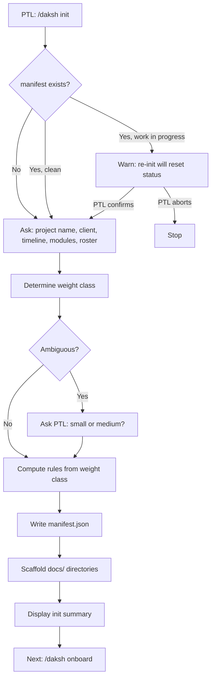
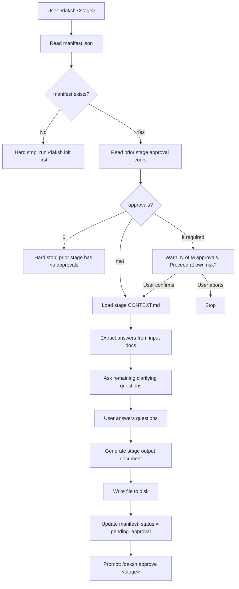
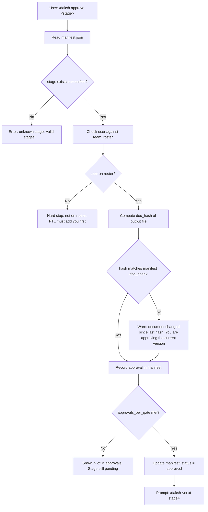
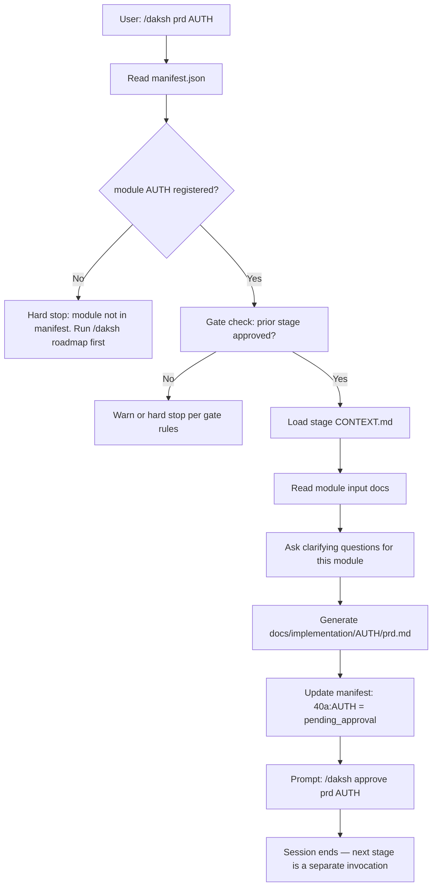
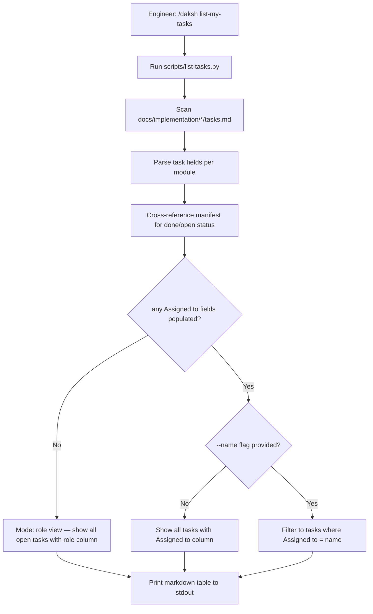
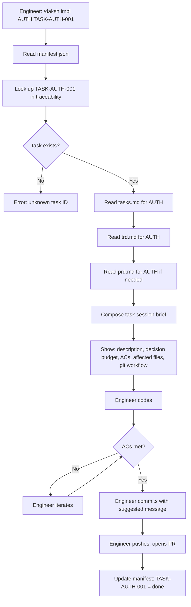
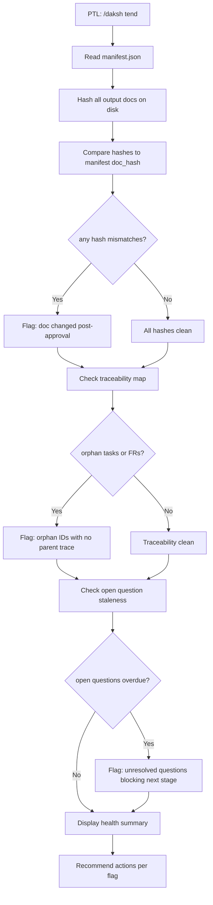
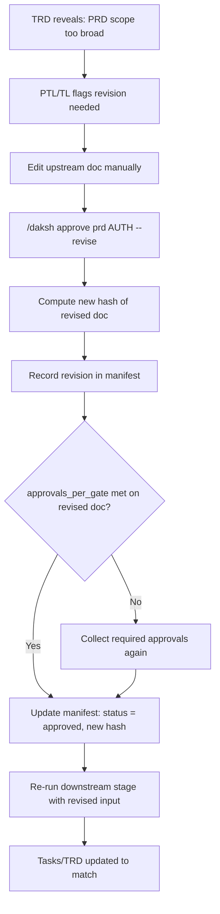
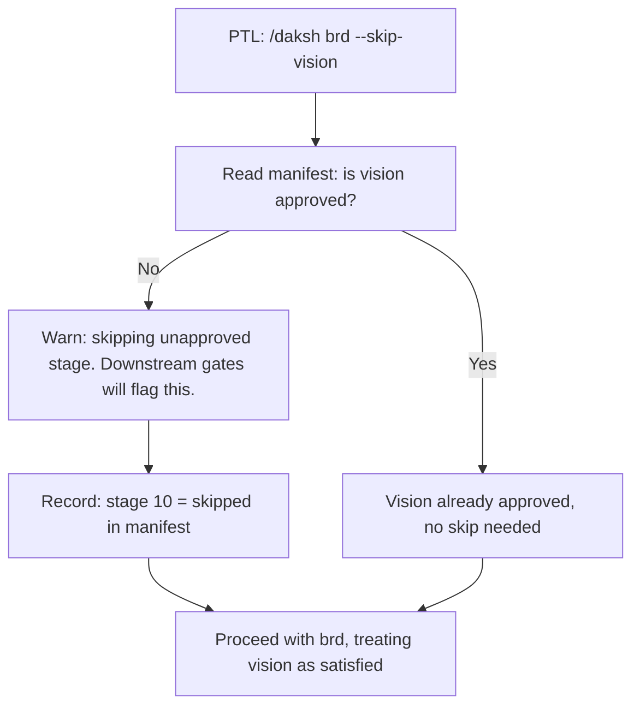
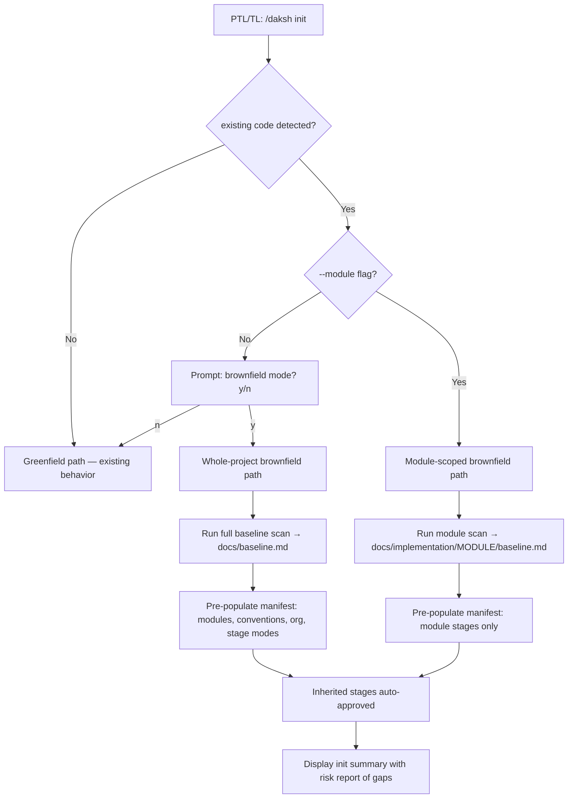

# What This BRD Covers — and Why It Exists

This document decomposes the approved Daksh vision into traceable, testable business requirements. It exists because a vision statement ("Daksh is how we approach software engineering at Divami") is a compass, not a blueprint — this BRD is the blueprint. Every [use case](glossary#uc) here traces back to a problem in the vision; every [functional requirement](glossary#fr) traces back to a use case. The audience is Yeshwanth (PTL), the future TL who will sign off, and any Divami engineer who wants to understand what Daksh is contractually supposed to do before reading code.

This BRD implements the vision at `docs/vision.md`.

---

## Scope

**In scope:**
- All 8 pipeline [stages](glossary#stage) as invocable commands (`onboard`, `vision`, `brd`, `roadmap`, `prd`, `trd`, `tasks`, `impl`)
- [Manifest](glossary#manifest) lifecycle: creation, reads, writes, hash validation, approval tracking
- Stage [gate](glossary#gate) enforcement (warn / [hard stop](glossary#hard-stop) based on approval count)
- [Weight class](glossary#weight-class) determination and rule derivation
- [Traceability chain](glossary#traceability-chain): [UC](glossary#uc) → [FR](glossary#fr) → [US](glossary#us) → [TASK](glossary#task)
- Error and alternate flows for all stages and commands

**Out of scope:**
- External integrations (Jira, Slack, email) — planned, not day-1
- CI/CD enforcement or git hooks
- Multi-user concurrent access control
- External client-facing approval portals
- Any UI beyond the copilot chat interface

---

## Stakeholders

| Role | Type | Involvement |
|------|------|-------------|
| PTL (Yeshwanth) | Primary | Runs `init`, reviews all stage outputs, approves gates |
| TL (TBD) | Primary | Signs off on gates, receives TRDs, owns module-level decisions |
| Engineer | Primary | Runs `impl`, receives self-contained task sessions |
| Divami (as org) | Secondary | Benefits from standardized output quality across projects |
| Future maintainer | Secondary | Inherits the skill; Daksh must be improvable via PRs |

---

## Use Cases

### UC-001 — Start a New Project Pipeline

**Actors:** PTL
**Preconditions:** No manifest exists in `docs/.daksh/manifest.json`

A PTL begins a new engagement and needs a configured pipeline before any documents are written. They invoke `/daksh init`, answer weight-class and [roster](glossary#roster) questions, and get a manifest and scaffolded directory tree. From that point, every subsequent stage has a home and the pipeline has a single source of truth.

**Alternate flows:**
- PTL specifies known modules upfront → manifest registers them; module dirs scaffolded immediately
- PTL overrides weight class with "treat as large" → rules recomputed for large
- PTL re-inits a clean pipeline → proceeds without warning

**Error states:**
- PTL attempts init inside a project with no git root → warn: "No git repository found. Daksh works best inside a git repo. Continue anyway? (y/n)"
- Manifest template missing from skill dir → hard stop: "Manifest template not found at `templates/manifest-template.json`. Skill installation may be incomplete."

---

### UC-002 — Run a Pipeline Stage

**Actors:** PTL, TL, or Engineer (depending on stage)
**Preconditions:** Manifest exists; previous stage is approved (or user accepts warning)

The core use case. A user invokes a named stage command, the system reads the manifest, checks the gate for the prior stage, asks clarifying questions, and generates the stage output document. This is the loop that runs 8 times per project.

**Alternate flows:**
- All questions already answered by input docs → skip to generate
- User skips a question explicitly ("skip") → record as open question in output
- User invokes stage out of order (e.g., `brd` before `vision`) → warn with stage dependency chain; proceed only with override

**Error states:**
- Input doc referenced in CONTEXT.md is missing → warn: "Expected `docs/vision.md` but it doesn't exist. Preceding stage may not have run. Proceed with missing input? (y/n)"
- Stage output file already exists with content → ask: "Output file exists. Overwrite, append, or abort?"

---

### UC-003 — Approve a Stage Gate

**Actors:** PTL or TL
**Preconditions:** Stage output document exists; user is on the team roster

[Approval](glossary#approval) is the mechanism that makes gates meaningful. Without it, stages are optional suggestions. The approver reads the document, invokes `/daksh approve <stage>`, and the manifest records their name, role, date, and a [doc hash](glossary#doc-hash) of the document at approval time. If the document changes after approval, the hash mismatch surfaces as a [stale approval](glossary#stale-approval) warning.

**Alternate flows:**
- Same person tries to approve twice → warn: "You already approved this stage. A second approval from you doesn't count toward the gate."
- TL approves a stage that only PTL should sign → manifest role check; warn if role constraint violated

**Error states:**
- Output file missing at approval time → hard stop: "No output document found for stage `vision`. Run `/daksh vision` first."
- Manifest write fails → display approval details; instruct user to paste manually

---

### UC-004 — Run a Module Document Stage (PRD / TRD / Tasks)

**Actors:** TL (PRD, TRD), Engineer (Tasks)
**Preconditions:** Prior module stage approved; module registered in manifest

Module document stages are invoked one at a time, each in its own session. A TL runs `/daksh prd AUTH`, gets the PRD approved, then runs `/daksh trd AUTH`, and so on. Each invocation follows the same pattern: gate check on the prior stage, load module-scoped inputs, ask clarifying questions, generate output, update manifest. The diagram shows PRD as the example; TRD and Tasks are structurally identical with different inputs and outputs.

*TRD replaces step H with `prd.md`; Tasks replaces it with `trd.md`. Output path and manifest key change accordingly.*

**Alternate flows:**
- Small [weight class](glossary#weight-class): PRD+TRD combined as `40a+40b:MODULE` → single document, merged questions, one approval gate
- Module added mid-project → `/daksh roadmap` updates manifest with new module; then proceed
- All questions answered by input docs → skip directly to generate
- *(Future — Jira sync enabled)* After `tasks.md` is generated, system creates one Jira ticket per TASK and stores the mapping in `manifest.jira.ticket_map`. `tasks.md` is the source of truth for task content; Jira is the execution view. Engineers update ticket status in Jira; task content changes go through Daksh first.

**Error states:**
- Module name collision (AUTH already exists) → hard stop: "Module AUTH already registered. Use a different short name."
- TRD reveals PRD scope was wrong → revision flow (see UC-007)

---

### UC-004.5 — List Tasks for an Engineer

**Actors:** Engineer
**Preconditions:** At least one `tasks.md` exists under `docs/implementation/`

An engineer wants to know what to work on without reading every `tasks.md` file manually. `/daksh list-my-tasks` runs `scripts/list-tasks.py` across all modules and prints a flat table of tasks with status, points, sprint, role, and — if sprint planning has happened — the name assigned to each task. This works in two modes depending on whether names have been assigned.

**Modes:**

- **Role mode** (no names assigned yet): shows all open tasks across modules; engineer picks one based on role match. Output columns: Task ID | Module | Summary | Points | Sprint | Assignee (role) | Depends on.
- **Name mode** (after sprint planning or Jira sync): `Assigned to` field is populated in `tasks.md`. `/daksh list-my-tasks --name "Alice"` filters to Alice's tasks. Output adds: Assigned to | Status.

**Alternate flows:**
- `--sprint N` flag → filter to a specific sprint
- `--module AUTH` flag → filter to one module
- `--open` flag → hide tasks where manifest status = done
- *(Future — Jira sync enabled)* `Assigned to` fields are populated automatically from Jira assignment; `--name` resolves against the Jira user map in manifest

**Error states:**
- No `tasks.md` found anywhere → hard stop: "No tasks found. Run `/daksh tasks MODULE` first."
- `tasks.md` found but unparseable (malformed headings) → warn per file and skip; show which files were skipped

---

### UC-005 — Implement a Task

**Actors:** Engineer
**Preconditions:** `tasks.md` for module exists; engineer has a specific task ID

The engineer's day-to-day use case. They invoke `/daksh impl MODULE TASK-ID` and receive a self-contained session brief: task description, [decision budget](glossary#decision-budget) (what they can decide vs. what needs escalation), acceptance criteria, affected files, and a git workflow (branch name, commit message template). They code, commit, and push without needing to re-read any upstream docs.

**Alternate flows:**
- Engineer invokes `impl` without a task ID → show all open tasks for the module; engineer picks one
- Engineer hits a decision that exceeds their budget → Daksh generates an escalation prompt for TL
- Task depends on another incomplete task → warn: "TASK-AUTH-001 depends on TASK-AUTH-003 (not done). Proceed anyway?"

**Error states:**
- `tasks.md` missing → hard stop: "Run `/daksh tasks AUTH` first."
- TRD and PRD are out of sync (hash mismatch in manifest) → warn: "TRD was updated after PRD approval. Tasks may be stale. Consider re-running `/daksh tasks AUTH`."

---

### UC-006 — Audit Pipeline Health

**Actors:** PTL
**Preconditions:** Manifest exists

The PTL wants a snapshot of the pipeline's health — which stages are done, which are stale, which docs have drifted from their approval hashes, and whether any [orphans](glossary#orphan) exist. This is `/daksh tend`.

**Alternate flows:**
- Everything clean → display a one-line "Pipeline healthy. Next: `/daksh <next stage>`"
- Manifest has stages with no output file on disk → flag as "stage registered but no artifact"

**Error states:**
- Manifest corrupted (invalid JSON) → hard stop: "Manifest parse failed. Backup at `docs/.daksh/manifest.json.bak` if available."

---

### UC-007 — Upstream Revision

**Actors:** PTL or TL
**Preconditions:** Downstream stage reveals a problem in an upstream approved document

This is the correction flow — the document feedback loop. A downstream stage (e.g., TRD) surfaces a problem in an upstream document (e.g., vision or PRD). The upstream doc needs a lightweight correction, not a full re-run. The approver revises the doc, re-approves, and the revision is recorded in the manifest with a hash pair (before/after) and reason.

**Alternate flows:**
- Revision is cosmetic (typo, formatting) → hash changes but approval is retained with a note
- Revision fundamentally changes scope → full re-run of affected downstream stages

---

### UC-008 — Add a Team Member to the Roster

**Actors:** PTL
**Preconditions:** Manifest exists

A TL joins the project mid-stream. They need to be added to the roster before they can approve gates. PTL invokes `/daksh init --add-member` or manually edits the manifest and runs `/daksh tend` to validate.

*(No flowchart — simple manifest update. Validation covered by UC-006.)*

---

### UC-009 — Skip a Stage (Weight Class Override)

**Actors:** PTL
**Preconditions:** Small weight class with combined stages, or explicit skip request

For small projects, stages 00+10 are combined and 40a+40b are combined. For even simpler cases (e.g., a team that already has a vision and jumps straight to BRD), a PTL may skip a stage. Daksh records the skip in the manifest and warns on any downstream gate that depends on the skipped stage.

---

### UC-010 — Retrofit Existing Repo with Daksh

**Actors:** PTL, TL
**Preconditions:** Existing repo with code and/or docs; no Daksh manifest (or module-scoped manifest)

A PTL or TL needs to adopt Daksh on a project that already has code, docs, and a backlog. Daksh supports three entry modes: greenfield (no existing code), whole-project brownfield (scan full repo, inherit existing stage artifacts, adapt to org conventions), and module-scoped brownfield (adopt Daksh on one module without requiring a whole-project commitment). The system scans what exists, maps artifacts to stage outputs, and surfaces gaps without requiring the team to pretend the project is starting from scratch.

| ID | Requirement | Traces to |
|----|-------------|-----------|
| FR-013 | System must detect existing code/docs at init time and offer brownfield mode; `--brownfield` flag bypasses prompt; `--module NAME` flag enters module-scoped path without prompt | UC-010 |
| FR-014 | In whole-project brownfield mode, system must scan repo and produce `docs/baseline.md` covering: tech stack, module boundaries, existing docs, git conventions, test/linter config | UC-010 |
| FR-014b | In module-scoped brownfield mode, system must scan the named module directory and produce `docs/implementation/[MODULE]/baseline.md`; must not infer or describe other modules | UC-010 |
| FR-015 | System must set `mode: inherited` for stages whose outputs already exist, `mode: delta` for stages with partial existing work, and `mode: greenfield` for gaps; inherited stages are auto-approved at init | UC-010 |
| FR-016 | System must populate `manifest.conventions` from scan results (git branch template, indent style, test framework, linter, CI config); all scan-derived values tagged `"source": "baseline-scan"` | UC-010 |
| FR-017 | System must populate `manifest.org.governance.stage_authority` from user input, allowing custom roles (e.g., Architect, Client) to be mapped to approval authority per stage; when absent, approve.py falls back to hardcoded PTL/TL map | UC-010 |
| FR-018 | System must populate `manifest.org.jira.existing_epics` so jira-sync places tasks under existing epics rather than creating duplicates; must read `manifest.org.jira.custom_fields` for field mapping | UC-010 |
| FR-019 | System must populate `manifest.org.capacity` (sprint length, current sprint, velocity per engineer, team allocation per module) so stage 40c can validate sprint assignments against real capacity | UC-010 |
| FR-020 | Approval gates must produce a risk report (missing approvals, stale hashes, open CRs) rather than a hard block; engineer is prompted to proceed with acknowledged risk; acknowledgement is written to `manifest.risk_acknowledgements` | UC-010 |
| FR-021 | System must support Discovery Records (DR-NNN) as a distinct artifact type from Change Records (CR-NNN); DRs reference code paths, not spec documents; tend must surface open DRs as a separate audit category | UC-010 |
| FR-022 | Module-scoped manifest must be self-contained and valid; subsequent full-project init must detect an existing module-scoped manifest and offer to merge rather than overwrite | UC-010 |

---

## Functional Requirements

### Pipeline Initialization

| ID | Requirement | Traces to |
|----|-------------|-----------|
| FR-001 | System must create `docs/.daksh/manifest.json` populated with project metadata, weight class, rules, roster, and stage skeleton on init | UC-001 |
| FR-002 | System must scaffold `docs/`, `docs/.daksh/`, `docs/conversations/client/`, `docs/implementation/` on init | UC-001 |
| FR-003 | System must determine weight class from timeline × module count; prompt user if ambiguous | UC-001 |
| FR-004 | System must warn (not hard stop) if manifest already exists with work in progress | UC-001 |
| FR-005 | System must compute `rules` block from weight class using the fixed mapping in manifest-schema.md | UC-001 |

### Stage Execution

| ID | Requirement | Traces to |
|----|-------------|-----------|
| FR-006 | System must read manifest before loading any stage CONTEXT.md; hard stop if manifest missing | UC-002 |
| FR-007 | System must count prior-stage approvals and enforce gate (0=hard stop, <required=warn, met=proceed) | UC-002, UC-003 |
| FR-008 | System must extract answers from input documents before asking clarifying questions | UC-002 |
| FR-009 | System must write stage output to the path specified in stage CONTEXT.md | UC-002 |
| FR-010 | System must update manifest stage status to `pending_approval` after output is written | UC-002 |
| FR-011 | System must warn (not hard stop) if an input document referenced in CONTEXT.md is missing | UC-002 |
| FR-012 | System must ask before overwriting an existing stage output file | UC-002 |

### Approval

Approved by: Yeshwanth
Role:        PTL
Date:        2026-03-30
Hash:        595cf5ee85c3…
