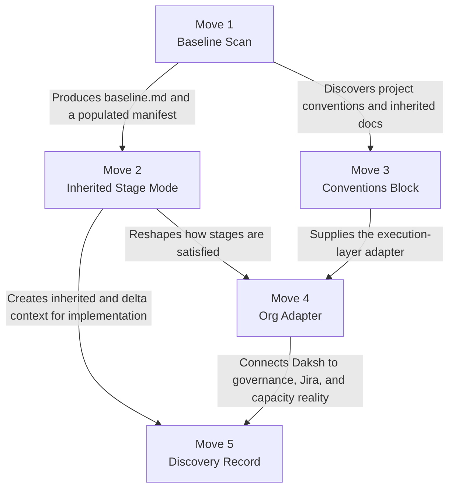

# Brownfield Gaps in Daksh

Daksh was designed as a greenfield pipeline: initialize the repo, create the
documents, then implement the code. Brownfield work inverts that order. The code,
docs, habits, and backlog already exist, and the system has to explain inherited
reality before it can improve it. This note is for a cold reader deciding whether
Daksh can be adapted to that world without turning the process into ceremony.

The core diagnosis is simple: Daksh has no durable model of prior state. It behaves as
though every project begins at stage zero and every artifact worth trusting was created
inside the pipeline. Once that assumption breaks, multiple downstream behaviors start
producing fiction instead of leverage.

> [!summary] Throughline
> Most of the observed deficiencies are not separate bugs. They are repeated symptoms
> of one architectural omission: inherited systems have state, and Daksh currently
> lacks a first-class way to import, describe, and respect that state.

## Why Brownfield Breaks the Current Flow

Brownfield work is like renovating a hospital while patients are still inside. You do
not get to pretend the building is empty just because the blueprint format prefers a
blank page. A process that starts by ignoring the existing structure will produce neat
documents that are directionally wrong.

That is what happens in Daksh today. The pipeline is sequential and additive, but
brownfield delivery is recursive and referential. New work depends on code that is
already deployed, branch conventions that teams already follow, docs that operators
already trust, and planning artifacts that often live outside Daksh entirely.

## The Gap Pattern

The sixteen gaps below collapse into five recurring failure modes:

1. Daksh cannot enter an existing project cleanly.
2. Daksh rewrites inherited context as if it were net-new authorship.
3. Daksh executes against its own defaults instead of discovered conventions.
4. Daksh does not adapt to the organization's governance, Jira, or capacity model.
5. Daksh has no clean artifact for discoveries that come from legacy code rather than
   from divergence against a Daksh-authored spec.

## The Sixteen Gaps

### G1 — No entry point other than zero

`/daksh init` scaffolds an empty manifest and empty directories. There is no import
mode that scans the codebase, infers module boundaries, detects the stack, and
bootstraps from what already exists. Brownfield teams are forced to pretend the repo
is new when it plainly is not.

### G9 — No "what already exists" audit

`/daksh tend` audits Daksh artifacts. It can't audit a codebase that predates Daksh — can't surface "this module has no tests" or "this API has no docs."

### G10 — Change records assume a Daksh-authored spec to diverge from

Change records (CR-NNN) capture divergence between spec and reality: "What was specified" vs. "What reality showed." In brownfield, the module may have no Daksh spec at all — the "spec" is the running code. When an engineer discovers that existing auth can't coexist with the new OAuth2 design, the CR format forces them to frame a **legacy constraint discovery** as a **spec divergence**. Two fundamentally different situations crammed into one format.

### G11 — Approval authority is hardcoded to PTL/TL

`approve.py` maps exactly two roles to approval permissions: PTL and TL. Client and Stakeholder roles exist in the roster but have no approval authority. In brownfield, the client's business owner may need to approve the PRD (stage 40a) — they own what the module does. An external stakeholder may need to sign off on roadmap changes. The governance model is too rigid for orgs that already have their own decision structure.

### G12 — Jira sync assumes a fresh project

`jira-sync.py` creates epics named `"{MODULE} Module"` and pushes tasks as new stories. It assumes Daksh owns the Jira structure. Brownfield projects have existing epics (named differently), in-progress stories, custom fields, board-specific workflows, and ticket numbering (`PROJ-1234`) that won't match `TASK-MODULE-NNN`. A sync push creates duplicates and orphans existing sprint plans.

### G13 — Tend ignores pre-Daksh code quality

Tend audits Daksh docs — hash drift, traceability orphans, stale approvals. It doesn't audit code. When a brownfield module has zero tests, no API docs, and 15% coverage, tend says "all clean" because there are no Daksh artifacts to flag. The quality gap is invisible until stage 60 (handbook) hits a wall trying to document unexplained code.

### G14 — Coding guidelines are prescriptive, not adaptive

`references/python-guidelines.md` and `references/typescript-guidelines.md` specify conventions as universal standards. They don't defer to existing codebase patterns. A brownfield Python project using 4-space indentation across 50k LOC will get new code in 2-space if the engineer follows Daksh guidelines. PR blocked. Time wasted. The guidelines should be defaults that yield to discovered conventions, not mandates.

### G15 — Handbook stubs orphan existing docs

Init scaffolds fresh handbook stubs. Handbook patch mode only touches sections generated by stage 50 tasks. A battle-tested runbook at `docs/ops/runbook.md` is never linked, never merged, never migrated. Operators keep using the old runbook. The handbook becomes a ghost document that duplicates but doesn't replace what already exists.

### G16 — Task sizing ignores existing team capacity

Stage 40c sizes tasks using a standard Fibonacci scale and assigns them to sprints from the roadmap. It doesn't know the team's actual velocity (10 points/engineer/sprint), current sprint number (mid-Sprint 4), or active capacity (2 engineers on AUTH). 21 points of work gets shoved into "Sprint 5" regardless. Sprint planning explodes because Daksh did capacity math without capacity data.

---

## Compound Solutions

> "A good solution solves a problem. A great solution wipes a class of problems."

Five structural moves solve all sixteen gaps. Three of the original moves extend naturally to absorb new gaps; two new moves handle the rest. Each move is independently valuable. Together they make Daksh brownfield-native without compromising greenfield rigor.

---

### Move 1 — The Baseline Scan

**One new step in init. Solves G1, G4, G5, G8, G15.**

When init detects an existing codebase (non-empty `src/`, `lib/`, `app/`, package files, or user says "brownfield"), it runs a **codebase scan** before asking questions. The scan:

- **Reads package manifests** (`package.json`, `go.mod`, `pyproject.toml`, `Cargo.toml`, etc.) → extracts tech stack, dependencies, language
- **Maps directory structure** → infers module boundaries (services, packages, top-level dirs with their own concerns)
- **Discovers existing docs** → READMEs, wikis, `docs/` folders, inline doc comments, OpenAPI specs — each tagged with audience (end-user, admin, ops, developer) and coverage summary
- **Reads git history** → branch naming patterns, recent contributors, active areas of code
- **Detects conventions** → test framework, linter config, CI/CD setup, env patterns

**Output:**

1. **`docs/baseline.md`** — a human-readable snapshot of inherited state. Not a full spec — a map. "Here's what exists, where it lives, and what shape it's in." Written once, referenced by every downstream stage.

2. **Pre-populated manifest** — modules, tech stack, team (from git contributors), git conventions, existing doc locations. All marked as `"source": "baseline-scan"` so it's clear what was discovered vs. declared.

3. **Existing docs mapped and linked** to Daksh's four handbook audiences. Handbook stubs are generated with `<!-- inherited: docs/ops/runbook.md -->` markers that the handbook command treats as merge sources, not blank sections. The existing runbook *becomes* the ops handbook's foundation — patched by new tasks, not replaced by empty stubs.

**Why this compounds:** A single scan at init eliminates the need for separate codebase-awareness in TRDs (G4), separate module discovery in roadmap (G5), the "no entry point" problem (G1), and the doc orphaning problem (G8, G15). The baseline becomes the brownfield equivalent of stage 00 — the inherited context that every downstream stage reads. Handbook stubs that reference existing docs instead of starting empty means the merge path exists from day one.

**What changes in existing Daksh:**
- `commands/init/CONTEXT.md` — brownfield detection + scan step
- `manifest.json` schema — `baseline`, `conventions`, `source` fields
- `templates/manifest-template.json` — new fields
- `commands/handbook/CONTEXT.md` — `<!-- inherited: path -->` merge logic
- New output: `docs/baseline.md`

---

### Move 2 — Inherited Stage Mode (The Fast-Forward)

**One new field per stage in the manifest. Solves G2, G3, G7.**

Each stage in the manifest gains a `mode` field:

```json
{
  "mode": "greenfield | inherited | delta",
  "status": "approved",
  "output": "docs/baseline.md#vision",
  "inherited_ref": "docs/baseline.md#section"
}
```

**Three modes:**

| Mode | Meaning | Document | Traceability | Gate |
|---|---|---|---|---|
| `greenfield` | Written from scratch through Daksh (current behavior) | Full spec | Full ID chain | Normal approval |
| `inherited` | Satisfied by existing product/code | Thin reference pointing to baseline.md | None — existing state isn't tagged | Auto-approved at init |
| `delta` | Existing state + planned changes | Baseline reference + "what's changing and why" | IDs only for new/changed work | Normal approval |

**How it works:**

- At init, the user (or the baseline scan) declares which stages are inherited vs. delta. Typical brownfield: stages 00–20 are inherited, stage 30 is delta (roadmap for new work), stages 40+ are greenfield or delta per module.
- Inherited stages are auto-marked `"status": "approved"` with their output pointing to the relevant section of `baseline.md`. Preflight treats them as valid predecessors.
- Delta stages produce a two-part document: "Here's what exists (from baseline)" + "Here's what's changing (new work)." Only the "changing" section gets traceability IDs.
- Traceability gains a `tier` field: `"tracked"` (full chain) or `"inherited"` (description-only reference, no ID). Only tracked items flow through the UC → FR → US → TASK chain.

**Why this compounds:** One field (`mode`) eliminates the need for separate stage bypass logic (G3), separate baseline document types (G2), and separate traceability tiers (G7). The pipeline becomes flexible without losing rigor — inherited stages don't skip gates, they satisfy them differently. Delta stages get exactly the documentation depth they need — no more, no less.

**What changes in existing Daksh:**
- `references/manifest-schema.md` — stage entries gain `mode` and `inherited_ref` fields
- `scripts/preflight.py` — accepts `inherited` and `delta` modes as valid
- `scripts/approve.py` — auto-approves inherited stages at init
- All stage CONTEXT.md files — preamble: "If this stage is `delta`, read baseline first, then document only what's changing"
- `traceability` schema — `tier: "tracked" | "inherited"` per entry

---

### Move 3 — The Conventions Block (The Adapter)

**One new manifest section. Solves G6, G9, G13, G14.**

The manifest gains a `conventions` block — the project's "how we do things here" config:

```json
{
  "conventions": {
    "git": {
      "base_branch": "main",
      "branch_template": "feat/{module}/{task-slug}",
      "pr_base": "develop",
      "commit_style": "conventional"
    },
    "code": {
      "language": "python",
      "indent": "4-space",
      "test_framework": "pytest",
      "linter": "ruff",
      "ci": "github-actions",
      "source_layout": "src/{module}/",
      "min_coverage": 80
    },
    "docs": {
      "existing": [
        { "path": "README.md", "audience": "developer", "covers": "setup, architecture" },
        { "path": "docs/runbook.md", "audience": "ops", "covers": "deploy, monitoring" }
      ],
      "api_spec": "openapi/spec.yaml"
    }
  }
}
```

**How it works:**

- Populated by the baseline scan (Move 1) or declared by the user at init. User can override any discovered value.
- **All downstream commands read conventions instead of hardcoding.** `impl start` uses `git.branch_template` instead of `[MODULE]/main`. `impl done` creates PRs against `git.pr_base` instead of assuming structure.
- **Coding guidelines become adaptive.** `references/python-guidelines.md` and `references/typescript-guidelines.md` gain a preamble: "If `conventions.code` exists in the manifest, defer to it for indentation, naming, test framework, and import style. These guidelines are defaults for greenfield only." The guidelines stop being mandates and become fallbacks.
- **Tend gains codebase-awareness.** It reads `conventions.code` to check: does every module in `source_layout` have tests? Is coverage above `min_coverage`? Is `api_spec` up to date? It audits the *project* against its own declared standards — not just Daksh artifacts against themselves. Pre-Daksh code quality gaps become visible.

**Why this compounds:** One config block makes the impl pipeline adapter-friendly (G6), makes guidelines adaptive instead of prescriptive (G14), gives tend something to audit against in brownfield (G9, G13), and provides a living reference for codebase conventions that TRDs and tasks can cite.

**What changes in existing Daksh:**
- `references/manifest-schema.md` — `conventions` schema
- `commands/init/CONTEXT.md` — populate conventions from scan or user input
- `commands/impl/CONTEXT.md` — read `conventions.git.*` for all git operations
- `commands/tend/CONTEXT.md` — codebase-aware checks using `conventions.code.*`
- `references/python-guidelines.md` — defer-to-conventions preamble
- `references/typescript-guidelines.md` — defer-to-conventions preamble

---

### Move 4 — The Org Adapter

**One new manifest section. Solves G11, G12, G16.**

The manifest gains an `org` block — the project's existing organizational state:

```json
{
  "org": {
    "governance": {
      "stage_authority": {
        "00": ["PTL", "Client"],
        "10": ["PTL", "Client"],
        "20": ["PTL", "Client"],
        "30": ["PTL", "TL"],
        "40a": ["PTL", "Client"],
        "40b": ["PTL", "TL", "Architect"],
        "40c": ["PTL", "TL"],
        "50": ["TL"],
        "60": ["PTL", "TL"]
      },
      "custom_roles": [
        { "role": "Architect", "name": "Dana", "email": "dana@co.com" },
        { "role": "Client", "name": "Ravi", "email": "ravi@client.com" }
      ]
    },
    "jira": {
      "project_key": "PROJ",
      "existing_epics": {
        "AUTH": "PROJ-42",
        "NOTIFY": "PROJ-87"
      },
      "custom_fields": {
        "story_points": "customfield_10016",
        "sprint": "customfield_10020"
      },
      "workflow_statuses": ["To Do", "In Progress", "In Review", "Done"]
    },
    "capacity": {
      "sprint_length_days": 14,
      "current_sprint": 4,
      "velocity_per_engineer": 10,
      "team_allocation": {
        "AUTH": { "engineers": 2, "available_from_sprint": 5 },
        "NOTIFY": { "engineers": 1, "available_from_sprint": 4 }
      }
    }
  }
}
```

**How it works:**

- **Governance becomes configurable.** `approve.py` reads `org.governance.stage_authority` instead of the hardcoded PTL/TL map. Client approvers can sign off on PRDs. Architects can approve TRDs. The authority model mirrors the org that already exists — Daksh adapts to the decision structure, it doesn't impose one.

- **Jira sync becomes a bridge, not a builder.** `jira-sync.py` reads `org.jira.existing_epics` to place tasks under the right epic (`PROJ-42`, not a new "AUTH Module" epic). It uses `custom_fields` to write story points and sprint assignments into the correct Jira fields. It respects `workflow_statuses` for transitions instead of assuming a default workflow. Brownfield Jira stays intact; Daksh adds to it.

- **Task sizing respects reality.** Stage 40c reads `org.capacity` to validate sprint assignments. If 21 points of AUTH work is planned but the team has 2 engineers at 10 pts/sprint (20 pts/sprint capacity), Daksh flags: "AUTH work needs 2 sprints minimum, not 1." Sprint boundaries align with the team's actual cadence, not Daksh's idealized plan. `current_sprint` prevents tasks from being assigned to sprints that already started.

**Why this compounds:** One manifest section solves three gaps that all stem from the same root cause: Daksh ignoring the organization's existing structure. Governance, Jira, and capacity are three expressions of one truth — the org already has a way of working, and Daksh needs to respect it. The `org` block is the adapter layer between Daksh's internal model and the organization's external reality.

**What changes in existing Daksh:**
- `references/manifest-schema.md` — `org` schema (governance, jira, capacity)
- `scripts/approve.py` — read `org.governance.stage_authority` instead of hardcoded roles
- `scripts/jira-sync.py` — read `org.jira.*` for epic mapping, custom fields, workflow statuses
- `stages/40c-tasks/CONTEXT.md` — capacity validation step using `org.capacity`
- `commands/init/CONTEXT.md` — collect org data (or import from Jira API)

---

### Move 5 — The Discovery Record

**One new artifact type. Solves G10, enhances G13.**

Change records gain a sibling: the **Discovery Record** (DR-NNN). Where a CR says "the spec said X but reality showed Y," a DR says "there was no spec for this — we found a constraint in existing code."

```markdown
# DR-NNN — [One-line description]

**Date:**
**Task:** TASK-[MODULE]-NNN
**Raised by:**

## What we found
[Describe the existing behavior, constraint, or technical debt discovered]

## Where it lives
[File paths, modules, APIs — concrete pointers into the codebase]

## Impact on current work
[How this affects the task in progress — blocks, complicates, or reshapes]

## Impact on baseline
[Should baseline.md be updated? Does this change the module map?]

## Proposed path forward
[Options: work around, refactor, accept, escalate]

## Decision
[Filled in by TL/PTL]

## Status: OPEN | RESOLVED
```

**How it works:**

- Discovery records live in the same `change-records/` directory as CRs but use `DR-` prefix.
- Unlike CRs, they don't reference a spec — they reference **code**. The "What we found" section points to files and behaviors, not documents.
- Discovery records feed back into the system:
  - **Baseline update:** If the discovery reveals something the baseline scan missed, `baseline.md` gets patched.
  - **Tend signal:** Open DRs become a tend audit category — "N discovery records unresolved." Tend can also correlate DRs with code quality: "3 DRs raised against AUTH, which has 15% test coverage — consider a quality sprint."
  - **Capacity adjustment:** Significant DRs may require capacity re-planning. Tend flags: "DR-003 added 8 points of refactoring to AUTH — sprint plan may need adjustment."

**Why this compounds:** One artifact type gives the implementation phase a vocabulary for brownfield reality (G10) and gives tend a signal layer for pre-Daksh code quality (G13 enhancement). CRs handle "spec vs. reality" divergence; DRs handle "no spec, just reality" discovery. The distinction matters because the response is different: a CR triggers a spec revision, a DR triggers a baseline update. Without this distinction, brownfield surprises get misclassified as spec failures — which poisons the feedback loop.

**What changes in existing Daksh:**
- `stages/50-implementation/CONTEXT.md` — DR format, when to use DR vs CR
- `commands/tend/CONTEXT.md` — open DR count, DR-to-quality correlation
- `commands/impl/CONTEXT.md` — DR creation during `impl start` when legacy constraints found
- New template: `templates/discovery-record.md`

---

## Coverage Matrix

| Gap | M1 Baseline | M2 Inherited | M3 Conventions | M4 Org | M5 Discovery |
|-----|:-----------:|:------------:|:--------------:|:------:|:------------:|
| G1 — No entry point | **P** | | | | |
| G2 — Net-new authorship | | **P** | | | |
| G3 — Gate rigidity | | **P** | | | |
| G4 — No codebase awareness | **P** | | + | | |
| G5 — Manual module discovery | **P** | | | | |
| G6 — Git assumptions | | | **P** | | |
| G7 — Traceability from zero | | **P** | | | |
| G8 — Blank-slate handbook | **P** | | | | |
| G9 — No codebase audit | | | **P** | | |
| G10 — CR assumes spec exists | | | | | **P** |
| G11 — Hardcoded approval roles | | | | **P** | |
| G12 — Jira assumes fresh project | | | | **P** | |
| G13 — Tend ignores code quality | | | **P** | | + |
| G14 — Guidelines not adaptive | | | **P** | | |
| G15 — Handbook orphans docs | **P** | | | | |
| G16 — Sizing ignores capacity | | | | **P** | |

**P** = Primary solve · **+** = Enhances

Five moves. Sixteen gaps. Full coverage. No move solves fewer than three gaps.

---

## Implementation Sequence



**Move 1 first** — it produces the data that every other move consumes. Without a baseline scan, there's nothing to inherit from, no conventions to discover, no org structure to read.

**Moves 2 and 3 in parallel** — Move 2 reshapes how the pipeline interprets stage state; Move 3 adapts how commands execute. Independent concerns, no dependency between them.

**Move 4 after 2 and 3** — it connects the adapted pipeline to external systems (Jira, org governance). Needs the conventions block (Move 3) to exist so Jira mapping has a home.

**Move 5 last** — it's an implementation-phase artifact. Only needed once teams are actually running tasks in brownfield. Can ship any time after Move 2 (which defines inherited/delta modes that DRs reference).

Each move is independently shippable. A team could use Move 1 alone (baseline scan + doc) and get immediate value. Moves 2–5 build on that foundation progressively.
