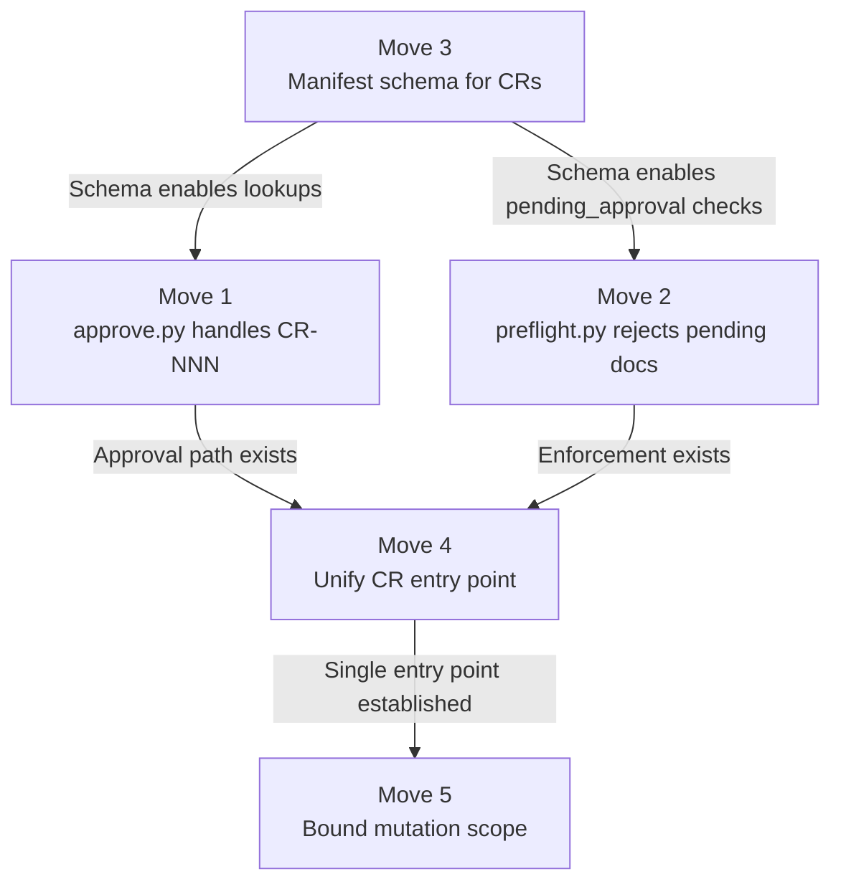

# Handling Change Requests in Daksh

Daksh is a stage-gated product development pipeline: vision → business requirements → roadmap → module specs → tasks → implementation. Each stage produces a document, each document gets approved, and each approval is a gate that downstream stages must pass through. The pipeline assumes that by the time an engineer starts coding, the spec they're coding against is correct. That assumption is a useful fiction. This document examines what happens when it breaks — when implementation discovers that the spec was wrong, incomplete, or impossible — and evaluates the `/daksh change` command proposed to handle it. By the end, you'll understand the structural problem, the shape of the proposed solution, where it succeeds, and where it still has gaps that would produce silent failures in practice.

> [!summary] Throughline
> Daksh's stage gates enforce a forward-only flow: plan, approve, implement. But reality
> doesn't flow forward. When implementation reveals that the plan was wrong, the system
> needs a controlled way to flow backward — to re-enter the planning layer, patch it,
> and re-gate the result before execution continues. The proposed `/daksh change` command
> is the right shape for this problem. Its governance model — gated re-planning, not
> ungated rewriting — is the key insight. But the current implementation is a sketch on
> one layer (CONTEXT.md instructions for the LLM) with no enforcement on any other layer
> (scripts, preflight, manifest schema). A gate that only the LLM knows about is not a
> gate. It's a suggestion.

---

## Why Change Breaks the Current Flow

A stage-gated pipeline is a one-way valve. Documents flow from left to right: vision produces business requirements, business requirements produce a roadmap, the roadmap produces module specs, specs produce tasks, tasks produce code. At each transition, an approval gate checks that the upstream document is finished, hashed, and signed off. The downstream stage can then trust its inputs.

Change requests invert that flow. An engineer implementing TASK-PREFLIGHT-003 discovers that `preflight.py` checks all module tasks instead of only the active task's dependencies. The TRD said "check the task's `Depends on` field" but the command interface only accepts `[MODULE]`. Two things went wrong at the same time: the spec was ambiguous about scope, *and* the implementation chose the maximalist interpretation of that ambiguity — blocking on every unfinished task in the module rather than erring on the side of permissiveness when the input didn't provide enough information to be precise.

CR-001 frames this as a single spec-vs-reality divergence. It isn't. It's two failures with different root causes and different fixes. The spec bug is: the TRD and the command interface disagreed about granularity (task-scoped rule, module-scoped input). The implementation bug is: given that ambiguity, `preflight.py` chose to over-block rather than under-block. A conservative implementation would have warned ("cannot verify per-task dependencies — module-level input only") instead of hard-failing. The spec fix is a planning change; the code fix is a judgment-call correction that stands regardless of whether the spec gets clarified.

This distinction matters because the change record format forces everything into one frame: "What was specified" vs. "What reality showed." That frame fits the spec bug. It doesn't fit the code bug — the code wasn't faithfully implementing a bad spec, it was making an independent bad call in the presence of spec silence. A format that can't distinguish "the spec was wrong" from "the code overreached beyond what the spec said" will consistently under-describe compound failures.

Regardless of root cause, the fix requires changes to the PRD (what the user expects), the TRD (how the system achieves it), and `tasks.md` (what work needs to happen). Three upstream documents need to be patched, but all three are already approved and gated. The pipeline has no reverse gear.

Before the proposed changes, stage 50's CONTEXT.md offered one mechanism: write a `CR-NNN.md` file and stop. The change record was a passive artifact — a note in a folder that said "something is wrong, await decision." It had no workflow, no manifest state, no approval path, and no way to propagate fixes back into the planning documents. The engineer wrote the note, then waited. The pipeline paused. Someone outside the system — a TL or PTL reading the file manually — had to decide what to do, then manually update the TRD, tasks, and manifest. Every step of that propagation was ad hoc.

> As Fred Brooks put it: "Plan to throw one away; you will, anyhow." Daksh's stage
> gates were designed to prevent throwing things away. But preventing throwaway without
> providing a revision path just means the throwaway happens informally, untracked,
> and ungated.

---

## What the Proposed Solution Gets Right

The conversation with ChatGPT converged on a design with one genuinely good structural idea: **separate re-planning from re-execution, and gate the boundary between them.**

`/daksh change [MODULE]` is a planning command, not an execution command. It:

1. Creates `CR-NNN.md` — the divergence record
2. Patches the affected planning docs (TRD, PRD, tasks) with a bounded delta
3. Creates a new change task in `tasks.md`
4. Marks every touched document as `pending_approval` in the manifest
5. Creates a Jira ticket for the change task

Then it stops. The engineer cannot run `/daksh impl start` on the change task until `/daksh approve CR-NNN` has been run, which approves the entire change set — the CR itself and every document it touched — as a single unit.

This is the right architecture. It mirrors how real engineering change orders work in hardware: the change proposal and the change execution are separate acts with a review gate between them. The LLM can do the re-planning work (it's good at that), but it cannot execute the re-plan until a human has reviewed it. The `pending_approval` state is the interlock.

The routing change in SKILL.md is clean — `change / cr [MODULE]` routes to `commands/change/CONTEXT.md`, following the same pattern as every other command. The approve extension (`/daksh approve CR-NNN`) is a natural overload. The `.vyasa` ordering update ensures change records render in the right place in the documentation site.

---

## The Eight Gaps

The design is structurally sound. The implementation is structurally incomplete. Eight gaps remain, and they cluster into three failure modes: the enforcement layer doesn't exist, the artifact semantics are ambiguous, and the scope of mutation is unbounded.

### Failure Mode 1 — No Enforcement Layer

#### G1 — `approve.py` doesn't know about CRs

The approve CONTEXT.md says: "If the target is `CR-NNN`, approve the whole change set." But `approve.py` only accepts stage names (`brd`, `prd`, `trd`, `tasks`, `impl`). It has no code path for `CR-NNN`. The approval of a change set is entirely a CONTEXT.md instruction to the LLM — meaning the LLM will *simulate* approval by writing JSON to the manifest, but no script validates the operation.

This matters because `approve.py` does real work: it hashes documents, checks roster permissions, validates open questions, writes approval blocks, and commits. A CR approval that bypasses all of that is an approval in name only.

#### G2 — `preflight.py` doesn't check `pending_approval`

The proposed governance model depends on `pending_approval` blocking `impl start`. But `preflight.py` checks whether the prior stage has enough approvals — it doesn't check whether individual documents within an already-approved stage have been reverted to `pending_approval` by a subsequent CR. An approved TRD that gets patched by `/daksh change` and marked `pending_approval` will still pass preflight, because preflight looks at `stages["40b:AUTH"].status`, not at per-document state.

The interlock doesn't interlock.

#### G3 — No manifest schema for change records

The manifest schema defines `stages`, `traceability`, `contracts`, and `jira`. It has no `change_records` section. The change CONTEXT.md says "update manifest with the CR path, affected docs, pending approval state" — but there's no schema for what that looks like. Where does the CR path go? How is the link between a CR and the documents it touched persisted? Without a schema, every LLM invocation will invent its own structure, and downstream consumers (tend, preflight, approve) can't reliably read it.

### Failure Mode 2 — Ambiguous Artifact Semantics

#### G4 — Two entry points, one artifact, different behaviors

Stage 50's CONTEXT.md still says: "if during implementation you discover divergence, write a change record." The new `/daksh change` command also writes change records. But the stage-50 path produces a passive note (no doc patches, no task creation, no manifest state change), while `/daksh change` produces a full re-planning cycle. An engineer reading stage 50 will create a passive CR. An engineer using `/daksh change` will get a gated workflow. Same artifact name, radically different behaviors.

Which path should an engineer use? When? The docs don't say. This will produce inconsistent CRs — some with full governance, some without — and tend will have no way to distinguish them.

#### G5 — The CR format diverges between stage 50 and change

Stage 50's CR format has `**Task:** TASK-[MODULE]-NNN` — singular, because it's written during implementation of one specific task. The change command's format has `**Tasks affected:** [TASK IDs, none yet, or inferred: ...]` — plural, because the change may affect multiple tasks. Same artifact type, two templates. A script that parses CRs must handle both formats, but neither document acknowledges the other exists.

#### G6 — Change records vs. discovery records

The [brownfield deficiencies analysis](brownfield-deficiencies.md) proposed a *Discovery Record* (DR-NNN) for situations where there was no spec to diverge from — where the finding is about inherited code, not about spec-vs-reality mismatch. The change command's CR format assumes a spec exists ("What was specified" / "What reality showed"). For brownfield work, this frame doesn't fit: the engineer found a constraint in legacy code, not a contradiction in a Daksh spec. The two artifact types need to coexist, and their boundary needs to be explicit.

### Failure Mode 3 — Unbounded Mutation Scope

#### G7 — "Smallest viable delta" is undefined

Step 5 of change/CONTEXT.md: "Patch the affected planning docs with the smallest viable delta that reflects the change." This is the most consequential step in the entire command — it's where the LLM rewrites approved documents — and it's described in one sentence. What counts as "smallest viable"? Can it add a new section to the TRD? Remove a task? Change acceptance criteria? Modify the BRD?

The `pending_approval` gate is supposed to catch bad patches. But a reviewer seeing a `pending_approval` flag on the TRD has no way to know what changed unless they diff the entire document. The change command should produce a structured diff summary — what was added, removed, or modified in each document — so the reviewer knows what they're approving.

#### G8 — Overlapping CRs create approval hazards

If CR-001 patches the TRD and marks it `pending_approval`, then CR-002 also patches the TRD before CR-001 is approved, what happens? Approving CR-001 marks the TRD as `approved` — but CR-002's changes are still in the document. The approval granularity is document-level, but the change granularity is section-level. One CR's approval can silently ratify another CR's unapproved changes.

---

## Compound Solutions

Five moves close all eight gaps. Three are script-level enforcement (making the governance model real), one is artifact clarification (making the semantics precise), and one is scope control (making the mutation safe).

### Move 1 — Extend `approve.py` to handle CR-NNN

Teach `approve.py` a new first argument: `CR-NNN`. When it receives one:

- Look up the CR in the manifest's `change_records` map (see Move 3)
- Validate the approver against roster and role permissions
- Hash every document the CR touched
- Write approval blocks into each touched document
- Mark all touched documents back to `approved`
- Mark the CR itself as `RESOLVED`
- Commit the lot

**Solves G1.** The approval path becomes real — same hashing, same roster validation, same commit discipline as every other gate.

### Move 2 — Teach `preflight.py` to reject `pending_approval` documents

When `preflight.py` runs for `impl`, after checking that the prior stage is approved, also check: do any documents in the output path of stages `40a`, `40b`, `40c` for this module have status `pending_approval`? If yes, fail hard with: "Documents modified by CR-NNN are pending approval. Run `/daksh approve CR-NNN` first."

**Solves G2.** The interlock interlocks.

### Move 3 — Add `change_records` to the manifest schema

```jsonc
{
  "change_records": {
    "CR-001": {
      "module": "PREFLIGHT",
      "path": "docs/implementation/PREFLIGHT/change-records/CR-001.md",
      "status": "OPEN",           // OPEN | RESOLVED
      "touched_docs": [
        "docs/implementation/PREFLIGHT/trd.md",
        "docs/implementation/PREFLIGHT/prd.md"
      ],
      "change_task": "TASK-PREFLIGHT-005",
      "raised_by": "Yeshwanth",
      "date": "2026-03-29"
    }
  }
}
```

This gives every downstream consumer (approve, preflight, tend) a machine-readable index of change records and the documents they touched.

**Solves G3.** Also enables Move 1 and Move 2 to look up CR state.

### Move 4 — Unify the change record entry point

Remove the inline CR-creation instructions from stage 50's CONTEXT.md. Replace with:

> If during implementation you discover that the spec is wrong, incomplete, or
> impossible, stop and run `/daksh change [MODULE]`. Do not write a change record
> by hand — the change command handles creation, doc patching, manifest state,
> and Jira. A hand-written CR is an ungated CR.

Reconcile the format: use `**Tasks affected:**` (plural) as the canonical field in both templates, since even a single-task CR benefits from the explicit field.

**Solves G4 and G5.** One entry point, one format, one workflow.

### Move 5 — Bound the mutation and make it diffable

Replace step 5 of change/CONTEXT.md with:

> 5a. For each affected planning doc, produce a **change summary** before modifying it:
>     ```
>     ## Changes to [doc name]
>     - Section X: [what changed and why]
>     - Section Y: [what changed and why]
>     ```
>     Include this summary in the CR document under a new `## Change Summary` section.
>
> 5b. Apply only the changes listed in the summary. Do not reorganize, reformat,
>     or "improve" untouched sections. The diff between the pre-change and post-change
>     document must correspond exactly to the items in the change summary.
>
> 5c. **Approval authority scales with reach.** The further upstream a CR reaches,
>     the heavier the gate:
>
>     | Highest doc touched | Required approver |
>     |---|---|
>     | `tasks.md` only | TL |
>     | TRD | TL or PTL |
>     | PRD | PTL |
>     | BRD / roadmap | PTL + Client |
>
>     The change command records the highest-touched tier in the CR metadata so
>     `approve.py` can enforce the right authority. No mutation is forbidden —
>     but the gate gets proportionally heavier.
>
> 5d. The following mutations require explicit confirmation from the engineer
>     before the command proceeds:
>     - Removing tasks (prefer marking as `cancelled` with rationale)
>     - Changing acceptance criteria on tasks already `In Progress` in Jira

**Solves G7.** The reviewer reads the `## Change Summary` in the CR to know exactly what they're approving, then diffs the doc to verify. The scope is bounded, the mutations are auditable.

For G8 (overlapping CRs): Move 3's `touched_docs` array enables detection. When `/daksh change` runs and a document it needs to modify is already `pending_approval` from another CR, it should warn: "TRD is pending approval from CR-001. Approve or resolve CR-001 before raising a new change against the same document." This is a soft block (warn, not fail) because sometimes overlapping CRs are intentional, but the engineer must acknowledge the overlap.

---

## Coverage Matrix

| Gap | M1 approve.py | M2 preflight.py | M3 Schema | M4 Unify | M5 Bound |
|-----|:---:|:---:|:---:|:---:|:---:|
| G1 — approve.py blind to CRs | **P** | | + | | |
| G2 — preflight ignores pending_approval | | **P** | + | | |
| G3 — No manifest schema for CRs | | | **P** | | |
| G4 — Two entry points, one artifact | | | | **P** | |
| G5 — Divergent CR formats | | | | **P** | |
| G6 — CR vs. DR boundary | | | | + | |
| G7 — Unbounded mutation scope | | | | | **P** |
| G8 — Overlapping CR approval hazard | | | **P** | | + |

**P** = Primary solve · **+** = Enables or enhances

---

## Implementation Sequence



**Move 3 first** — the schema is the foundation. approve.py and preflight.py both need the `change_records` map to function.

**Moves 1 and 2 in parallel** — they read the same schema but modify different scripts with no dependency between them.

**Move 4 after 1 and 2** — unifying the entry point only makes sense once the unified path has real enforcement behind it. Telling engineers "always use `/daksh change`" before the approval and preflight scripts support it would create a governance gap.

**Move 5 last** — bounding the mutation scope is a refinement of a working system, not a prerequisite for one. The system can function (safely, if noisily) with unbounded mutations gated by approval. The bound makes review easier; the gate makes it safe.

---

## Open Questions

1. **Should `/daksh change` support non-module-scoped changes?** The current syntax is `/daksh change [MODULE]`, but some changes affect the BRD or roadmap (stages 20/30), not a specific module. A client saying "we need to add OAuth2 support across all modules" isn't a module-level change — it's a roadmap-level change that spawns module-level work. The command may need a `/daksh change --roadmap` variant. Deferred until a real cross-module change request surfaces.

2. **Who can approve a CR?** Move 1 says "validate the approver against roster and role permissions" — but which roles? The brownfield analysis proposed configurable `stage_authority`. For now, the simplest answer is: whoever could approve the highest-stage document the CR touched. If it touched the TRD, TL or PTL. If it touched the PRD, PTL. But this should be explicit in the schema.

3. **What about the Jira double-push?** Change step 8 creates a Jira ticket. Approve step also says "create or push the generated change task to Jira." The boundary should be: change creates a *draft* Jira ticket (or skips Jira entirely), approve pushes the ticket live. This prevents unreviewed change tasks from appearing on the sprint board. Blocked on deciding whether draft Jira tickets are worth the API complexity.

4. **G6 — CR vs. DR coexistence.** The brownfield analysis designed Discovery Records for "no spec, just reality" findings. The change command's CR format assumes a spec exists. These need to coexist in the same `change-records/` directory with clear guidance on when to use which. Blocked on whether brownfield moves (from the [brownfield analysis](brownfield-deficiencies.md)) are in scope for the current sprint.
