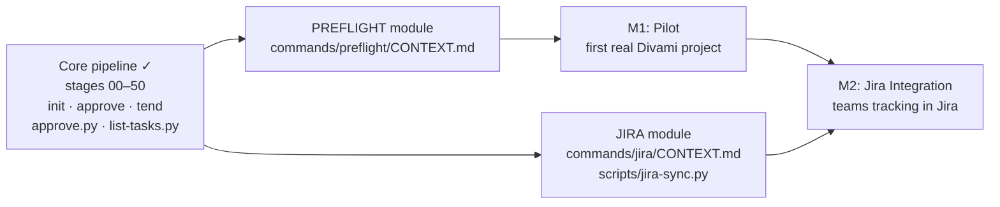

# What This Roadmap Covers — and Why This Build Sequence

This roadmap translates the approved Daksh [BRD](business-requirements.md) into a sequenced delivery plan for the two remaining modules: `preflight` (guards against bad stage invocations) and `jira` (bidirectional ticket sync). The core pipeline is already operational — all 8 [stage](glossary#stage) CONTEXT.md files, the `init`, `approve`, and `tend` commands, and the Python scripts that back them are written and working. What remains is the finishing layer that makes Daksh safe enough to pilot on a real engagement and connected enough to slot into Divami's Jira workflows.

The build sequence is PREFLIGHT first, JIRA second. PREFLIGHT is lower complexity, has higher day-1 impact (it's the guard rail every future engineer hits before running a [stage](glossary#stage)), and unblocks the pilot milestone. JIRA is explicitly deferred from day-1 per the [client context](client-context.md) and can't realistically be tested without a live project to push to.

This roadmap implements the BRD at `docs/business-requirements.md`.

---

## Scope

**In scope:**
- PREFLIGHT module — `commands/preflight/CONTEXT.md` + preflight validation logic
- JIRA module — `commands/jira/CONTEXT.md` + `scripts/jira-sync.py`
- Pilot — run Daksh on one real Divami project; `/daksh tend` at the end confirms no drift

**Explicitly deferred:**
- CI/CD enforcement or git hook integration
- External client approval portals
- Multi-user concurrent manifest access control
- Any work already delivered: stages 00–50, init, approve, tend, approve.py, list-tasks.py, extract-file-headings.py

---

## Team Map

| Name | Role | Owns |
|------|------|------|
| Yeshwanth | PTL | All stages, all commands, all scripts, pipeline gate approvals |
| TBD | TL | Module sign-off on PREFLIGHT and JIRA; joins at M1 or later |

Solo delivery until TL is hired. No parallel execution is possible now — all work is sequential through Yeshwanth.

---

## Dependency Graph

The core pipeline is the foundation everything builds on. PREFLIGHT and JIRA are independent of each other but both depend on the core being stable. The pilot depends on PREFLIGHT being done; Jira integration follows the pilot.



PREFLIGHT and JIRA could be built in parallel if a second contributor joined, but solo delivery makes them sequential. PREFLIGHT → Pilot → JIRA is the default order.

---

## Milestone Plan

| Milestone | Components | Delivers | Success criteria |
|-----------|------------|---------|-----------------|
| M1 — Pilot Ready | PREFLIGHT module | Engineers can run the full Daksh pipeline without hitting an undocumented edge case; preflight catches missing prerequisites before stages run | Daksh piloted on one real project; `/daksh tend` at end shows 0 orphans, 0 stale approvals, all hashes clean |
| M2 — Jira Integration | JIRA module | PTL can push task breakdown to Jira; status flows back to `tasks.md` and manifest | `/daksh jira push` creates Jira epics/stories; `manifest.jira.ticket_map` is populated; `/daksh jira pull` syncs done status back |

---

## Cross-Module Contracts

PREFLIGHT and JIRA are independent — no shared data model or API surface between them. Both read from the [manifest](glossary#manifest) but neither writes anything the other depends on.

| Producer | Consumer | What's passed |
|----------|----------|--------------|
| `manifest.stages` | PREFLIGHT | Stage status, prior-stage output path, `approvals_per_gate` |
| `manifest.stages` | JIRA | Stage keys, module names for epic hierarchy mapping |
| `docs/implementation/*/tasks.md` | JIRA | TASK IDs, sprint assignments, `Assigned to` fields |
| JIRA push | `manifest.jira.ticket_map` | Jira issue keys keyed by TASK ID |

---

## Parallel Work Plan

Everything is sequential while solo. If a TL joins before M2 is complete, the JIRA module could be developed in parallel with the pilot run. No blocking dependency between PREFLIGHT and JIRA — they share no outputs.

---

## Jira Epics, Sprints, and Stories

The PTL will create tickets from this structure. Every story traces to a [UC](glossary#uc) in the BRD.

```
Epic: Complete Command Layer
  Sprint 1 — Preflight is available for all pipeline stages
    Story: As a PTL, I can run /daksh preflight <stage> before any stage to catch
           missing prerequisites early (UC-002)
      Acceptance: preflight prints a clear pass/fail checklist; exits 0 if all clear;
                  blocks on missing manifest, failed gate, or missing output files

Epic: Jira Integration
  Sprint 2 — PTL can push task breakdown to Jira
    Story: As a PTL, I can run /daksh jira push to create Jira epics, sprints,
           and stories from the roadmap and tasks.md files (UC-004)
      Acceptance: tickets created with correct epic > sprint > story hierarchy;
                  manifest.jira.ticket_map populated with issue keys
    Story: As a PTL, I can run /daksh jira pull to sync Jira status back
           into tasks.md and manifest (UC-004)
      Acceptance: done tickets in Jira reflected as done in tasks.md status column;
                  no overwrites of task content — status only
  Sprint 3 — Engineers can use name-filtered task lists after Jira sync
    Story: As an engineer, I can run /daksh list-my-tasks --name "Alice" to see
           only my assigned tasks across all modules (UC-004.5)
      Acceptance: filters to tasks where Assigned to = Alice; --sprint and --open
                  flags work; warns if no tasks found for that name

Epic: Pilot
  Sprint 4 — Daksh completes first real engagement from init to tend
    Story: As a PTL, I run the full Daksh pipeline on a real Divami project
           and verify pipeline health at the end (UC-006)
      Acceptance: /daksh tend shows 0 orphans, 0 stale approvals, all doc hashes clean;
                  at least one engineer used /daksh impl with a self-contained task brief
```

---

## Open Questions

1. ~~**PREFLIGHT scope**~~ — **Decided:** preflight runs before every stage (woven in via `python scripts/preflight.py <stage> [MODULE]`). Stage 50 gets the strictest checks: tasks approved, TRD approved, no stale doc hashes, task dependencies done, git working tree clean. Skill detectability (doc-narrator, vyasa) is deferred to the PREFLIGHT TRD.
2. ~~**JIRA auth storage**~~ — **Decided:** three env vars: `JIRA_SERVER`, `JIRA_EMAIL`, `JIRA_TOKEN`. No file-based secrets. Specified in JIRA TRD.
3. ~~**list-my-tasks name resolution**~~ — **Decided:** LLM does best-match of the current user's name against Jira assignee names; user confirms; confirmed mapping stored in `manifest.jira.user_map` for reuse. Spec goes in JIRA TRD.
4. **FR coverage gap** — The BRD defines FR-001 through FR-012 covering init and stage execution. FRs for approval, module stages, list-tasks, impl, tend, upstream revision are not yet written. The PRD for PREFLIGHT and JIRA should define their own FRs; the BRD should be revised to add the missing FR sections for UC-003 through UC-009.
5. ~~**Pilot project selection**~~ — **Decided:** Daksh itself is the pilot project.

---

## Approval

Approved by: Yeshwanth
Role:        PTL
Date:        2026-03-28
Hash:        c7ad3975fdd0…
