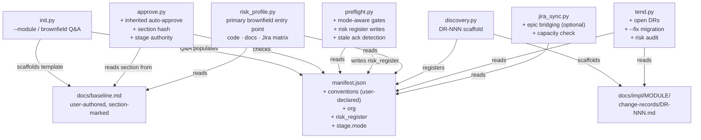
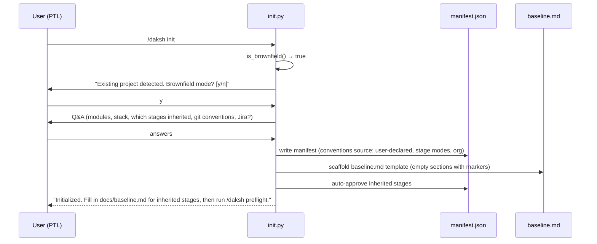
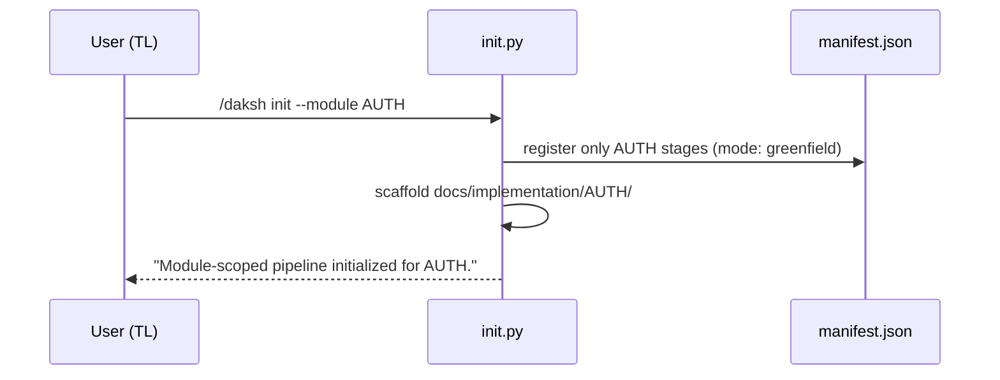
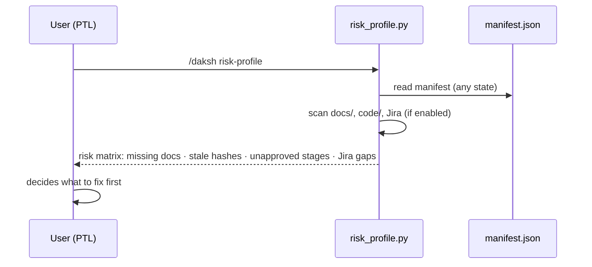
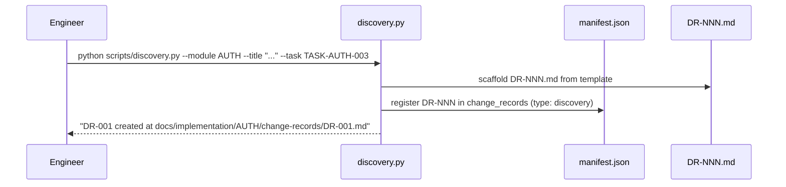

# BROWNFIELD — Technical Requirements

This document specifies how to implement the BROWNFIELD module. The PRD answers what and why; this answers how. Every design decision here traces to a BR or resolved decision in the PRD. Implementors should read the PRD first — this document assumes it.

**Revision note (2026-04-03):** This TRD was rewritten after the March 30 internal review (see [20260330-mom.md](../../conversations/internal/20260330-mom.md)). The key shift: Naveen's direction was to not invest in auto-retrofitting brownfield state. The original TRD specified a `scan.py` that would reverse-engineer an existing codebase into a `baseline.md`. That approach is removed. The brownfield entry point is now the risk report (`risk_profile.py`, already implemented), not a scan. Everything else is simplified accordingly.

---

## 1. Architecture Overview

BROWNFIELD is a **pure extension layer**. It adds new scripts, adds new manifest fields, and extends existing scripts with brownfield-aware branches. It does not replace or restructure existing Daksh components.

**New scripts:**

| Script | Purpose |
|--------|---------|
| `scripts/discovery.py` | DR-NNN scaffold and manifest registration |

**Extended scripts (new flags/branches only):**

| Script | Extension |
|--------|---------|
| `scripts/init.py` | `--module MODULE` flag, `merge` subcommand, brownfield Q&A path |
| `scripts/approve.py` | Inherited stage auto-approval, section-marker hashing, configurable stage authority |
| `scripts/preflight.py` | Mode-aware gate validation, risk-register writes instead of hard blocks, stale acknowledgement detection |
| `scripts/tend.py` | Open DR surfacing, `--fix` flag for manifest migration, pending risk audit |
| `scripts/jira_sync.py` | Existing-epic bridging, capacity-aware sprint assignment (Jira optional) |

**Already implemented — primary brownfield visibility tool:**

| Script | Role |
|--------|------|
| `scripts/risk_profile.py` | Scans code, docs, and Jira for missing or inconsistent artifacts; produces the risk report. This is the brownfield entry point — not a codebase scanner. |

**Removed from original TRD:**

- `scripts/scan.py` — automated codebase-to-baseline-md reverse engineering. Per the March 30 review: the adoption problem is intent, not tooling friction. A team that has bought in can author `baseline.md` via Q&A. A team that hasn't won't benefit from an automated scan.

**No new external dependencies.** All scripts use Python stdlib only. Nothing requires a network connection at init time (Jira bridging is optional and gated behind the `org.jira` block existing).

---

## 2. Component Diagram



---

## 3. Data Model

### 3.1 New manifest top-level fields

```json
{
  "conventions": {
    "git": {
      "branch_template": "feat/{module}/{task-slug}",
      "pr_base": "main",
      "source": "user-declared"
    },
    "code": {
      "indent": "4-space",
      "test_framework": "pytest",
      "linter": "ruff",
      "import_style": "absolute",
      "source": "user-declared"
    },
    "docs": {
      "readme_location": "README.md",
      "source": "user-declared"
    }
  },
  "org": {
    "governance": {
      "stage_authority": {
        "40a": ["PTL", "Client"],
        "40b": ["PTL", "TL", "Architect"],
        "20": ["PTL", "Client"]
      }
    },
    "jira": {
      "enabled": true,
      "existing_epics": {
        "AUTH": "PROJ-42",
        "PAYMENTS": "PROJ-55"
      },
      "custom_fields": {
        "story_points": "customfield_10016"
      },
      "workflow_statuses": {
        "in_progress": "In Development",
        "done": "Released"
      }
    },
    "capacity": {
      "current_sprint": 4,
      "velocity_per_engineer": 10,
      "team_allocation": {
        "AUTH": {
          "engineers": 2,
          "start_sprint": 5
        }
      }
    }
  }
}
```

All `source` fields take one of two values: `"user-declared"` (written by `init.py` Q&A or manual edit). There is no `"baseline-scan"` source — the scan path was removed. Manifest-wins rule applies: `init.py` Q&A never overwrites a field already in the manifest.

**Jira optional:** When `org.jira.enabled` is `false` (or the `org.jira` block is absent), `jira_sync.py` exits cleanly with: `"Jira integration is disabled for this project. Set org.jira.enabled: true in the manifest to enable."` No other script checks Jira state.

### 3.2 Stage mode field

Every stage entry in `manifest.stages` gains a `mode` field:

```json
{
  "40a+40b:AUTH": {
    "mode": "inherited",
    "status": "approved",
    "output": ["docs/implementation/AUTH/prd.md"],
    "inherited_ref": "section:stage-40a-AUTH",
    "doc_hash": {
      "docs/baseline.md#stage-40a-AUTH": "<sha256>"
    },
    "approvals": [
      {
        "by": "system",
        "role": "auto",
        "date": "2026-03-30",
        "reason": "inherited stage — auto-approved at init"
      }
    ]
  }
}
```

Valid `mode` values:

| Value | Meaning |
|-------|---------|
| `greenfield` | Stage was authored from scratch by Daksh (default for all existing stages) |
| `inherited` | Stage represents pre-existing work; auto-approved at init; `doc_hash` hashes a `baseline.md` section |
| `delta` | Stage has both inherited state and net-new work; document has two explicit sections |

Existing stages that lack a `mode` field are treated as `greenfield` by all scripts. Migration adds `"mode": "greenfield"` via `tend --fix`.

### 3.3 Baseline doc — user-authored template

`docs/baseline.md` is not scan-generated. `init.py` scaffolds an empty template when brownfield Q&A path is taken. The PTL fills it in. This is the same accountability model as every other Daksh document.

Section marker convention (required for inherited stage hashing):

```markdown
<!-- section:stage-00 -->
## Client Onboarding — Inherited State
...content authored by PTL/TL...
<!-- /section:stage-00 -->

<!-- section:stage-40a-AUTH -->
## AUTH Module — Existing Spec
...content authored by PTL/TL...
<!-- /section:stage-40a-AUTH -->
```

Section identifier convention: `stage-{key}` where `{key}` matches the stage key in the manifest (e.g., `00+10` → `stage-00-10`, `40a+40b:AUTH` → `stage-40a-AUTH`). Dashes replace `+` and `:`.

`approve.py` extracts the text between the markers (exclusive of the comment lines) and computes `sha256` of that substring. The `doc_hash` key is `"docs/baseline.md#stage-40a-AUTH"`.

If a stage's `inherited_ref` is set but the marker is absent from `baseline.md`, `approve.py` exits: `ERROR: Section marker <!-- section:{id} --> not found in {path}`.

### 3.4 Risk register (already implemented in preflight.py)

```json
{
  "risk_register": [
    {
      "risk_id": "RISK-001",
      "stage": "40a+40b:AUTH",
      "reason": "Stage 40a+40b:BROWNFIELD was not approved before running 40a+40b:AUTH",
      "detected_at": "2026-03-30T10:00:00+00:00",
      "status": "open",
      "acknowledged_by": null,
      "acknowledged_at": null,
      "hash_at_acknowledgement": null
    }
  ]
}
```

**Gate model (revised from original TRD):** Missing approvals are written to the risk register — they do not hard-block execution. When `preflight.py` detects a gate gap, it: (1) writes a RISK entry, (2) prints the risk report, (3) asks `"Proceed with acknowledged risk? [y/n]"`. If `y`, execution continues and `acknowledged_by`, `acknowledged_at`, and `hash_at_acknowledgement` are written. If `n`, execution stops with no manifest change. `risk_profile.py` surfaces all open and stale risk entries on demand.

Stale acknowledgement: when `preflight.py` runs, for each `acknowledged` entry, it computes the current hash of the referenced doc and compares to `hash_at_acknowledgement`. If different, it sets `status: "stale"` and raises a new WARN. Stale entries are not deleted.

### 3.5 DR manifest entry

```json
{
  "change_records": {
    "DR-001": {
      "type": "discovery",
      "module": "AUTH",
      "title": "Legacy session tokens stored in localStorage",
      "status": "OPEN",
      "raised_by": "Priya",
      "raised_at": "2026-04-02",
      "baseline_patch_required": true,
      "task_ref": "TASK-AUTH-003"
    }
  }
}
```

`type: "discovery"` distinguishes DRs from `type: "change"` (CRs). `tend.py` groups them separately.

---

## 4. API Contracts

### 4.1 `init.py` — extended CLI

```
python scripts/init.py                    # existing greenfield path
python scripts/init.py --brownfield       # force whole-project brownfield Q&A
python scripts/init.py --module AUTH      # module-scoped init
python scripts/init.py merge <path>       # merge module manifest into full project manifest
```

**Brownfield detection (heuristic only — no scan):**

```python
def is_brownfield(root: Path) -> bool:
    package_files = ["package.json", "pyproject.toml", "go.mod", "Cargo.toml", "composer.json"]
    code_dirs = ["src", "lib", "app"]
    if any((root / f).exists() for f in package_files):
        return True
    if any((root / d).is_dir() and any((root / d).iterdir()) for d in code_dirs):
        return True
    result = subprocess.run(["git", "rev-list", "--count", "HEAD"], capture_output=True, text=True)
    if result.returncode == 0 and int(result.stdout.strip() or 0) >= 5:
        return True
    return False
```

If `is_brownfield()` returns `True` and neither `--brownfield` nor `--module` was passed:

```
This looks like an existing project. Initialize in brownfield mode? [y/n]:
```

If `y` or `--brownfield`: runs brownfield Q&A path (see below). If `n`: runs greenfield path (existing behavior).

**Brownfield Q&A path (replaces scan):**

`init.py` asks the PTL directly for the information the scan would have inferred. Questions (in order):

1. `Project name:` (pre-filled from git remote or directory name)
2. `List top-level modules (comma-separated, e.g. AUTH,PAYMENTS):` 
3. `Primary language/framework (e.g. Python/FastAPI, TypeScript/Next.js):` 
4. `Which stages already have approved docs? (e.g. 00,10,20 or "none"):` → marks those stages `mode: inherited`
5. `Git branch naming convention (e.g. feat/{module}/{task-slug} or enter to skip):`
6. `Jira integration? [y/n]:` → if `y`, collect `project_key` and `existing_epics` per module; if `n`, set `org.jira.enabled: false`

After Q&A, `init.py`:
- Writes `manifest.json` with declared conventions (`source: "user-declared"`), stage modes, and org block
- Scaffolds `docs/baseline.md` from template (empty sections with markers for each declared-inherited stage)
- Auto-approves all `mode: inherited` stages
- Prints: `"Fill in docs/baseline.md sections for each inherited stage before running /daksh preflight."`

**Module-scoped init path:**

1. If a manifest already exists at `docs/.daksh/manifest.json`, load it. Otherwise create a new one.
2. Register only the specified module: add `"40a+40b:{MODULE}"`, `"40c:{MODULE}"`, `"50:{MODULE}"` stage keys with `status: "not_started"`, `mode: "greenfield"`.
3. Scaffold `docs/implementation/{MODULE}/` and `docs/implementation/{MODULE}/change-records/`.
4. Do NOT add global stages (00, 10, 20, 30).
5. Print: `"Module-scoped pipeline initialized for {MODULE}. Run /daksh init (no flag) to initialize the full project later."`

**Merge subcommand:**

```
python scripts/init.py merge docs/.daksh/manifest-auth.json
```

1. Load current `docs/.daksh/manifest.json` (full project manifest).
2. Load the module manifest at the given path.
3. For each stage key in the module manifest: if key absent in full manifest, copy it. If key present in both, apply higher-status-wins: `approved > pending_approval > not_started`.
4. For any status upgrade (lower → higher): print `"Upgrading {key} from {old} to {new}. Confirm? [y/n]"`.
5. Merge `conventions` (manifest-wins on conflict), `org` (manifest-wins on conflict), `change_records` (union by key), `risk_register` (union by risk_id).
6. Write merged manifest. Print summary: `"Merged {N} stages, {M} change records."`

### 4.2 `discovery.py` — new script

```
python scripts/discovery.py --module AUTH --title "Legacy session tokens in localStorage" --task TASK-AUTH-003
```

Scaffolds `docs/implementation/{MODULE}/change-records/DR-{NNN}.md` using the DR template (section 4.2.1), then registers the entry in `manifest.change_records` as `type: "discovery"`.

DR numbering: scan existing `DR-*.md` files in the module's change-records directory, take max NNN, increment by 1.

#### 4.2.1 DR template

```markdown
# DR-{NNN} — {title}

**Module:** {module}
**Task:** {task_ref}
**Raised by:** {name}
**Date:** {date}
**Status:** OPEN

## What we found

<!-- Describe the constraint: what exists, how it works, why it's a constraint -->

## Where it lives

<!-- File paths, module names, service boundaries -->

## Impact on current work

<!-- How this constrains TASK-{ref}: what you can't do, what you have to do differently -->

## Impact on baseline

<!-- Does docs/baseline.md or the module baseline need to be updated? -->

## Proposed path forward

<!-- Options + recommended approach. This is advisory — no approval required to proceed -->
```

### 4.3 `approve.py` — extensions

**Inherited stage handling (AC-BROWNFIELD-003a):**

```python
if stage_data.get("mode") == "inherited":
    print(f"Stage {stage_key} is inherited — no approval needed.")
    sys.exit(0)
```

Check this at the top of the approval flow, before any file existence checks.

**Section-marker hashing (resolved decision 2):**

When `stage_data.get("inherited_ref")` is set, compute the doc hash as follows:

```python
def hash_section(path: Path, section_id: str) -> str:
    text = path.read_text()
    start_marker = f"<!-- section:{section_id} -->"
    end_marker = f"<!-- /section:{section_id} -->"
    start = text.find(start_marker)
    end = text.find(end_marker)
    if start == -1 or end == -1:
        sys.exit(f"ERROR: Section marker <!-- section:{section_id} --> not found in {path}")
    section_text = text[start + len(start_marker):end]
    return hashlib.sha256(section_text.encode()).hexdigest()
```

The doc_hash key is `"{path}#{section_id}"` (e.g., `"docs/baseline.md#stage-00"`).

**Configurable stage authority (AC-BROWNFIELD-005):**

```python
def allowed_roles(manifest: dict, stage_key: str) -> list[str]:
    authority = manifest.get("org", {}).get("governance", {}).get("stage_authority", {})
    base_key = stage_key.split(":")[0].split("+")[0]
    if base_key in authority:
        return authority[base_key]
    return HARDCODED_AUTHORITY.get(base_key, ["PTL"])
```

The approver's role is looked up from `manifest.team_roster` by name match.

### 4.4 `preflight.py` — extensions

**Mode-aware prior-stage gate:**

```python
if stage.get("mode") == "inherited":
    return result("PASS", f"Stage {prior_key} is inherited — auto-approved", False)
```

**Gate enforcement model (revised):**

Missing approvals no longer hard-block. The flow:

```python
gaps = collect_gate_gaps(manifest, stage_key)
if gaps:
    print_risk_report(gaps)
    answer = input("Proceed with acknowledged risk? [y/n]: ").strip().lower()
    if answer != "y":
        sys.exit(0)  # no manifest change
    write_risk_acknowledgement(manifest, gaps, approver=current_user())
```

`write_risk_acknowledgement` appends to `manifest.risk_register` with `status: "acknowledged"`, `acknowledged_by`, `acknowledged_at`, and `hash_at_acknowledgement` for each referenced doc.

**Stale acknowledgement check:**

For each `acknowledged` entry in `manifest.risk_register`, check if the referenced doc's current hash matches `hash_at_acknowledgement`. If not, mark `status: "stale"` and emit a new WARN. This check runs at the top of every `preflight.py` invocation.

### 4.5 `tend.py` — extensions

**`--fix` migration flag (resolved decision 5):**

```
python scripts/tend.py --fix
```

Adds missing BROWNFIELD fields to an existing manifest:
- If `manifest.conventions` is absent: add `"conventions": {}`.
- If `manifest.org` is absent: add `"org": {}`.
- For each stage lacking `mode`: add `"mode": "greenfield"`.

Prints each field it adds. Does not overwrite existing values.

**New audit categories:**

```
Open Discovery Records: 2
  DR-001 [AUTH] Legacy session tokens in localStorage (TASK-AUTH-003)
  DR-002 [PAYMENTS] Custom date serialization in legacy models

Pending approvals with acknowledged risk: 1
  RISK-003 [40a+40b:AUTH] Stage 40a+40b:BROWNFIELD was not approved...
    Acknowledged by: Yeshwanth on 2026-03-30

Stale risk acknowledgements: 1
  RISK-001 [40a+40b:AUTH] — doc hash changed since acknowledgement; re-acknowledge required
```

---

## 5. Data Flow

### 5.1 Whole-project brownfield init



### 5.2 Module-scoped init



### 5.3 Risk-report-first brownfield onboarding



This flow works on any project state — no manifest required to start. It is the recommended first step for any brownfield onboarding.

### 5.4 DR creation



---

## 6. Technology Choices

| Choice | Rationale |
|--------|-----------|
| No codebase scan | Per March 30 review: adoption is an intent problem, not a tooling-friction problem. A team with intent fills in Q&A in 3 minutes. A scan that infers a wrong module boundary costs more to correct than it saved. |
| User-authored `baseline.md` | Same accountability model as every other Daksh doc. The PTL who knows the project writes it; the system hashes and gates against it. |
| `risk_profile.py` as brownfield entry point | Already implemented. Works on any project state without requiring a manifest. Naveen's framing: "generate a risk report no matter what state the project is in." |
| Risk register over hard blocks | Hard gates cause rubber-stamp approvals, which corrupt the audit trail. Risk-register-plus-weekly-review produces the same accountability with less friction. |
| Jira optional via `org.jira.enabled` | Naveen confirmed small/medium projects should be able to disable Jira entirely. One flag, clean exit, no other script changes. |
| HTML comment markers for baseline sections | Machine-parseable, invisible in rendered markdown, survives most doc edits. |
| Manifest-wins precedence (silent, no prompt) | A prompt-based merge breaks non-TTY invocations. Warning + proceed is the right tradeoff. |
| Higher-status-wins for merge | Only case where `merge` needs a prompt. Status downgrades are destructive; upgrades are expected. |

---

## 7. Non-Functional Requirements and Testing

### 7.1 Performance

No scan performance constraint (scan removed). Init Q&A completes in under 5 minutes for projects with ≤20 modules.

### 7.2 Correctness

- **Section marker hashing**: If a marker is present but the section is empty, `hash_section` returns the hash of an empty string. Correct — it means the section exists but has no content. `approve.py` must not treat an empty section as an error.
- **Module-scoped manifest**: Must pass `json.JSONDecodeError`-free parsing and all Daksh stage commands without modification. Tests must invoke `preflight.py prd AUTH` on a module-scoped manifest and assert exit 0.
- **Merge idempotency**: Running `init.py merge` twice on the same module manifest must produce the same result as running it once.
- **Risk-register-only gate**: `preflight.py` must never `sys.exit(1)` on a missing approval alone. Only `sys.exit(0)` (user said `n` to risk acknowledgement) or `sys.exit(1)` on a fatal error (missing manifest, corrupt JSON).

### 7.3 Test fixtures

All brownfield tests use filesystem fixtures, not mocks:

```
tests/fixtures/brownfield-repo/
    pyproject.toml
    src/
        auth/
            __init__.py
    docs/
        baseline.md          ← pre-written with section markers
    .daksh/
        manifest.json        ← module-scoped manifest stub with mode fields
```

### 7.4 Backward compatibility

All extensions are additive. Scripts that encounter a manifest without `conventions`, `org`, or stage `mode` fields behave identically to before. The `tend --fix` migration path is the supported upgrade path.

---

## 8. Open Questions

None. All open questions from the PRD were resolved before TRD authoring. The March 30 review resolved the one architectural question that remained open (scan vs. Q&A). Implementation questions belong in Discovery Records (DR-NNN), not here.

---

## Approval

Approved by: —
Role:        —
Date:        —
Hash:        —
