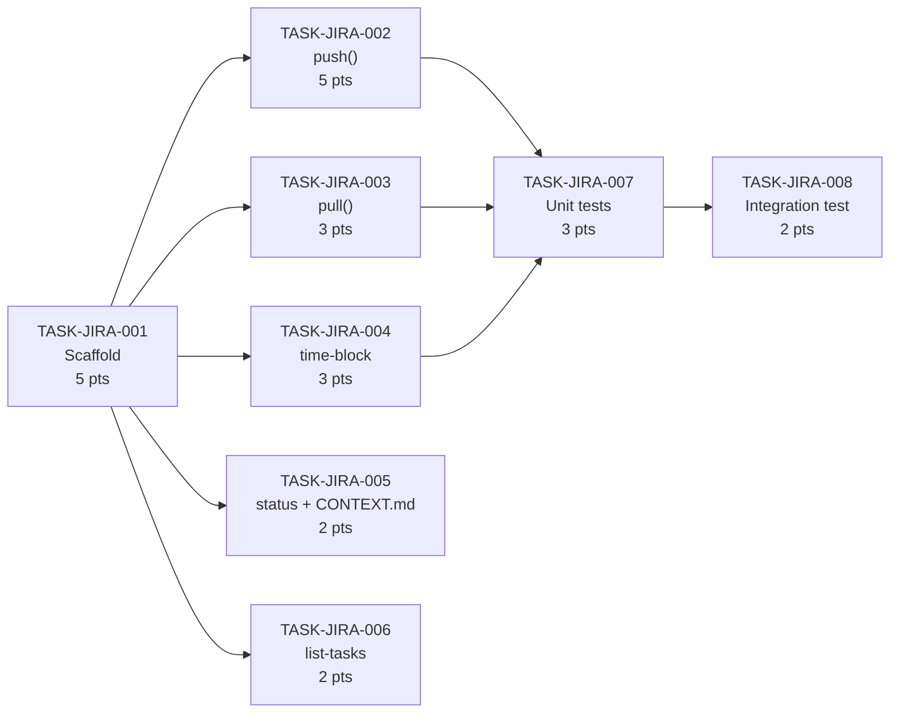

# JIRA Module Tasks — Sprint 2 and Sprint 3 Delivery Breakdown

This document breaks down `trd.md` into executable tasks for the JIRA [module](../../glossary#module). The audience is the PTL (Yeshwanth) running solo delivery. The module has more surface area than PREFLIGHT — five distinct behaviors (push, pull, time-block, status, list-tasks) across two deliverables (`scripts/jira-sync.py` and an enhancement to `scripts/list-tasks.py`) — so the scaffold task is load-bearing. Nothing else runs until TASK-JIRA-001 is done.

The `jira` Python library is a hard dependency here. Install it before starting Sprint 2: `uv pip install jira`. All other I/O is stdlib.

---

## Task Summary

| ID | Summary | Points | Sprint | Role | Depends on |
|----|---------|--------|--------|------|-----------|
| TASK-JIRA-001 | Scaffold jira-sync.py — arg parse, JIRA client, manifest I/O, parse/update tasks.md | 5 | Sprint 2 | PTL | none |
| TASK-JIRA-002 | Implement push() — Epic/Sprint/Story hierarchy → ticket_map | 5 | Sprint 2 | PTL | TASK-JIRA-001 |
| TASK-JIRA-003 | Implement pull() — query Jira status → tasks.md Status column + traceability | 3 | Sprint 2 | PTL | TASK-JIRA-001 |
| TASK-JIRA-004 | Implement time_block_start/stop — auto-close logic, add_worklog, worklog_id | 3 | Sprint 2 | PTL | TASK-JIRA-001 |
| TASK-JIRA-005 | Implement status() + write commands/jira/CONTEXT.md | 2 | Sprint 2 | PTL | TASK-JIRA-001 |
| TASK-JIRA-007 | Unit tests — mock jira.JIRA for push, pull, time-block | 3 | Sprint 2 | PTL | TASK-JIRA-002, TASK-JIRA-003, TASK-JIRA-004 |
| TASK-JIRA-006 | Enhance list-tasks.py — --name, --sprint, --open flags | 2 | Sprint 3 | PTL | TASK-JIRA-001 |
| TASK-JIRA-008 | Integration test — --dry-run push against real Daksh manifest | 2 | Sprint 3 | PTL | TASK-JIRA-007 |

**Sprint 2 total: 21 points. Sprint 3 total: 4 points.**

TASK-JIRA-002, 003, 004, and 005 can all be developed in parallel once 001 is done. TASK-JIRA-006 can start any time after 001 — it makes no Jira API calls, so it doesn't need 002–005.

---

## Dependency Graph

The scaffold is the single blocking dependency. After it's in place, push, pull, time-block, and status fan out independently, then converge at unit tests.

TASK-JIRA-005 (status + CONTEXT.md) and TASK-JIRA-006 (list-tasks) are not blocked by unit tests and can be merged independently.

---

## Detailed Task List

#### TASK-JIRA-001: Scaffold jira-sync.py — arg parse, JIRA client, manifest I/O, parse/update tasks.md

- **Type:** Story
- **Epic:** Jira Integration
- **Sprint:** Sprint 2
- **Points:** 5
- **Assignee:** PTL
- **Assigned to:** Yeshwanth
- **Traces to:** [US-JIRA-001](prd.md#us-jira-001), [US-JIRA-002](prd.md#us-jira-002), [US-JIRA-004](prd.md#us-jira-004)
- **Depends on:** none
- **Description:** Create `scripts/jira-sync.py` with the full scaffold from TRD §Architecture: `main()` (argparse with subcommands push/pull/status/time-block), `make_client()` (returns `jira.JIRA(server, basic_auth=(email, token))`), `load_manifest()` / `save_manifest()` (atomic write via tmp+rename, same pattern as `approve.py`), `parse_tasks_md(module)` (regex-parse TASK blocks from `docs/implementation/[MODULE]/tasks.md` — extract ID, summary, Epic field, Sprint field, Assigned to field), `update_tasks_md(module, task_id, status)` (update Status column in summary table for the given task ID; do not touch task content blocks). Validate env vars in `main()` before building client: exit 1 with specific message if any of `JIRA_SERVER`, `JIRA_EMAIL`, `JIRA_TOKEN` is missing. Also validate `manifest.jira.project_key` and `manifest.jira.board_id` are set before push/pull subcommands. Implement `--dry-run` flag: when set, print what would be created/written without calling any Jira API or writing to manifest.
- **Decision budget:**
  - Junior can decide: regex pattern for parsing TASK block headers from tasks.md; exact argparse structure; how to format the dry-run output
  - Escalate to TL/PTL: any change to the atomic write pattern; if `jira.JIRA()` constructor raises on bad credentials (should catch `jira.exceptions.JIRAError` and exit 1 with a readable message)
- **Acceptance criteria:**
  - [ ] `python scripts/jira-sync.py --help` shows push/pull/status/time-block subcommands
  - [ ] Missing `JIRA_TOKEN` → exits 1 with `"ERROR: JIRA_TOKEN not set"`
  - [ ] Missing `manifest.jira.project_key` on push → exits 1 with clear message
  - [ ] `parse_tasks_md("PREFLIGHT")` returns list of task dicts from the PREFLIGHT tasks.md
  - [ ] `save_manifest()` writes atomically (tmp file + os.rename)
  - [ ] `--dry-run` flag parses and is passed through to push/pull (no-op in scaffold; wired up per subcommand)
- **Definition of Done:**
  - [ ] Jira ticket updated to Done
  - [ ] Script runs without crashing on `python scripts/jira-sync.py --help`
  - [ ] `parse_tasks_md` tested manually against PREFLIGHT tasks.md
  - [ ] PR reviewed and merged to module branch

---

#### TASK-JIRA-002: Implement push() — Epic/Sprint/Story hierarchy → ticket_map

- **Type:** Story
- **Epic:** Jira Integration
- **Sprint:** Sprint 2
- **Points:** 5
- **Assignee:** PTL
- **Assigned to:** Yeshwanth
- **Traces to:** [US-JIRA-001](prd.md#us-jira-001)
- **Depends on:** TASK-JIRA-001
- **Description:** Implement `push(client, manifest, modules, dry_run, force)` per TRD §Push flow. Order of operations: (1) for each module create one Epic if not in ticket_map (key: `{MODULE}_epic`); (2) for each unique Sprint label across all task dicts, get or create Sprint on the board (`client.sprints(board_id)` to check existence, `client.create_sprint(name, board_id)` if missing); (3) for each task not in ticket_map (or all if `--force`), create Story with Epic Link and Sprint assignment, store key in `manifest.jira.ticket_map[TASK_ID]`; (4) set `manifest.jira.synced_at` to UTC now; (5) save manifest atomically. Idempotency: skip any TASK_ID already in ticket_map unless `--force`. On `--force`, call `client.issue(key).update(summary=...)` instead of creating. Skip Epic creation if `{MODULE}_epic` already in ticket_map. See TRD §jira library calls for exact method signatures.
- **Decision budget:**
  - Junior can decide: how to derive the Epic summary from the module name (e.g., "PREFLIGHT Module" is fine); Sprint name format (use the Sprint field value from tasks.md verbatim)
  - Escalate to TL/PTL: if `client.create_sprint` requires a different board type (some Jira instances use company-managed vs. team-managed projects — this affects sprint API availability); if Epic Link field assignment fails (fallback: set parent instead of Epic Link)
- **Acceptance criteria:**
  - [ ] `python scripts/jira-sync.py push --dry-run` prints planned creates without calling Jira
  - [ ] Full push creates epics, sprints, stories in correct order
  - [ ] `manifest.jira.ticket_map` populated after push
  - [ ] Re-running push (no --force) skips already-mapped tasks with "N tasks skipped (already in ticket_map)"
  - [ ] `manifest.jira.synced_at` updated after each push
- **Definition of Done:**
  - [ ] Jira ticket updated to Done
  - [ ] Push verified against a real Jira project (or dry-run output reviewed and accepted)
  - [ ] PR reviewed and merged to module branch
  - [ ] ticket_map entries persisted in manifest after push

---

#### TASK-JIRA-003: Implement pull() — query Jira status → tasks.md Status column + traceability

- **Type:** Story
- **Epic:** Jira Integration
- **Sprint:** Sprint 2
- **Points:** 3
- **Assignee:** PTL
- **Assigned to:** Yeshwanth
- **Traces to:** [US-JIRA-002](prd.md#us-jira-002)
- **Depends on:** TASK-JIRA-001
- **Description:** Implement `pull(client, manifest, modules, dry_run)` per TRD §Pull flow. For each TASK_ID in `manifest.jira.ticket_map`: call `client.issue(key, fields="status").fields.status.name`; if status name is in `manifest.jira.done_statuses` (default `["Done", "Closed", "Resolved"]`), call `update_tasks_md(module, task_id, "Done")` and set `manifest.traceability[task_id]["status"] = "done"`; otherwise set status to `"in_progress"`. The `update_tasks_md` function must add a Status column to the summary table header if not present (first pull on a fresh tasks.md). Never touch task description, ACs, or decision budget blocks. Set `manifest.jira.synced_at` to UTC now. Save manifest. If `done_statuses` key is missing from `manifest.jira`, initialize it to `["Done", "Closed", "Resolved"]` and save before querying.
- **Decision budget:**
  - Junior can decide: how to detect whether the Status column already exists in the summary table (check header row for "Status"); which column position to insert it (rightmost is fine)
  - Escalate to TL/PTL: if `manifest.traceability[task_id]` is missing entirely (task was never time-block started) — initialize to `{"status": "in_progress", "time_blocks": []}` before updating
- **Acceptance criteria:**
  - [ ] `python scripts/jira-sync.py pull --dry-run` prints what would be updated without writing
  - [ ] Tasks whose Jira status is "Done" have Status column updated to "Done" in tasks.md
  - [ ] Tasks not in `done_statuses` get `"in_progress"` in traceability
  - [ ] `update_tasks_md` does not modify any content below the summary table
  - [ ] `manifest.jira.done_statuses` initialized if missing
- **Definition of Done:**
  - [ ] Jira ticket updated to Done
  - [ ] Pull verified after at least one story is marked Done in Jira
  - [ ] PR reviewed and merged to module branch
  - [ ] Tests passing (TASK-JIRA-007 covers pull)

---

#### TASK-JIRA-004: Implement time_block_start/stop — auto-close logic, add_worklog, worklog_id

- **Type:** Story
- **Epic:** Jira Integration
- **Sprint:** Sprint 2
- **Points:** 3
- **Assignee:** PTL
- **Assigned to:** Yeshwanth
- **Traces to:** [US-JIRA-004](prd.md#us-jira-004)
- **Depends on:** TASK-JIRA-001
- **Description:** Implement `time_block_start(manifest, task_id)` and `time_block_stop(client, manifest, task_id)` per TRD §Time-block flow. `time_block_start`: (1) check `manifest.traceability[task_id].time_blocks` for any block with `end == null`; if found, auto-close it (set `end = now`) and call `_submit_worklog` if the task is in ticket_map; (2) append `{"start": now_iso, "end": null, "jira_worklog_id": null}`; (3) save manifest. `time_block_stop`: (1) find the open block (end == null); (2) set `end = now`; (3) call `_submit_worklog`; (4) save manifest. `_submit_worklog(client, manifest, task_id, block)`: if task_id in ticket_map, compute `timeSpent` as `end - start` formatted as Jira duration string (`"{h}h {m}m"`), call `client.add_worklog(jira_key, timeSpent=timeSpent, started=start_datetime)`, store returned worklog `.id` in `block["jira_worklog_id"]`. If task not in ticket_map, print warning and return without Jira call. If `manifest.traceability[task_id]` doesn't exist, initialize it to `{"status": "in_progress", "time_blocks": []}`.
- **Decision budget:**
  - Junior can decide: UTC vs local time for timestamps (use UTC throughout — `datetime.utcnow().isoformat() + "Z"`); minimum granularity for timeSpent (round to nearest minute is fine)
  - Escalate to TL/PTL: if `add_worklog` raises `JIRAError` (network error, auth failure) — catch, print warning, leave `jira_worklog_id` as null so it can be retried; do not crash the session
- **Acceptance criteria:**
  - [ ] `time-block start TASK-JIRA-001` creates open block in traceability
  - [ ] `time-block stop TASK-JIRA-001` closes block and calls `add_worklog` if task in ticket_map
  - [ ] Starting a second session while block is open auto-closes the first block
  - [ ] `jira_worklog_id` stored after successful worklog submission
  - [ ] If task not in ticket_map: block saved locally, warning printed, exit 0
- **Definition of Done:**
  - [ ] Jira ticket updated to Done
  - [ ] Time block verified in Jira Work Log for at least one real task
  - [ ] PR reviewed and merged to module branch
  - [ ] Tests passing (TASK-JIRA-007 covers time-block)

---

#### TASK-JIRA-005: Implement status() + write commands/jira/CONTEXT.md

- **Type:** Story
- **Epic:** Jira Integration
- **Sprint:** Sprint 2
- **Points:** 2
- **Assignee:** PTL
- **Assigned to:** Yeshwanth
- **Traces to:** [US-JIRA-001](prd.md#us-jira-001), [US-JIRA-002](prd.md#us-jira-002)
- **Depends on:** TASK-JIRA-001
- **Description:** Implement `status(manifest)`: print `manifest.jira.synced_at` (or "Never synced" if null), total ticket count in `ticket_map`, count of tasks with `traceability[id].status == "done"`, count of open time blocks (blocks with `end == null`). If ticket_map is empty, print: `"No tickets in ticket_map. Run /daksh jira push first."` Also create `commands/jira/CONTEXT.md` following the stub in TRD §commands/jira/CONTEXT.md. Directory `commands/jira/` must be created if it doesn't exist.
- **Decision budget:**
  - Junior can decide: exact output format for status (a simple table or labeled lines; readable is the only constraint); whether to show per-module breakdown or totals only (totals only is sufficient for Sprint 2)
  - Escalate to TL/PTL: no escalation needed for this task
- **Acceptance criteria:**
  - [ ] `python scripts/jira-sync.py status` prints last sync time, ticket count, done count, open time blocks
  - [ ] Empty ticket_map → "No tickets in ticket_map" message
  - [ ] `commands/jira/CONTEXT.md` exists with Persona + Steps for push/pull/status/list-my-tasks
  - [ ] `commands/jira/` directory created
- **Definition of Done:**
  - [ ] Jira ticket updated to Done
  - [ ] `status` output verified against real manifest state
  - [ ] PR reviewed and merged to module branch

---

#### TASK-JIRA-006: Enhance list-tasks.py — --name, --sprint, --open flags

- **Type:** Story
- **Epic:** Jira Integration
- **Sprint:** Sprint 3
- **Points:** 2
- **Assignee:** PTL
- **Assigned to:** Yeshwanth
- **Traces to:** [US-JIRA-003](prd.md#us-jira-003)
- **Depends on:** TASK-JIRA-001
- **Description:** Add three flags to `scripts/list-tasks.py` per TRD §list-tasks.py Enhancements. `--name NAME`: filter to tasks where `Assigned to` field exactly matches NAME (case-insensitive); if no tasks match, print `"No tasks found for Assigned to = '<NAME>'."` and exit 0. `--sprint N`: filter to tasks where Sprint field = "Sprint N". `--open`: exclude tasks where `manifest.traceability[task_id].status == "done"` (cross-reference manifest; if task not in traceability, treat as open). When `--name` is used, add `Assigned to` and `Status` columns to the output table (Status read from traceability, defaulting to "not_started" if absent). Without `--name`, existing output format is unchanged.
- **Decision budget:**
  - Junior can decide: case sensitivity of name match (case-insensitive is preferred); column order for the extended table; behavior when manifest.traceability is missing entirely (treat all tasks as open)
  - Escalate to TL/PTL: if existing list-tasks.py parsing logic needs significant refactoring to support the new flags — flag before touching more than 30 lines of existing code
- **Acceptance criteria:**
  - [ ] `python scripts/list-tasks.py --name "Yeshwanth"` returns only tasks assigned to Yeshwanth
  - [ ] `python scripts/list-tasks.py --sprint 1` returns only Sprint 1 tasks
  - [ ] `python scripts/list-tasks.py --open` excludes done tasks
  - [ ] Flags can be combined: `--name "Yeshwanth" --sprint 1 --open`
  - [ ] Existing output (no flags) unchanged
- **Definition of Done:**
  - [ ] Jira ticket updated to Done
  - [ ] All flag combinations tested manually against PREFLIGHT tasks.md
  - [ ] PR reviewed and merged to module branch

---

#### TASK-JIRA-007: Unit tests — mock jira.JIRA for push, pull, time-block

- **Type:** Story
- **Epic:** Jira Integration
- **Sprint:** Sprint 2
- **Points:** 3
- **Assignee:** PTL
- **Assigned to:** Yeshwanth
- **Traces to:** [US-JIRA-001](prd.md#us-jira-001), [US-JIRA-002](prd.md#us-jira-002), [US-JIRA-004](prd.md#us-jira-004)
- **Depends on:** TASK-JIRA-002, TASK-JIRA-003, TASK-JIRA-004
- **Description:** Write unit tests in `tests/test_jira_sync.py` using `unittest` and `unittest.mock.patch`. Mock `jira.JIRA` constructor to return a mock client with configured return values for `create_issue` (returns object with `.key`), `sprints` (returns list of mock sprint objects), `create_sprint` (returns object with `.id`), `add_issues_to_sprint`, `issue` (returns object with `.fields.status.name`), `add_worklog` (returns object with `.id`). No real Jira API calls in unit tests. Test coverage: push creates Epic/Sprint/Story in correct order; push skips tasks already in ticket_map; pull updates traceability for done tasks; pull does not modify task content blocks (assert tasks.md content unchanged except Status column); time-block start creates open block; time-block stop closes block and calls add_worklog; time-block start auto-closes existing open block; task not in ticket_map on stop → warning printed, no add_worklog call.
- **Decision budget:**
  - Junior can decide: test file organization (one class per function or flat functions — either is fine); how to build mock manifest dicts (inline in each test is clearest)
  - Escalate to TL/PTL: if jira-sync.py internals need restructuring to be testable (e.g., client passed as argument vs. created internally) — flag before refactoring
- **Acceptance criteria:**
  - [ ] `python -m pytest tests/test_jira_sync.py` passes
  - [ ] No real Jira API calls (assert `jira.JIRA` is patched in every test)
  - [ ] Push: mock client `create_issue` called once per module (Epic) + once per task (Story)
  - [ ] Pull: `update_tasks_md` called for done tasks; not called for in-progress tasks
  - [ ] Time-block: auto-close path tested; worklog not called when task absent from ticket_map
- **Definition of Done:**
  - [ ] Jira ticket updated to Done
  - [ ] All tests green
  - [ ] PR reviewed and merged to module branch

---

#### TASK-JIRA-008: Integration test — --dry-run push against real Daksh manifest

- **Type:** Story
- **Epic:** Jira Integration
- **Sprint:** Sprint 3
- **Points:** 2
- **Assignee:** PTL
- **Assigned to:** Yeshwanth
- **Traces to:** [US-JIRA-001](prd.md#us-jira-001)
- **Depends on:** TASK-JIRA-007
- **Description:** Add an integration test (or shell script) that runs `python scripts/jira-sync.py push --dry-run` against the real Daksh manifest and asserts exit 0 and that the dry-run output contains expected Epic and Story summaries derived from the actual PREFLIGHT and JIRA tasks.md files. Skip the test if `JIRA_SERVER` is not set (`unittest.skipUnless`). A second integration test runs `python scripts/jira-sync.py status` against the real manifest and asserts exit 0. Both tests confirm the script parses the real manifest and tasks files correctly without making any Jira API calls. Integration tests are labeled "integration" and excluded from default `pytest` runs (use `-m integration` marker).
- **Decision budget:**
  - Junior can decide: exact assertions on dry-run output (at minimum, assert at least one "Would create Epic" and one "Would create Story" line appear); whether to implement as pytest or shell script
  - Escalate to TL/PTL: if dry-run against the real manifest surfaces a parse error in tasks.md — that is a real bug, fix it before merging
- **Acceptance criteria:**
  - [ ] Integration tests skipped cleanly when `JIRA_SERVER` not set
  - [ ] `push --dry-run` exits 0 against real Daksh manifest
  - [ ] Dry-run output contains Epic and Story create lines for at least PREFLIGHT module
  - [ ] `status` exits 0 against real manifest
  - [ ] Tests marked with `@pytest.mark.integration`
- **Definition of Done:**
  - [ ] Jira ticket updated to Done
  - [ ] Integration tests green (with or without real Jira creds depending on marker)
  - [ ] PR reviewed and merged to module branch

---

## Parallel Work Plan

Sprint 2 has a wide fan-out after TASK-JIRA-001. Once the scaffold is merged, TASK-JIRA-002 (push), TASK-JIRA-003 (pull), TASK-JIRA-004 (time-block), and TASK-JIRA-005 (status + CONTEXT.md) can all be developed independently. For solo delivery, the recommended order is 001 → 002 → 003 → 004 → 005 → 007. TASK-JIRA-006 (list-tasks) can be batched with 005 since it doesn't touch jira-sync.py.

If a second contributor joins, 002/003/004 can be done in parallel after 001 is merged.

---

## Open Questions

1. **`tests/` directory** — No `tests/` directory exists yet. TASK-JIRA-007 assumes it can be created here. If PREFLIGHT's TASK-PREFLIGHT-004 runs first (it should, Sprint 1 precedes Sprint 2), the `tests/` directory will already exist with `test_preflight.py` in it.
2. **Company-managed vs. team-managed Jira** — Sprint creation API (`client.create_sprint`) is only available on company-managed projects. If Divami's Jira instance uses team-managed boards, the Sprint API behaves differently. TASK-JIRA-002 should verify board type before first push and escalate if it's team-managed.
3. **Epic Link vs. parent** — Newer Jira Cloud instances use `parent` instead of Epic Link for story-epic association. The `jira` library's Epic Link handling may vary. TASK-JIRA-002 should test this against the actual Jira instance and document which field works.

---

## Approval

Approved by: Yeshwanth
Role:        PTL
Date:        2026-03-28
Hash:        c97cd027ebd0…
