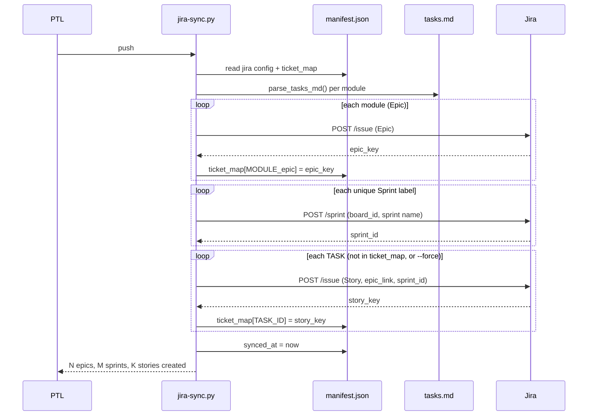
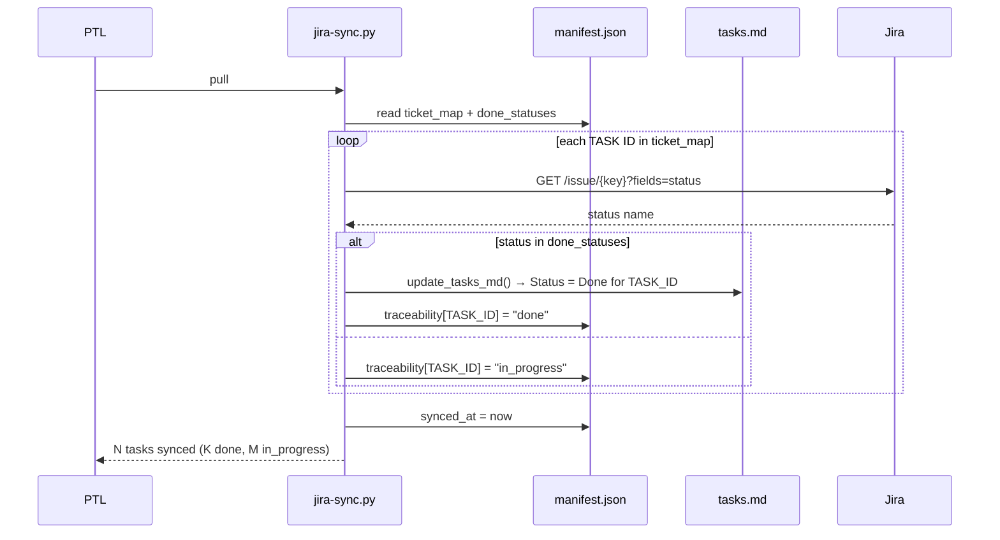
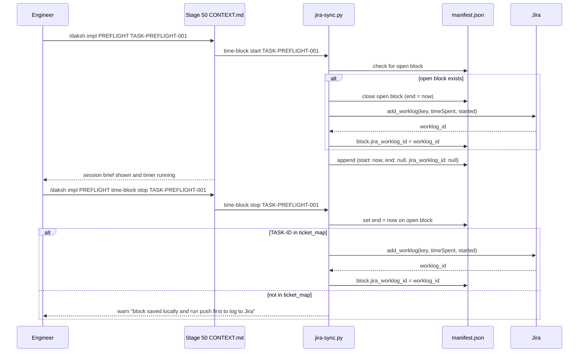

# How jira-sync.py Works — Technical Design

`scripts/jira-sync.py` is a Python script that bridges Daksh's manifest and `tasks.md` files to a Jira project. It takes a subcommand (`push`, `pull`, or `status`), reads the [manifest](../../glossary#manifest) and task files, calls the Jira REST API, and updates the manifest and `tasks.md` in place. The script is intentionally simple — no background daemons, no webhooks, no database. State lives in `manifest.jira` and `tasks.md`. The engineer who reads this cold at 11pm should be able to trace any sync failure to a specific API call or manifest field without needing a debugger.

This TRD implements the PRD at `prd.md`.

---

## Scope

Design covers: `scripts/jira-sync.py`, `commands/jira/CONTEXT.md`, and enhancements to `scripts/list-tasks.py` (`--name`, `--sprint`, `--open` flags). Does not cover: Jira board/project creation, webhook integration, or any content sync from Jira back to `tasks.md`.

---

## Architecture

Single Python script, subcommand dispatch. Jira API calls via the `jira` Python library (`pip install jira`). All other I/O is stdlib. Structure:

```
scripts/jira-sync.py
  main()              → arg parse → validate env vars → build JIRA client → dispatch
  push()              → read manifest + tasks.md → create Jira hierarchy → write ticket_map
  pull()              → read ticket_map → query issue status → update tasks.md + traceability
  status()            → print ticket_map summary + last sync time
  make_client()       → return jira.JIRA(server, basic_auth=(email, token))
  time_block_start()  → record open block in traceability; auto-close any existing open block first
  time_block_stop()   → close open block; compute duration; add_worklog to Jira; store worklog_id
  parse_tasks_md()    → extract TASK blocks (ID, summary, epic, sprint, assignee) from tasks.md
  update_tasks_md()   → update Status column in summary table for done tasks; content untouched
  load_manifest()     → read + parse docs/.daksh/manifest.json
  save_manifest()     → write manifest back atomically (write to .tmp, rename)
```

The same manifest-load/save pattern as `approve.py`. Atomic write (temp file + rename) prevents corruption on interrupted sync.

**PRD open question resolution:**

OQ-1 (project_key / board_id setup) — **Decided:** manual manifest edit before first push. No configure subcommand. The PTL sets `manifest.jira.project_key` and `manifest.jira.board_id` once. Script exits with a clear error if either is missing. This is a one-time setup for a small project — a configure subcommand adds complexity for a two-field edit.

OQ-2 (done status mapping) — **Decided:** configurable via `manifest.jira.done_statuses` (list of strings). Default value written by push on first run if not set: `["Done", "Closed", "Resolved"]`. PTL can override in manifest without a code change.

---

## Data Model

The `manifest.jira` block is the sync state for the whole project. The manifest template already has this block at `{}` level fields; this TRD defines the full schema.

```json
"jira": {
  "project_key": "DAK",
  "board_id": 1,
  "synced_at": "2026-03-28T10:00:00Z",
  "done_statuses": ["Done", "Closed", "Resolved"],
  "ticket_map": {
    "TASK-PREFLIGHT-001": "DAK-42",
    "TASK-PREFLIGHT-002": "DAK-43"
  },
  "user_map": {
    "Yeshwanth": "yeshwanth.r@divami.com"
  }
}
```

`manifest.traceability` is updated by pull (status) and by time-block start/stop. The schema is an object per TASK ID — a breaking change from a flat string. Any consumer reading `traceability` must handle the object form.

```json
"traceability": {
  "TASK-PREFLIGHT-001": {
    "status": "done",
    "time_blocks": [
      {
        "start": "2026-03-28T10:00:00Z",
        "end": "2026-03-28T12:30:00Z",
        "jira_worklog_id": "10001"
      },
      {
        "start": "2026-03-28T14:00:00Z",
        "end": "2026-03-28T15:15:00Z",
        "jira_worklog_id": "10002"
      }
    ]
  },
  "TASK-PREFLIGHT-002": {
    "status": "in_progress",
    "time_blocks": [
      {"start": "2026-03-28T16:00:00Z", "end": null, "jira_worklog_id": null}
    ]
  }
}
```

`jira_worklog_id: null` means the block is open or was not yet submitted. `end: null` means the block is open. Only blocks with `end` set and `jira_worklog_id: null` need to be submitted to Jira — this makes the submit step idempotent on re-run.

The tasks.md summary table gains a **Status** column after first pull. Push does not add this column — it's added by pull on first write. The column is appended to the right of the existing summary table header.

---

## API Contracts

### Script CLI

```
python scripts/jira-sync.py push              [--module MODULE] [--dry-run] [--force]
python scripts/jira-sync.py pull              [--module MODULE] [--dry-run]
python scripts/jira-sync.py status
python scripts/jira-sync.py time-block start  TASK-ID
python scripts/jira-sync.py time-block stop   TASK-ID
```

`time-block start` and `time-block stop` are the only subcommands that don't require env vars if the ticket_map entry for that task is missing — they always write to manifest first and submit to Jira only if the task key is in `ticket_map`.

- `--module`: limit push/pull to one module; default is all modules
- `--dry-run`: print what would be created/updated without writing to Jira or manifest
- `--force`: on push, update existing tickets (using stored key); do not skip if in ticket_map

### jira library calls

The script uses the `jira` Python library (`pip install jira`). Connection is established once in `make_client()` and passed to push/pull functions.

```python
client = jira.JIRA(server=JIRA_SERVER, basic_auth=(JIRA_EMAIL, JIRA_TOKEN))
```

| Operation | Library call |
|-----------|-------------|
| Create Epic | `client.create_issue(project=key, issuetype="Epic", summary=...)` |
| List board sprints | `client.sprints(board_id)` |
| Create sprint | `client.create_sprint(name, board_id)` |
| Create Story in sprint | `client.create_issue(project=key, issuetype="Story", summary=..., customfield_10014=epic_key)` then `client.add_issues_to_sprint(sprint_id, [story_key])` |
| Get issue status | `client.issue(key, fields="status").fields.status.name` |
| Update issue | `client.issue(key).update(summary=...)` |
| Log work | `client.add_worklog(key, timeSpent="2h 30m", started=datetime_obj)` → returns worklog with `.id` |

The `jira` library handles Epic Link field resolution internally — no need to hardcode `customfield_10014` or discover it per tenant. Sprint operations use the `jira.JIRA` agile extension which is included in the standard package.

---

## Data Flow

### Push flow

Push reads tasks.md files and manifest, then creates Jira objects in a fixed order: Epics first (one per module), Sprints second (one per unique Sprint label across all tasks), Stories last (one per TASK block).



### Pull flow

Pull reads the ticket_map, queries Jira for each ticket's current status, and updates tasks.md and traceability.



### Time-block flow

Time blocks are triggered by impl sessions, not by explicit jira commands. The stage 50 CONTEXT.md calls `jira-sync.py time-block start TASK-ID` as its first step (after preflight). Stop is explicit via `/daksh impl MODULE time-block stop TASK-ID`.



`timeSpent` is computed as `end - start`, formatted as Jira duration string (e.g., `"2h 30m"`). The `started` parameter passed to `add_worklog` is the block's `start` timestamp as a `datetime` object.

---

## commands/jira/CONTEXT.md

The command file routes `/daksh jira` to the script and handles the name-resolution flow for `list-my-tasks --name`.

```
## Persona
Jira Bridge. Run the script, show output verbatim. For name resolution,
ask the engineer to confirm before writing to manifest.

## Steps — push
1. Verify env vars: JIRA_SERVER, JIRA_EMAIL, JIRA_TOKEN (hard stop if any missing).
2. Run: python scripts/jira-sync.py push [--module MODULE] [--dry-run] [--force]
3. Show output verbatim.
4. If exit 0: "Jira push complete. manifest.jira.ticket_map updated."
5. If exit 1: "Jira push failed. Resolve the error above before retrying."

## Steps — pull
1. Verify env vars.
2. Run: python scripts/jira-sync.py pull [--module MODULE] [--dry-run]
3. Show output verbatim.
4. If exit 0: "Jira pull complete. tasks.md status columns updated."
5. If exit 1: "Jira pull failed. Resolve the error above."

## Steps — status
1. Run: python scripts/jira-sync.py status
2. Show output verbatim.

## Steps — list-my-tasks --name NAME
1. Check manifest.jira.user_map for NAME.
2. If found: run python scripts/list-tasks.py --name "mapped_name" [--sprint N] [--open]
3. If not found:
   a. Scan Assigned to fields across all tasks.md files.
   b. Show the PTL/engineer the closest matching names.
   c. Ask: "Is '<candidate>' the right Jira display name for '<NAME>'? (y/n)"
   d. On yes: write {NAME: candidate} to manifest.jira.user_map.
   e. Run python scripts/list-tasks.py --name "candidate" [--sprint N] [--open]
4. Show output verbatim.
```

---

## list-tasks.py Enhancements

Three flags are added to `scripts/list-tasks.py`. These are purely filtering flags — no Jira API calls from list-tasks.py itself.

| Flag | Behavior |
|------|---------|
| `--name NAME` | Filter to tasks where `Assigned to` field exactly matches NAME |
| `--sprint N` | Filter to tasks where Sprint = Sprint N |
| `--open` | Exclude tasks where `manifest.traceability[TASK_ID] = "done"` |

The output table gains two columns when `--name` is used: `Assigned to` and `Status` (read from traceability). Without `--name`, the existing output format is unchanged.

If `--name` is provided but no tasks match, the script prints: `"No tasks found for Assigned to = '<NAME>'. Run /daksh jira pull to sync latest assignments."` and exits 0.

---

## Technology Choices

| Choice | Why |
|--------|-----|
| `jira` Python library | Handles Epic Link field resolution, sprint operations, and auth without per-tenant field discovery. `customfield_10014` is not stable across Jira instances — raw `requests` would require tenant-specific configuration. One `pip install jira` is less risky than manually constructing Jira Cloud REST payloads. |
| stdlib `json` + `re` for manifest/tasks parsing | Consistent with all other Daksh scripts. No extra deps for file I/O. |
| Atomic manifest write (tmp + rename) | Prevents partial-write corruption on interrupted sync. Same pattern recommended for approve.py. |
| `manifest.jira.done_statuses` for status mapping | Jira status names vary by project configuration. Hardcoding "Done" would silently fail on projects using "Resolved" or custom statuses. |
| Manual project_key / board_id setup | One-time two-field edit is simpler than a configure subcommand. `--dry-run` lets PTL verify config before first real push. |

---

## Security Design

- JIRA_TOKEN is read from environment only. Never printed in output, never stored in manifest, never logged.
- `JIRA_SERVER` must use HTTPS. Script validates scheme on startup: if `http://`, exit 1 with "JIRA_SERVER must use HTTPS."
- Jira API tokens have read+write scope by default. The script only creates and reads issues — no board configuration, no project settings changes.
- No credentials written to any file. manifest.jira.user_map stores display names only (not emails or tokens).

---

## NFR Design

The Daksh manifest `weight_class: small` implies projects under 4 weeks with under 3 modules. A small project has at most ~50–100 tasks total. Push creates one API call per task (plus one per module for Epics, one per Sprint). Pull is one GET per task. All calls are serial (no parallel requests) — this keeps the code simple and avoids rate limit surprises.

At 100 tasks: push ≈ 110 serial calls. Jira Cloud typically responds in 200–500ms per call. Worst case: ~55 seconds. For a small project this is acceptable. If a future medium/large project needs faster sync, batching can be added then — not now.

---

## Testing Strategy

Unit tests cover push and pull logic using mock `jira.JIRA` instances and temp files for manifest + tasks.md. `unittest.mock.patch` wraps `jira.JIRA` constructor; test fixtures return mock issue objects with `.fields.status.name` attributes. No real Jira API calls in unit tests.

Integration tests require `JIRA_SERVER`, `JIRA_EMAIL`, and `JIRA_TOKEN` to be set and are skipped if any are missing (`unittest.skipUnless`). Integration tests run against a real Jira project (the Daksh project in Divami's Jira instance once available).

The `--dry-run` flag enables a lightweight manual integration check: run `jira-sync.py push --dry-run` against a real manifest to verify parsing and API payloads without creating any tickets.

---

## Open Questions

None. Both PRD open questions resolved in this TRD.

---

## Approval

Approved by: Yeshwanth
Role:        PTL
Date:        2026-03-28
Hash:        947e9297b2a6…
