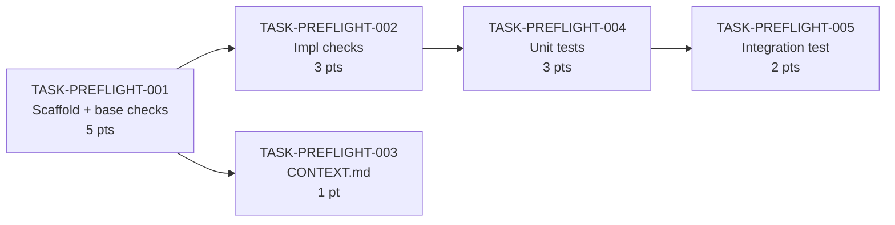

# PREFLIGHT Module Tasks — Sprint 1 Delivery Breakdown

This document breaks down `trd.md` into executable tasks for the PREFLIGHT [module](../../glossary#module). The audience is the PTL (Yeshwanth) running solo delivery. Every task is sized for one engineer in one sprint. The [decision budget](../../glossary#decision-budget) on each task is the load-bearing field — it tells the implementer exactly where they have latitude and where they must stop and confirm.

Two deliverables come out of this module: `scripts/preflight.py` (the validation script) and `commands/preflight/CONTEXT.md` (the command entry point). Tests are a first-class deliverable, not an afterthought. The stage CONTEXT.md updates across all 8 stages were completed during the PRD/TRD session and are not tasks here.

---

## Task Summary

| ID | Summary | Points | Sprint | Role | Depends on |
|----|---------|--------|--------|------|-----------|
| TASK-PREFLIGHT-001 | Scaffold preflight.py — arg parse, manifest load, base checks, print_table | 5 | Sprint 1 | PTL | none |
| TASK-PREFLIGHT-002 | Add impl checks to preflight.py — git clean, task dependency resolution | 3 | Sprint 1 | PTL | TASK-PREFLIGHT-001 |
| TASK-PREFLIGHT-003 | Write commands/preflight/CONTEXT.md | 1 | Sprint 1 | PTL | TASK-PREFLIGHT-001 |
| TASK-PREFLIGHT-004 | Unit tests — one test per check, mock manifest + temp files | 3 | Sprint 1 | PTL | TASK-PREFLIGHT-002 |
| TASK-PREFLIGHT-005 | Integration test — run preflight against Daksh's own manifest | 2 | Sprint 1 | PTL | TASK-PREFLIGHT-004 |

**Sprint 1 total: 14 points.** TASK-PREFLIGHT-003 can run in parallel with TASK-PREFLIGHT-002 once 001 is done.

---

## Dependency Graph

Tasks 001 → 002 and 001 → 003 can branch after the scaffold is in place. Tests gate on the full implementation being done.

TASK-PREFLIGHT-003 is the one genuinely parallel task. Everything else is strictly sequential because each layer depends on the previous one being runnable.

---

## Detailed Task List

#### TASK-PREFLIGHT-001: Scaffold preflight.py — arg parse, manifest load, base checks, print_table

- **Type:** Story
- **Epic:** Complete Command Layer
- **Sprint:** Sprint 1
- **Points:** 5
- **Assignee:** PTL
- **Assigned to:** Yeshwanth
- **Traces to:** [US-PREFLIGHT-001](prd.md#us-preflight-001), [US-PREFLIGHT-003](prd.md#us-preflight-003)
- **Depends on:** none
- **Description:** Create `scripts/preflight.py` with the full scaffold defined in [TRD §Architecture](trd.md#architecture): `main()`, `resolve_key()`, `run_checks()`, `base_checks()`, `print_table()`. `resolve_key()` copies the STAGE_MAP constant from `scripts/approve.py` verbatim — no import, just duplication ([TRD §Technology Choices](trd.md#technology-choices) explains why). `base_checks()` implements the four checks applicable to all stages: manifest exists and is valid JSON, stage key registered in manifest, prior stage has sufficient approvals (`manifest.rules.approvals_per_gate`), prior output file exists on disk, prior output hash matches `manifest.stages[key].doc_hash`. Exit code: any HARD failure → 1; all HARD pass → 0 (WARNs also exit 0).
- **Decision budget:**
  - Junior can decide: exact wording of `[PASS]/[FAIL]/[WARN]` lines; separator character for the output table header
  - Escalate to TL/PTL: any deviation from the STAGE_MAP in approve.py; any new check not in the TRD check matrix; changing exit code semantics
- **Acceptance criteria:**
  - [ ] `python scripts/preflight.py brd` runs against the Daksh manifest without crashing
  - [ ] Missing manifest → exits 1 with `"ERROR: No Daksh pipeline found. Run /daksh init first."`
  - [ ] Unknown stage arg → exits 1 with a clear message
  - [ ] All base checks print one `[PASS]` or `[FAIL]` or `[WARN]` line each
  - [ ] Final line matches format: `"Result: PASS / BLOCKED — N hard failure(s)"`
  - [ ] No third-party imports — stdlib only
- **Definition of Done:**
  - [ ] Jira ticket updated to Done
  - [ ] Script runs cleanly on the Daksh repo (`python scripts/preflight.py brd` exits 0)
  - [ ] PR reviewed and merged to module branch
  - [ ] No new imports beyond Python stdlib

---

#### TASK-PREFLIGHT-002: Add impl checks to preflight.py — git clean, task dependency resolution

- **Type:** Story
- **Epic:** Complete Command Layer
- **Sprint:** Sprint 1
- **Points:** 3
- **Assignee:** PTL
- **Assigned to:** Yeshwanth
- **Traces to:** [US-PREFLIGHT-002](prd.md#us-preflight-002), [US-PREFLIGHT-003](prd.md#us-preflight-003)
- **Depends on:** TASK-PREFLIGHT-001
- **Description:** Extend `preflight.py` with `impl_checks()`, dispatched from `run_checks()` only when the resolved stage key is `50:[MODULE]`. Two checks: (1) git working tree clean — run `git status --porcelain` via `subprocess`; non-empty output = HARD FAIL; (2) task dependencies done — parse `docs/implementation/[MODULE]/tasks.md` for `Depends on:` fields, check `manifest.traceability` for each dependency's status; any not-done = HARD FAIL. Also add HARD checks on prior doc hashes for impl stage specifically (TRD check matrix row: "Prior doc hash matches manifest `doc_hash`" is HARD for stage 50, WARN for doc stages). See [TRD §Check Matrix](trd.md#check-matrix) for the full HARD/WARN split.
- **Decision budget:**
  - Junior can decide: subprocess timeout value for `git status`; exact parsing strategy for `Depends on:` field in tasks.md (regex or split — either is fine as long as it handles "none" gracefully)
  - Escalate to TL/PTL: if `manifest.traceability` is missing or the tasks.md format doesn't have a `Depends on` field matching what's in this file; any change to which checks are HARD vs WARN
- **Acceptance criteria:**
  - [ ] `python scripts/preflight.py impl PREFLIGHT` with dirty git → exits 1 with `[FAIL] Git working tree clean`
  - [ ] `python scripts/preflight.py impl PREFLIGHT` with clean git → git check passes
  - [ ] Tasks with `Depends on: none` → no dependency check attempted
  - [ ] Tasks with an unresolved dependency → `[FAIL] Dependency TASK-PREFLIGHT-NNN not done`
  - [ ] Doc stage invocation (`python scripts/preflight.py brd`) still works — impl_checks not called
- **Definition of Done:**
  - [ ] Jira ticket updated to Done
  - [ ] Both impl checks verified manually against a clean and dirty state
  - [ ] PR reviewed and merged to module branch
  - [ ] Tests passing (TASK-PREFLIGHT-004 passes for these checks)

---

#### TASK-PREFLIGHT-003: Write commands/preflight/CONTEXT.md

- **Type:** Story
- **Epic:** Complete Command Layer
- **Sprint:** Sprint 1
- **Points:** 1
- **Assignee:** PTL
- **Assigned to:** Yeshwanth
- **Traces to:** [US-PREFLIGHT-001](prd.md#us-preflight-001), [US-PREFLIGHT-002](prd.md#us-preflight-002)
- **Depends on:** TASK-PREFLIGHT-001
- **Description:** Create `commands/preflight/CONTEXT.md` following the slim pattern defined in [TRD §commands/preflight/CONTEXT.md](trd.md#commandspreflightcontextmd). The file has two sections: Persona ("Safety Inspector") and Steps (4 steps: run script, show output verbatim, message on exit 0, message on exit 1). Mirror the structure of `commands/approve/CONTEXT.md` for consistency. Also create `commands/preflight/` directory if it doesn't exist.
- **Decision budget:**
  - Junior can decide: exact phrasing of the persona description and step copy, as long as the command invocation matches `python scripts/preflight.py <stage> [MODULE]` exactly
  - Escalate to TL/PTL: any additional sections beyond Persona and Steps; any change to the exit code messaging
- **Acceptance criteria:**
  - [ ] `commands/preflight/CONTEXT.md` exists
  - [ ] Contains `## Persona` and `## Steps` sections
  - [ ] Step 1 invocation matches: `python scripts/preflight.py <stage> [MODULE]`
  - [ ] Step 3 message: "Preflight passed. Proceed with /daksh \<stage\>."
  - [ ] Step 4 message: "Preflight blocked. Resolve the FAIL items above before continuing."
  - [ ] File is ≤ 25 lines
- **Definition of Done:**
  - [ ] Jira ticket updated to Done
  - [ ] File present and matches TRD spec
  - [ ] PR reviewed and merged to module branch

---

#### TASK-PREFLIGHT-004: Unit tests — one test per check, mock manifest + temp files

- **Type:** Story
- **Epic:** Complete Command Layer
- **Sprint:** Sprint 1
- **Points:** 3
- **Assignee:** PTL
- **Assigned to:** Yeshwanth
- **Traces to:** [US-PREFLIGHT-001](prd.md#us-preflight-001), [US-PREFLIGHT-002](prd.md#us-preflight-002), [US-PREFLIGHT-003](prd.md#us-preflight-003)
- **Depends on:** TASK-PREFLIGHT-002
- **Description:** Write unit tests in `tests/test_preflight.py` using stdlib `unittest` and `tempfile`. Each check in the [TRD check matrix](trd.md#check-matrix) gets its own test: manifest missing, stage not registered, prior stage not approved, prior output missing, prior doc hash mismatch, git dirty (mock subprocess), dependency not done. Use mock manifest dicts constructed inline — no reading the real Daksh manifest. Use `tempfile.TemporaryDirectory` for any file existence checks. Tests must cover both HARD failure path (exits 1) and passing path (exits 0) for each check.
- **Decision budget:**
  - Junior can decide: test naming convention (test_check_name_pass / test_check_name_fail is sufficient); whether to use `unittest.mock.patch` or a wrapper for subprocess
  - Escalate to TL/PTL: if the preflight.py internals need to be refactored to be testable (e.g., if `main()` can't be called without side effects — flag before refactoring)
- **Acceptance criteria:**
  - [ ] `python -m pytest tests/test_preflight.py` (or `unittest discover`) runs and passes
  - [ ] At least one test per check row in [TRD §Check Matrix](trd.md#check-matrix)
  - [ ] No test reads from the real `docs/.daksh/manifest.json`
  - [ ] No test makes real `git` subprocess calls — subprocess is mocked
  - [ ] All 7 AC scenarios from [PRD §Acceptance Criteria](prd.md#acceptance-criteria) have a corresponding test
- **Definition of Done:**
  - [ ] Jira ticket updated to Done
  - [ ] All tests green
  - [ ] PR reviewed and merged to module branch
  - [ ] Test file added to repo alongside `scripts/`

---

#### TASK-PREFLIGHT-005: Integration test — run preflight against Daksh's own manifest

- **Type:** Story
- **Epic:** Complete Command Layer
- **Sprint:** Sprint 1
- **Points:** 2
- **Assignee:** PTL
- **Assigned to:** Yeshwanth
- **Traces to:** [US-PREFLIGHT-001](prd.md#us-preflight-001), [US-PREFLIGHT-002](prd.md#us-preflight-002)
- **Depends on:** TASK-PREFLIGHT-004
- **Description:** Add an integration test (or shell script) that runs `python scripts/preflight.py <stage>` against the real Daksh manifest for at least 3 approved stages (`brd`, `roadmap`, `tasks PREFLIGHT` once this sprint is done and approved). The test asserts exit 0 and that output contains no `[FAIL]` lines. This is the self-hosting test from [TRD §Testing Strategy](trd.md#testing-strategy) — if the real manifest is wrong, the test should catch it, not paper over it. No manifest mocking in this test.
- **Decision budget:**
  - Junior can decide: whether to implement as a pytest integration test or a standalone shell script; which approved stages to test against (any 3 currently approved stages are fine)
  - Escalate to TL/PTL: if any stage unexpectedly exits non-zero — that's a real bug in either the manifest or the script, not a test failure to work around
- **Acceptance criteria:**
  - [ ] Integration test runs from the Daksh project root
  - [ ] Tests at least 3 approved stages and asserts exit 0 for each
  - [ ] Output is checked for absence of `[FAIL]` lines
  - [ ] If the manifest has a genuine issue (e.g., stale hash), the test fails and the issue is fixed — not skipped
  - [ ] Test is clearly labeled "integration" and excluded from unit test runs if needed
- **Definition of Done:**
  - [ ] Jira ticket updated to Done
  - [ ] Integration test green against real Daksh manifest
  - [ ] PR reviewed and merged to module branch
  - [ ] Test documented with a comment explaining it is self-hosting (runs against the live project)

---

## Parallel Work Plan

Only one task is genuinely parallel in this sprint. Once TASK-PREFLIGHT-001 (scaffold) is done and the script is runnable, TASK-PREFLIGHT-002 (impl checks) and TASK-PREFLIGHT-003 (CONTEXT.md) can proceed simultaneously. Everything else is a strict sequence: scaffold → impl checks → unit tests → integration test.

Since this is solo delivery, the "parallel" option is only relevant if a second contributor joins mid-sprint. Default sequence for Yeshwanth: 001 → 002 → 003 → 004 → 005.

---

## Open Questions

1. **`manifest.traceability` format** — TASK-PREFLIGHT-002's task-dependency check reads `manifest.traceability` for done status. This field is currently `{}` in the Daksh manifest. The format needs to be defined before TASK-PREFLIGHT-002 can be implemented. Either decide the schema now (e.g., `{"TASK-PREFLIGHT-001": "done"}`) or the task-dependency check falls back to parsing tasks.md status column directly.
2. **`tests/` directory** — No `tests/` directory exists in the Daksh repo yet. TASK-PREFLIGHT-004 assumes it can create one. Confirm this is the right location before starting.
3. **`git status` in non-git directories** — If preflight is ever run outside a git repo, `subprocess.run(["git", "status", "--porcelain"])` will fail non-zero for a different reason than a dirty tree. The script should detect this and emit `[WARN] Not a git repository — git clean check skipped` rather than a HARD FAIL.

---

## Approval

Approved by: Yeshwanth
Role:        PTL
Date:        2026-03-28
Hash:        c01236992764…
