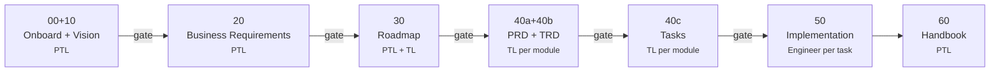

# End-User Handbook

Daksh is Divami's AI-guided workflow for product delivery. It runs as a skill inside any compatible AI coding assistant — Claude Code, VS Code GitHub Copilot, and Codex are all supported. Every project moves through a fixed sequence of stages — from client onboarding through code delivery — with an approval [gate](../docs/glossary#gate) between each one. This handbook tells you exactly what to do at your step in the sequence, whether you are an engineer picking up a task, a tech lead designing a module, or a PTL starting a new project.

## Who Does What

Daksh has three roles. Every team member has exactly one.

| Role | Short name | What you own |
|------|-----------|--------------|
| Project Technical Lead | PTL | Pipeline setup, gate approvals, Jira sync, project health |
| Tech Lead | TL | Module design (PRD + TRD), task breakdown, module gate approvals |
| Engineer | — | Task execution: branch, build, PR, mark done |

<details><summary>Why these three and not more?</summary>

Daksh's approval model needs exactly three levels of authority: project-wide decisions (PTL), module-wide design decisions (TL), and task-level execution (Engineer). Collapsing roles would blur accountability; adding more would require more approval tiers than small-to-medium projects can sustain.

</details>

## The Pipeline at a Glance

Each stage produces one document or one body of code. No stage begins until the previous one is [approved](../docs/glossary#approval). Each arrow below is a gate.



Stages 00 and 10 run together on small projects. Stages 40a and 40b (PRD and TRD) also run together per module. Everything from stage 40 onward repeats for each [module](../docs/glossary#module).

## Before You Begin

**All roles need:**
- A compatible AI coding assistant installed (Claude Code, VS Code GitHub Copilot, or Codex)
- Three skills installed in your assistant: **daksh**, **vyasa**, and **doc-narrator** — all three are required; stages will produce lower-quality output if any are missing
- Your name on the team [roster](../docs/glossary#roster) in `docs/.daksh/manifest.json` — your PTL sets this up at init

**Engineers also need:**
- Your task ID — the format is `TASK-[MODULE]-NNN` (e.g., `TASK-AUTH-003`)
- A clean git working tree before starting any task

**PTLs also need:**
- Jira credentials in environment variables — see [Admin Handbook](admin.md)
- `jira` Python package: `uv pip install jira`

---

## Engineer: Task Workflow

This is the most common Daksh action. You pick a task, build it, and close it. Four steps.

### Step 1 — Find Your Tasks

```
/daksh jira list-my-tasks [YOUR NAME]
```

Or from the terminal directly:

```bash
python scripts/list-tasks.py --name "Your Name" --open
```

The output shows task ID, summary, status, sprint, and acceptance criteria. If your name returns no results, your PTL needs to add you to `manifest.jira.user_map`.

### Step 2 — Start the Task

```
/daksh impl start TASK-[MODULE]-NNN
```

Before any code, Daksh automatically:

1. Runs [preflight](../docs/glossary#preflight) checks — gate status, dependencies, git cleanliness
2. Creates your feature branch: `[MODULE]/TASK-[MODULE]-NNN-<slug>`
3. Transitions your Jira ticket to **Development in Progress**
4. Starts a time block for worklog tracking
5. Prints your session brief: task summary, [decision budget](../docs/glossary#decision-budget), and acceptance criteria

> [!warning] If preflight fails, stop
> Each failure line names the exact blocker. Fix it, then re-run `impl start`. Do not work around preflight — it is protecting you from building on a stale or incomplete spec.

### Step 3 — Build

Work against the acceptance criteria in your session brief. Two rules while building:

- **Stay within your decision budget.** Decisions listed as yours to make — make them. Decisions listed as TL-level — stop and ask before proceeding.
- **If reality diverges from the spec,** raise a [change record](../docs/glossary#change-record) before continuing. See [Raising a Change Record](#raising-a-change-record) below.

### Step 4 — Mark Done

```
/daksh impl done TASK-[MODULE]-NNN
```

Daksh walks you through each acceptance criterion. Confirm each one. Then it:

1. Stops the time block and submits your worklog to Jira
2. Creates a PR to `[MODULE]/main` with ACs as a checklist
3. Transitions your Jira ticket to **Dev Internal Review**
4. Prints the PR URL

Your job ends when the PR URL prints.

> [!tip] Definition of Done
> A task is truly done when: Jira ticket updated, tests passing, PR reviewed and merged, and docs updated if behavior changed. `impl done` starts that chain — your reviewer closes it.

---

## Tech Lead: Module Workflow

You design the module before engineers build it. This happens once per module, after the roadmap is approved.

### Step 1 — Run Preflight

Always preflight before starting a stage:

```
/daksh preflight prd [MODULE]
```

Preflight is safe to run any time — it only reads, never writes. Fix any failures before continuing.

### Step 2 — Write the PRD and TRD

On small projects these run together:

```
/daksh prd [MODULE]
/daksh trd [MODULE]
```

The PRD defines user stories and acceptance criteria. The TRD defines architecture, data model, and API contracts. Both feed directly into the task breakdown.

### Step 3 — Break Down into Tasks

```
/daksh tasks [MODULE]
```

Each task gets: a summary, acceptance criteria, a [decision budget](../docs/glossary#decision-budget), and declared dependencies. Task IDs follow the pattern `TASK-[MODULE]-NNN`.

> [!note] Decision budget is mandatory
> Every task must state what the engineer decides independently and what gets escalated. A missing budget is a guarantee of either unnecessary blocking or unauthorized architectural decisions.

### Step 4 — Approve Your Gates

```
/daksh approve trd [MODULE]
/daksh approve tasks [MODULE]
```

Approval records your name, role, date, and a [doc hash](../docs/glossary#doc-hash) of the document at approval time. If the document changes after this point, the hash will drift and `/daksh tend` will flag it.

### Step 5 — Confirm the Jira Mapping

Once the PTL pushes tasks to Jira, verify the mapping looks right:

```
/daksh jira status
```

---

## PTL: Starting a New Project

Run these commands in order. Each one gates the next.

### Step 1 — Initialize

```
/daksh init
```

Creates `docs/.daksh/manifest.json`, determines [weight class](../docs/glossary#weight-class) from your project scope, and scaffolds the directory structure. No manifest means no pipeline — this is the first command on every project.

### Step 2 — Run the Strategic Stages

These four stages define what you are building and why. Run them in sequence; approve each before moving to the next.

| Command | Output | Approve with |
|---------|--------|-------------|
| `/daksh onboard` | `docs/client-context.md` | `/daksh approve onboard` |
| `/daksh vision` | `docs/vision.md` | `/daksh approve vision` |
| `/daksh brd` | `docs/business-requirements.md` | `/daksh approve brd` |
| `/daksh roadmap` | `docs/implementation-roadmap.md` | `/daksh approve roadmap` |

The roadmap stage also registers your modules in the [manifest](../docs/glossary#manifest). Module names are short, all-caps (e.g., `AUTH`, `NOTIFY`).

### Step 3 — Spec and Task Each Module

Repeat for every module registered in the roadmap:

```
/daksh preflight prd [MODULE]
/daksh prd [MODULE]
/daksh trd [MODULE]
/daksh tasks [MODULE]
/daksh approve tasks [MODULE]
```

### Step 4 — Push to Jira

Dry-run first — it proves the manifest and task parsing are sane without creating any tickets:

```
/daksh jira push --dry-run --module [MODULE]
```

If the output looks right:

```
/daksh jira push --module [MODULE]
```

The ticket map is written to `manifest.jira.ticket_map`. Engineers can now see their Jira tickets.

### Step 5 — Engineers Begin

Share task IDs. Engineers run `/daksh impl start TASK-[MODULE]-NNN` and the workflow takes it from there.

---

## PTL: Ongoing Hygiene

### Daily

Pull Jira status back into the manifest after any ticket transitions:

```
/daksh jira pull
```

This updates `manifest.traceability` and the `Status` column in each module's `tasks.md`.

### Weekly (or After Any Spec Change)

Run a health audit:

```
/daksh tend
```

Tend checks: [stale approvals](../docs/glossary#stale-approval) (doc changed after approval), [orphans](../docs/glossary#orphan) (tasks with no traceability parent), and drift between the manifest and what's on disk. Fix what it flags before the next sprint starts.

---

## Raising a Change Record

When what you are building diverges from what the spec says, stop and raise a change record immediately. Do not work around it silently.

```
/daksh change [MODULE]
```

Daksh will ask you: what was specified, what reality showed, and the impact. It then:

1. Creates `docs/implementation/[MODULE]/change-records/CR-NNN.md`
2. Patches the affected spec docs and marks them `pending_approval`
3. Registers the CR in the manifest

You cannot continue past the divergence until a PTL or TL approves the CR with `/daksh approve CR-NNN`.

> [!warning] Hand-editing specs without a CR is a workflow violation
> A CR is not bureaucracy — it is the only way the approval trail stays intact. Spec edits without a CR cause gate failures at the next `/daksh tend` and create approval debt that is painful to unwind later.

---

## Troubleshooting

| What you see | What to check |
|-------------|---------------|
| `No Daksh pipeline found` | Run `/daksh init` — the manifest does not exist yet |
| `Gate not met — 0 approvals` | The prior stage needs `/daksh approve [stage]` |
| `Hash drift on [doc]` | A doc changed after approval — run `/daksh tend` to see exactly what drifted, then re-approve the affected stage |
| `Dependency TASK-X not done` | `impl start` blocked — finish the dependency task first, then re-run |
| `Git working tree is dirty` | Commit or stash your local changes before `impl start` |
| Jira push fails immediately | Check `JIRA_SERVER`, `JIRA_EMAIL`, `JIRA_TOKEN` — see [Admin Handbook](admin.md) |
| Your name returns no tasks | Ask your PTL to add you to `manifest.jira.user_map` |
| `preflight` fails with missing stage | The stage key might be wrong — check the [command reference](#command-reference) below for the exact syntax |

---

## Command Reference

| Command | Who | What it does |
|---------|-----|-------------|
| `/daksh init` | PTL | Initialize pipeline, create manifest, scaffold dirs |
| `/daksh onboard` | PTL | Client context document |
| `/daksh vision` | PTL | Vision document |
| `/daksh brd` | PTL | Business requirements document |
| `/daksh roadmap` | PTL | Roadmap + module registration |
| `/daksh prd [MODULE]` | TL | Module PRD |
| `/daksh trd [MODULE]` | TL | Module TRD |
| `/daksh tasks [MODULE]` | TL | Task breakdown with ACs and decision budgets |
| `/daksh impl start TASK-ID` | Engineer | Start task: branch + Jira transition + time block |
| `/daksh impl done TASK-ID` | Engineer | Complete task: AC walk + PR + Jira transition |
| `/daksh approve [stage] [MODULE]` | PTL / TL | Record a gate approval with doc hash |
| `/daksh preflight [stage] [MODULE]` | Any | Pre-stage validation — safe to run anytime |
| `/daksh change [MODULE]` | Engineer | Raise a change record when spec diverges |
| `/daksh tend` | PTL | Health audit: orphans, stale hashes, drift |
| `/daksh jira push [--module M] [--dry-run]` | PTL | Push task breakdown to Jira |
| `/daksh jira pull [--module M]` | PTL | Pull Jira status into manifest and tasks.md |
| `/daksh jira status` | Any | Show sync health and open time blocks |
| `/daksh jira list-my-tasks [NAME]` | Any | List your open tasks by name |
| `python scripts/list-tasks.py --name NAME --open` | Any | Terminal-only task list with filtering |

---

## Changelog

- 2026-03-29: Full rewrite from skeleton. Action-oriented, role-based procedures for Engineer, TL, and PTL. Covers pipeline from init through PR close. Added troubleshooting table and full command reference.
